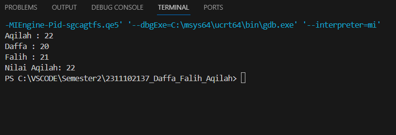

# <h1 align="center">Laporan Praktikum Modul Tipe Data</h1>
<p align="center">Daffa Falih Aqilah-2311102137/p>

## Dasar Teori

Tipe data adalah adalah sebuah pengklasifikasian data berdasarkan jenis data tersebut. Tipe data dibutuhkan agar kompiler dapat mengetahui bagaimana sebuah data akan digunakan. Adapun tipe data yang akan dipelajari, sebagai berikut :


1.Tipe data Primitif
Tipe data primitif di bahasa pemrograman C++ adalah tipe data yang sudah terdefinisi secara bawaan dalam bahasa pemrograman tersebut. Tipe data primitif biasanya digunakan untuk menyimpan nilai yang sederhana dan tidak kompleks seperti bilangan bulat, bilangan pecahan, karakter, dan nilai boolean.

2.Tipe Data Abstrak
Tipe Data Abstrak adalah tipe untuk objek yang perilakunya ditentukan oleh sekumpulan nilai dan sekumpulan operasi . Definisi Data Abstrak hanya menyebutkan operasi apa yang akan dilakukan tetapi tidak menyebutkan bagaimana operasi tersebut akan dilaksanakan.

3.Tipe Data Koleksi
Tipe data koleksi, digunakan untuk mengelompokkan dan menyimpan sejumlah nilai atau objek secara bersamaan. Tipe data koleksi memungkinkan Anda menyimpan, mengelola, dan mengakses sejumlah besar data secara terstruktur. Beberapa tipe data koleksi yang populer digunakan dalam pemrograman.


## Guided 

### 1. [Tipe Data Primitif]

```C++
int main () {
    char op;
    float num1, num2;

    cout<< "Enter operator ( +, -, *, /)";
    cin>>op;

    cout<<"enter two operands : ";
    cin >> num1 >> num2;
    
    switch (op) {
        case '+':
             cout << "Result: " << num1 + num2;
             break; 
        case '-':
             cout << "Result: " << num1 - num2;
             break; 
        case '*':
             cout << "Result: " << num1 * num2;
             break; 
        case '/':
            if (num2 != 0) {    
                cout << "Result :" << fixed << setprecision(2) << num1 / num2;
            } else {
                cout << "Error! Division by zero is not allowed.";
            }
            break;

            default:
                cout << "Error! Operation is not correct";
    }
    return 0;
}
```
Kode ini adalah program C++ sederhana yang berfungsi sebagai kalkulator sederhana. Dalam program ini, pengguna dapat memasukkan operator matematika (+, -, *, /) dan dua operand numerik. Kemudian, berdasarkan operator yang dimasukkan, program akan menjalankan operasi yang sesuai dan mencetak hasilnya.

### 2. [Tipe Data Abstrak]

```C++
#include <stdio.h>
#include <string.h>

struct Mahasiswa
{
    char name[50];
    char address[100];
    int age;
};
int main() {
    struct Mahasiswa mhs1, mhs2;
    strcpy(mhs1.name, "Dian");
    strcpy(mhs1.address, "Mataram");
    mhs1.age = 22;  
    strcpy(mhs2.name, "Dian");
    strcpy(mhs2.address, "Mataram");
    mhs2.age = 23;

    printf("## Mahasiswa 1 ##\n");
    printf("Nama: %s\n", mhs1.name);
    printf("Alamat: %s\n", mhs1.address);
    printf("Umur: %d\n", mhs1.age);
    printf("\n");
    printf("## Mahasiswa 2 ## \n");
    printf("Nama: %s\n", mhs2.name);
    printf("Alamat: %s\n", mhs2.address);
    printf("Umur: %d\n", mhs2.age);
    return 0;
}
```
Contoh penggunaan struktur dalam bahasa pemrograman C++ adalah kode ini. Struktur digunakan untuk menggabungkan beberapa tipe data yang berbeda ke dalam satu tipe data yang lebih kompleks. Dalam kasus ini, struktur mendefinisikan tipe data baru yang disebut Student, yang terdiri dari tiga anggota: nama (nama), alamat (alamat), dan age (umur).

### 3. [Tipe Data Koleksi]

```C++
#include <iostream>
#include <array>
using namespace std;

int main () {
    int nilai[5];
    nilai[0] = 23;
    nilai[1] = 50;
    nilai[2] = 34;
    nilai[3] = 78;
    nilai[4] = 90;

    cout << "Isi array pertama : " << nilai[0] << endl;
    cout << "Isi array kedua   : " << nilai[1] << endl;
    cout << "Isi array ketiga  : " << nilai[2] << endl;
    cout << "Isi array keempat : " << nilai[3] << endl;
    cout << "Isi array kelima  : " << nilai[4] << endl;

return 0;
}
```
Kode ini menunjukkan cara membuat dan mengakses array dalam C++. Array adalah struktur data yang dapat menyimpan sejumlah elemen data dengan tipe yang sama dalam satu variabel.


## Unguided 

### 1. [Buatlah program menggunakan tipe data primitif minimal dua fungsi dan bebas. Menampilkan program, jelaskan program tersebut dan ambil kesimpulan dari materi tipe data primitif!]

```C++
#include <iostream>

using namespace std;

int main() {
  // Deklarasi variabel
  const int MAX_OPERASI = 4;
  char operasi[MAX_OPERASI] = {'+', '-', '*', '/'};
  string namaOperasi[MAX_OPERASI] = {"Penjumlahan", "Pengurangan", "Perkalian", "Pembagian"};
  int hasil[MAX_OPERASI];

  // Lakukan perhitungan untuk semua operasi
  for (int i = 0; i < MAX_OPERASI; i++) {
    int angka1, angka2;

    // Input angka
    cout << "Masukkan angka pertama untuk " << namaOperasi[i] << ": ";
    cin >> angka1;

    cout << "Masukkan angka kedua untuk " << namaOperasi[i] << ": ";
    cin >> angka2;

    // Hitung hasil
    switch (operasi[i]) {
      case '+':
        hasil[i] = angka1 + angka2;
        break;
      case '-':
        hasil[i] = angka1 - angka2;
        break;
      case '*':
        hasil[i] = angka1 * angka2;
        break;
      case '/':
        if (angka2 == 0) {
          cout << "Pembagian dengan 0 tidak diizinkan!" << endl;
          continue;
        }
        hasil[i] = angka1 / angka2;
        break;
    }
  }

  // Tampilkan hasil
  cout << "=====================================" << endl;
  cout << "Hasil Perhitungan" << endl;
  cout << "=====================================" << endl;

  for (int i = 0; i < MAX_OPERASI; i++) {
    cout << namaOperasi[i] << ": " << hasil[i] << endl;
  }

  return 0;
}
```
Kode di atas kita menggunakan opsi pertambahan (+), pengurangan(-), perkalian (*), dan pembagian (/)

### 2. [Jelaskan fungsi dari class dan struct secara detail dan berikan contoh programnya]

```C++
#include <iostream>

using namespace std;

// **Class Person**
class Person {
  private:
    string nama;
    int usia;

  public:
    Person() {} // Constructor default
    Person(string nama, int usia) { // Constructor dengan parameter
      this->nama = nama;
      this->usia = usia;
    }

    string getNama() { return nama; } // nama
    void setNama(string nama) { this->nama = nama; } // Setter untuk nama

    int getUsia() { return usia; } // Getter untuk usia
    void setUsia(int usia) { this->usia = usia; } // Setter untuk usia

    void printInfo() { // Fungsi untuk mencetak informasi
      cout << "Nama: " << nama << endl;
      cout << "Usia: " << usia << endl;
    }
};

// **Struct Point**
struct Point {
  int x;
  int y;

  void printPoint() { // Fungsi untuk mencetak koordinat
    cout << "Titik (" << x << ", " << y << ")" << endl;
  }
};
```
Class Person:
Memiliki anggota data private nama dan usia.
Memiliki constructor default dan constructor dengan parameter.
Memiliki getter dan setter untuk nama dan usia.
Memiliki fungsi printInfo() untuk mencetak informasi.

Struct Point:
Memiliki anggota data public x dan y.
Memiliki fungsi printPoint() untuk mencetak koordinat

Class dan struct adalah alat yang berguna untuk membuat struktur data kompleks dengan fungsionalitas yang terdefinisi. Pilih class jika Anda membutuhkan fitur seperti inheritance, virtual functions, dan polymorphism. Pilih struct untuk struktur data sederhana.


### 3. [Jelaskan fungsi dari class dan struct secara detail dan berikan contoh programnya]

```C++
#include <iostream>
#include <map>

using namespace std;

int main() {
  // Membuat map kosong
  map<string, int> m;

  // Menambahkan elemen ke map
  m["Daffa"] = 20;
  m["Falih"] = 21;
  m["Aqilah"] = 22;

  // Menampilkan isi map
  for (auto it = m.begin(); it != m.end(); ++it) {
    cout << it->first << " : " << it->second << endl;
  }

  // Mencari elemen dalam map
  auto it = m.find("Aqilah");
  if (it != m.end()) {
    cout << "Nilai Aqilah: " << it->second << endl;
  } else {
    cout << "Aqilah tidak ditemukan" << endl;
  }

  return 0;
}


```
Array dan map adalah dua struktur data yang commonly used dalam pemrograman. Array lebih cocok untuk menyimpan data yang perlu diakses dalam urutan tertentu, sedangkan map lebih cocok untuk menyimpan data yang perlu diakses berdasarkan key.

#### Output:




Kode di atas digunakan untuk mencetak teks "ini adalah file code guided praktikan" ke layar menggunakan function cout untuk mengeksekusi nya.

## Kesimpulan
Tipe data koleksi digunakan untuk mengelompokkan dan menyimpan kumpulan nilai atau objek secara bersamaan. Tipe data ini memungkinkan Anda menyimpan, mengelola, dan mengakses data dalam jumlah besar dengan cara yang terstruktur.[1].

## Referensi
[1] Pemrograman C++: Pendekatan Modern (2022) oleh Dony Ariyus
[2] Belajar C++ dari Awal: Panduan Lengkap dan Praktis (2021) oleh Muhamad Ivan
[3] C++ untuk Pemula: Memahami Dasar-Dasar Pemrograman C++ (2020) oleh M.S. Haryadi
[4] Mastering C++: Panduan Lengkap untuk Menjadi Programmer C++ Mahir (2019) oleh I Wayan Gede Budiasa
[5] C++ untuk Pemula: Panduan Singkat dan Mudah (2022) oleh Dimas Purnama