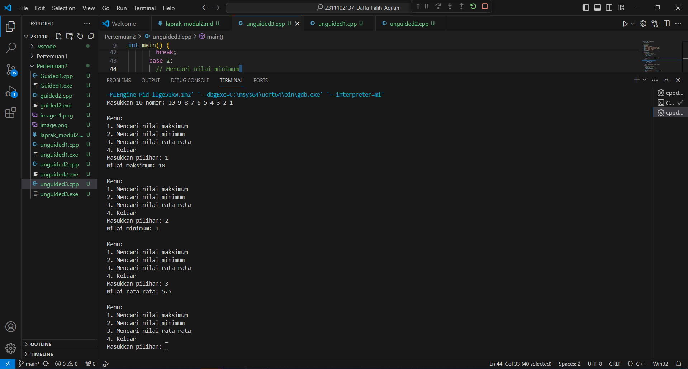

# <h1 align="center">Laporan Praktikum Modul ARRAY</h1>
<p align="center">Daffa Falih Aqilah-2311102137 /p>

## Dasar Teori

Array adalah suatu struktur yang terdiri dari sejumlah elemen yang memiliki tipe data yang sama. Elemen-elemen array tersusun secara sekuensial dalam memori komputer. Semua elemem array bertipe sama. Array cocok untuk organisasi kumpulan data homogen yang ukuran atau jumlah elemen maksimumnya telah diketahui dari awal. Homogen adalah bahwa setiap elemen dari sebuah array tertentu haruslah mempunyai tipe data yang sama.
Array dibagi menjadi :

1.  Array Satu Dimensi 

Array satu dimensi tidak lain adalah kumpulan elemen-elemen identik yang tersusun dalam satu baris, tetapi isi dari elemen tersebut boleh berbeda.  Dapat disebut juga dengan istilah vektor yang menggambarkan data dalam suatu urutan
Deklarasi : Type_Data Nama_Variabel [index] 
Misalnya : int A[5]; 

2.  Array Dua Dimensi 

	Array dua dimensi yang sering digambarkan sebagai sebuah matriks merupakan perluasan dari sebuah array satu dimensi. Jika array satu dimensi hanya terdiri dari sebuah baris dengan beberapa kolom elemen maka array dua dimensi terdiri dari beberapa baris dan beberapa kolom elemen yang bertipe sama. Pendeklarasian array dua dimensi hampir sama dengan pendeklarasian array satu dimensi, kecuali bahwa array dua dimensi terdapat dua jumlah elemen array yang terdapat di dalam kurung siku dan keduanya boleh tidak sama.
Deklarasi : Type_Data Nama_Variabel [Index1] [index2]; 
Misal : int A[3][2];

3.   Array Tiga Dimensi 
          Array tiga dimensi digunakan untuk mengelola data dalam bentuk 3 dimensi atau tiga sisi. 
Deklarasi : Type_Data Nama_Variabel [index1] [ndex2] [index3]; 
Misal : int A [3][4][2];

 4.   Array Banyak Dimensi

	Sebenarnya array banyak dimensi ini tidak terlalu sering dipakai seperti halnya array satu dimensi, dua dimensi, dan tiga dimensi. Array banyak dimensi ini pada dasarnya sama dengan array sebelimnya kecuali pada jumlah dimensinya.
Deklarasi : Type_Data Nama_Variabel [index1] [ndex2] [index3] [ndex4].....;
Misal : int A [3][4][2][5];

## Guided 

### 1. [Program Input Array Tiga Dimensi]

```C++
#include <iostream>
using namespace std;
// PROGRAM INPUT ARRAY 3 DIMENSI
int main()
{
// Deklarasi array
int arr[2][3][3];
// Input elemen
for (int x = 0; x < 2; x++)
{
for (int y = 0; y < 3; y++)
{
for (int z = 0; z < 3; z++)
{
cout << "Input Array[" << x << "][" << y << "][" <<
z << "] = ";
cin >> arr[x][y][z];
}
}
cout << endl;
}
// Output Array
for (int x = 0; x < 2; x++)
{
for (int y = 0; y < 3; y++)
{
for (int z = 0; z < 3; z++)
{
cout << "Data Array[" << x << "][" << y << "][" << z
<< "] = " << arr[x][y][z] << endl;
}
}
}
cout << endl;
// Tampilan array
for (int x = 0; x < 2; x++)
{
for (int y = 0; y < 3; y++)
{
for (int z = 0; z < 3; z++)
{
cout << arr[x][y][z] << ends;
}
cout << endl;
}
cout << endl;
}
}
```
Kode berikut digunakan untuk menginput array 3 dimensi. Kode di atas mendeklarasikan ukuran array tiga dimensi. Jadi nilai x-nya adalah 2, nilai y-nya adalah 3, dan nilai z-nya juga adalah 3. Proses pengisian elemen ke dalam array tiga dimensi dijalankan dengan dukungan nested loop x, y, z hingga ukurannya masing-masing tercapai.

### 2. [Tipe Data Abstrak]

```C++
#include <iostream>
using namespace std;
int main()
{
int maks, a, i = 1, lokasi;
cout << "Masukkan panjang array: ";
cin >> a;
int array[a];
cout << "Masukkan " << a << " angka\n";
for (i = 0; i < a; i++)
{
cout << "Array ke-" << (i) << ": ";
cin >> array[i];
}
maks = array[0];
for (i = 0; i < a; i++)
{
if (array[i] > maks)
{
maks = array[i];
lokasi = i;
}
}
cout << "Nilai maksimum adalah " << maks << " berada di Array ke " << lokasi << endl;
}
```
Kode di atas merupakan program C++ untuk mencari nilai maksimum dan lokasi (indeks) dari suatu array. Program ini dimulai dengan mendeklarasikan variabel maks, a, i, dan lokasi. Kemudian, program meminta user untuk memasukkan panjang array (a). Selanjutnya, program mendeklarasikan array dengan ukuran a. Program kemudian meminta user untuk memasukkan nilai-nilai elemen array. Setelah itu, program mencari nilai maksimum dari array dengan menggunakan perulangan for. Di dalam perulangan, program membandingkan setiap elemen array dengan nilai maks. Jika elemen array lebih besar dari maks, maka nilai maks diperbarui dengan nilai elemen array tersebut dan lokasi diperbarui dengan indeks elemen array.

## Unguided 

### 1. [Buatlah program untuk menampilkan Output seperti berikut dengan data yang diinputkan oleh user!]

```C++
#include <iostream>

using namespace std;

int main() {
  int data[10];
  cout << "Masukkan 10 data: ";
  for (int i = 0; i < 10; i++) {
    cin >> data[i];
  }

  cout << "Data array: ";
  for (int i = 0; i < 10; i++) {
    cout << data[i] << " ";
  }

  cout << endl;

  cout << "Nomor genap: ";
  for (int i = 0; i < 10; i++) {
    if (data[i] % 2 == 0) {
      cout << data[i] << " ";
    }
  }

  cout << endl;

  cout << "Nomor ganjil: ";
  for (int i = 0; i < 10; i++) {
    if (data[i] % 2 == 1) {
      cout << data[i] << " ";
    }
  }

  cout << endl;

  return 0;
}
```
Codingan di atas merupakan program C++ yang digunakan untuk menampilkan data array genap dan ganjil yang diinputkan oleh user. Pertama, program mendeklarasikan array dan meminta user untuk memasukkan 10 data. Kemudian, program mencetak data array dan menggunakan perulangan for untuk memeriksa setiap elemen array. Jika elemen array genap, program akan mencetaknya di baris "Nomor genap:". Jika elemen array ganjil, program akan mencetaknya di baris "Nomor ganjil:".

### 2. [Buatlah program Input array tiga dimensi (seperti pada guided) tetapi jumlah atau ukuran elemennya diinputkan oleh user!]

```C++
#include <iostream>
using namespace std;

int main() {
    int x_131, y_131, z_131;

    // Meminta pengguna untuk memasukkan ukuran array tiga dimensi
    cout << "Masukkan ukuran array tiga dimensi "<<endl;
    cout << "x :";
    cin >> x_131;
    cout << "y :";
    cin >> y_131;
    cout << "z :";
    cin >> z_131;

    // Deklarasi array sesuai dengan ukuran yang dimasukkan oleh pengguna
    int arr[x_131][y_131][z_131];

    // Input elemen array
    for (int x = 0; x < x_131; x++) {
        for (int y = 0; y < y_131; y++) {
            for (int z = 0; z < z_131; z++) {
                cout << "Input Array[" << x << "][" << y << "][" << z << "] = ";
                cin >> arr[x][y][z];
            }
        }
        cout << endl;
    }

    // Output elemen array
    for (int x = 0; x < x_131; x++) {
        for (int y = 0; y < y_131; y++) {
            for (int z = 0; z < z_131; z++) {
                cout << "Data Array[" << x << "][" << y << "][" << z << "] = " << arr[x][y][z] << endl;
            }
        }
    }
    cout << endl;

    // Tampilan array
    for (int x = 0; x < x_131; x++) {
        for (int y = 0; y < y_131; y++) {
            for (int z = 0; z < z_131; z++) {
                cout << arr[x][y][z] << " ";
            }
            cout << endl;
        }
        cout << endl;
    }

return 0;
}
```
Kode ini merupakan program C++ untuk membuat dan menampilkan array tiga dimensi. Program ini diawali dengan meminta user memasukkan ukuran untuk masing-masing dimensi (x, y, dan z) dari array. Kemudian, program mendeklarasikan array dengan ukuran sesuai input user. Setelah itu, program meminta user untuk mengisi elemen-elemen array melalui perulangan sebanyak tiga lapis sesuai dengan dimensi array. Terakhir, program menampilkan elemen array dalam dua bentuk: daftar dengan indeks dan tampilan seperti matriks berlapis.


### 3. [Buatlah program menu untuk mencari nilai Maksimum, Minimum dan Nilai rata – rata dari suatu array dengan input yang dimasukan oleh user!]

```C++
#include <iostream>

using namespace std;

int main() {
  int pilihan;
  int data[10];
  float rata_rata;
  int max = INT_MIN;
  int min = INT_MAX;

  // Input data
  cout << "Masukkan 10 data: ";
  for (int i = 0; i < 10; i++) {
    cin >> data[i];
  }

  // Tampilkan menu
  do {
    cout << endl;
    cout << "Menu:" << endl;
    cout << "1. Mencari nilai maksimum" << endl;
    cout << "2. Mencari nilai minimum" << endl;
    cout << "3. Mencari nilai rata-rata" << endl;
    cout << "4. Keluar" << endl;
    cout << "Masukkan pilihan: ";
    cin >> pilihan;

    switch (pilihan) {
      case 1:
        // Mencari nilai maksimum
        for (int i = 0; i < 10; i++) {
          if (data[i] > max) {
            max = data[i];
          }
        }
        cout << "Nilai maksimum: " << max << endl;
        break;
      case 2:
        // Mencari nilai minimum
        for (int i = 0; i < 10; i++) {
          if (data[i] < min) {
            min = data[i];
          }
        }
        cout << "Nilai minimum: " << min << endl;
        break;
      case 3:
        // Mencari nilai rata-rata
        rata_rata = 0;
        for (int i = 0; i < 10; i++) {
          rata_rata += data[i];
        }
        rata_rata /= 10;
        cout << "Nilai rata-rata: " << rata_rata << endl;
        break;
      case 4:
        // Keluar
        cout << "Terima kasih telah menggunakan program ini!" << endl;
        break;
      default:
        // Pilihan tidak valid
        cout << "Pilihan tidak valid!" << endl;
    }
  } while (pilihan != 4);

  return 0;
}

```
Codingan di atas merupakan program C++ yang menampilkan menu untuk mencari nilai maksimum, minimum, dan rata-rata dari suatu array. Pertama, program mendeklarasikan variabel dan array. Kemudian, program meminta user untuk memasukkan 10 data. Lalu, program menampilkan menu dengan 4 pilihan. User memilih salah satu pilihan dan program melakukan operasi yang sesuai. Program ini dapat dimodifikasi untuk menambahkan lebih banyak fitur seperti mencari nilai median, modus, mengurutkan array, dan mencari nilai tertentu dalam array.

#### Output:




Kode di atas digunakan untuk mencetak teks "ini adalah file code guided praktikan" ke layar menggunakan function cout untuk mengeksekusi nya.

## Kesimpulan

Struktur data merupakan salah satu bahan dasar pembuatan program. Pemakaian struktur data yang tepat di dalam proses pemrograman, akan menghasilkan algoritma yang jelas dan tepat sehingga menjadikan program secara keseluruhan lebih sederhana. Array merupakan bagian dari struktur data yaitu termasuk kedalam struktur data sederhana yang dapat di definisikan sebagai pemesanan alokasi memory sementara pada komputer. 

## Referensi
"Pemrograman Dasar C++" oleh Muhammad Sholeh (2021)
"Mengenal Array Satu Dimensi dalam Pemrograman C++" oleh Dimas Purnama (2022)
"Struktur Data dan Algoritma" oleh Michael T. Goodrich dan Roberto Tamassia (2020)
"Struktur Data dan Algoritma" oleh Thomas H. Cormen, Charles E. Leiserson, Ronald L. Rivest, dan Clifford Stein (2022)