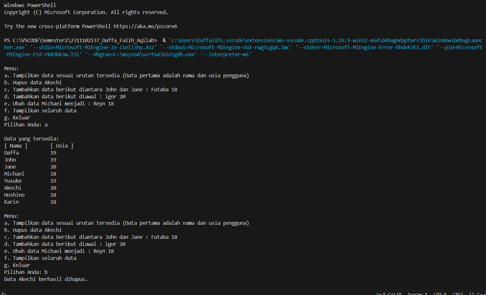
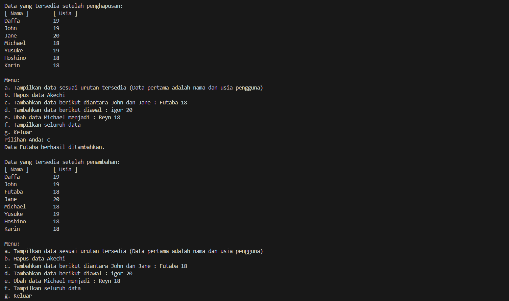
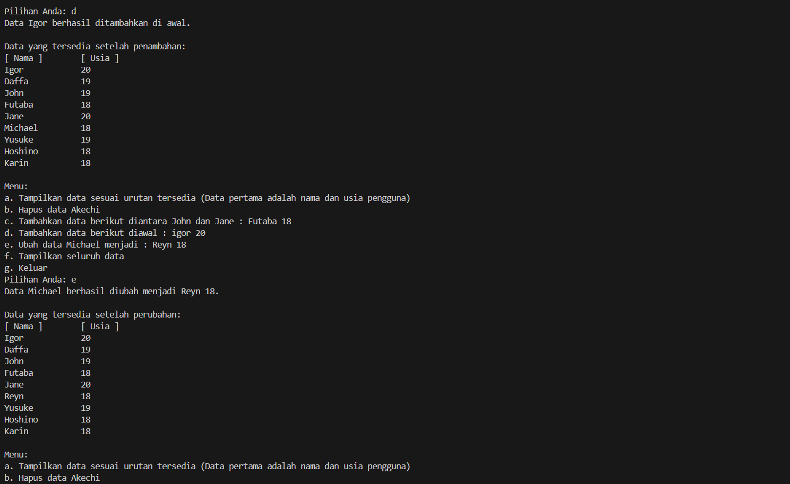
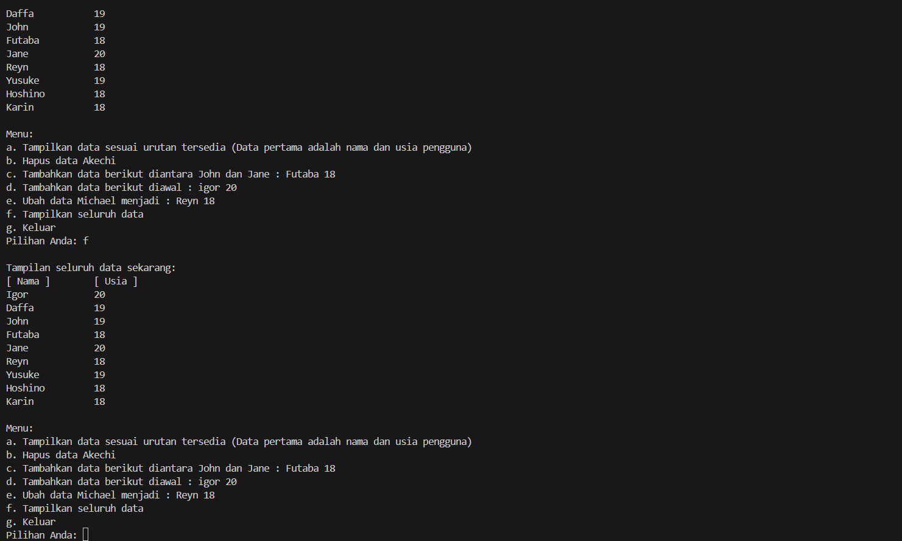
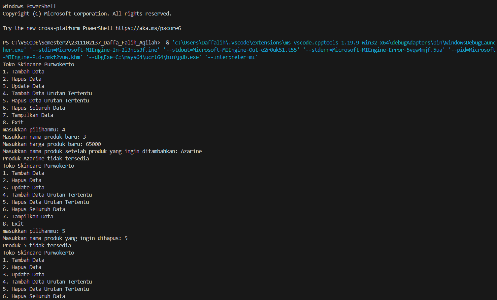
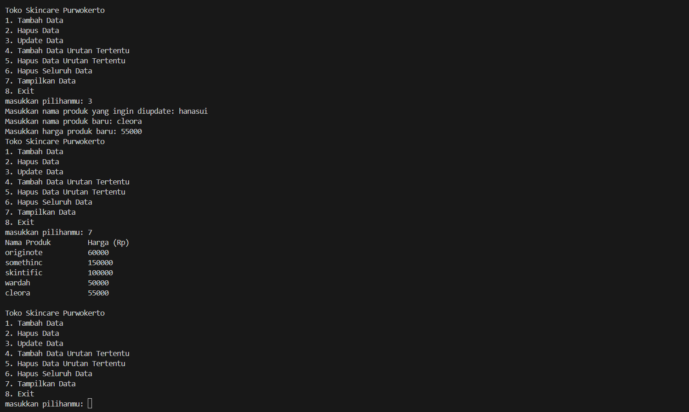

# <h1 align="center">Laporan Praktikum Modul 3 - Linked List</h1>
<p align="center">Daffa Falih Aqilah - 2311102137 /p>

## Dasar Teori

Linked List adalah class library yang termasuk ke dalam Collection, Pada dasarnya untuk tahap implementasinya Linked List digunakan untuk 
keperluan strukturisasi data sama seperti Array List. Namun perbedaanya terletak bagaimana cara menyimpan dan memaintain suatu objek. Jika di 
Array List lebih fokus ke dalam aspek menyimpan dan mengakses. Di Linked List lebih fokus kedalam aspek memanipulasi data seperti misalnya membuat
banyak insert dan delete. Sebagai tambahan untuk menyimpan objek, Linked List menyimpan alamat memori /link dari element yang mengikutinya. Jadi
setiap element berisi link atau bisa disebut simpul/node yang terhubung satu sama lain dengan element berikutnya. 

a. Single Linked List
Single Linked List adalah sebuah LINKED LIST yang menggunakan sebuah variabel pointer saja untuk menyimpan banyak data dengan metode LINKED 
LIST, suatu daftar isi yang saling berhubungan. Berikut contoh gambar dari konsep single linkedlist Data terletak pada sebuah lokasi dalam s
ebuah memory. Setiap node memiliki pointer (penunjuk) yang menunjuk ke node berikutnya sehingga terbentuk suatu untaian yang disebut 
single LINKED LIST. Bila dalam single LINKED LIST pointer hanya dapat bergerak ke satu arah saja, maju / mundur, kanan / kiri, 
sehingga pencarian datanya juga hanya satu arah saja. 

b. Double Linked List 
Double Linked List adalah elemen-elemen yang dihubungkan dengan dua pointer 
dalam satu elemen dan list dapat melintas baik di depan atau belakang.
Elemen double link list terdiri dari tiga bagian: 
 Bagian data informasi 
 Pointer next yang menunjuk ke elemen berikutnya 
 Pointer prev yang menunjuk ke elemen sebelumnya 
Berikut contoh gambar dari konsep double linked list: 
Setiap node pada linked list mempunyai field yang berisi data dan pointer ke node 
berikutnya & ke node sebelumnya. 
Untuk pembentukan node baru , mulanya pointer next dan prev akan menunjuk ke 
nilai NULL. 
Selanjutnya pointer prev akan menunjuk ke node sebelumnya , dan pointer next 
akan menunjuk ke node selanjutnya pada list.

## Guided 

### 1. [Latihan Single Linked List]

```C++
#include <iostream>
using namespace std;
///PROGRAM SINGLE LINKED LIST NON-CIRCULAR
//Deklarasi Struct Node
struct Node{
int data;
Node *next;
};
Node *head;
Node *tail;
//Inisialisasi Node
void init(){
head = NULL;
tail = NULL;
}
// Pengecekan
bool isEmpty(){
if (head == NULL)
return true;
else
return false;
}
//Tambah Depan
void insertDepan(int nilai){
//Buat Node baru
Node *baru = new Node;
baru->data = nilai;
baru->next = NULL;
if (isEmpty() == true){
head = tail = baru;
tail->next = NULL;
}
else{
baru->next = head;
head = baru;
}
}
//Tambah Belakang
void insertBelakang(int nilai){
//Buat Node baru
Node *baru = new Node;
baru->data = nilai;
baru->next = NULL;
if (isEmpty() == true){
head = tail = baru;
tail->next = NULL;
}
else{
tail->next = baru;
tail = baru;
}
}
//Hitung Jumlah List
int hitungList(){
Node *hitung;
hitung = head;
int jumlah = 0;
while( hitung != NULL ){
jumlah++;
hitung = hitung->next;
}
return jumlah;
}
//Tambah Tengah
void insertTengah(int data, int posisi){
if( posisi < 1 || posisi > hitungList() ){
cout << "Posisi diluar jangkauan" << endl;
}
else if( posisi == 1){
cout << "Posisi bukan posisi tengah" <<
endl;
}
else{
Node *baru, *bantu;
baru = new Node();
baru->data = data;
// tranversing
bantu = head;
int nomor = 1;
while( nomor < posisi - 1 ){
bantu = bantu->next;
nomor++;
}
baru->next = bantu->next;
bantu->next = baru;
}
}
//Hapus Depan
void hapusDepan() {
Node *hapus;
if (isEmpty() == false){
if (head->next != NULL){
hapus = head;
head = head->next;
delete hapus;
}
else{
head = tail = NULL;
}
}
else{
cout << "List kosong!" << endl;
}
}
//Hapus Belakang
void hapusBelakang() {
Node *hapus;
Node *bantu;
if (isEmpty() == false){
if (head != tail){
hapus = tail;
bantu = head;
while (bantu->next != tail){
bantu = bantu->next;
}
tail = bantu;
tail->next = NULL;
delete hapus;
}
else{
head = tail = NULL;
}
}
else{
cout << "List kosong!" << endl;
}
}
//Hapus Tengah
void hapusTengah(int posisi){
Node *hapus, *bantu, *bantu2;
if( posisi < 1 || posisi > hitungList() ){
cout << "Posisi di luar jangkauan" << endl;
}
else if( posisi == 1){
cout << "Posisi bukan posisi tengah" <<
endl;
}
else{
int nomor = 1;
bantu = head;
while( nomor <= posisi ){
if( nomor == posisi-1 ){
bantu2 = bantu;
}
if( nomor == posisi ){
hapus = bantu;
}
bantu = bantu->next;
nomor++;
}
bantu2->next = bantu;
delete hapus;
}
}
//Ubah Depan
void ubahDepan(int data){
if (isEmpty() == false){
head->data = data;
}
else{
cout << "List masih kosong!" << endl;
}
}
//Ubah Tengah
void ubahTengah(int data, int posisi){
Node *bantu;
if (isEmpty() == false){
if( posisi < 1 || posisi > hitungList() ){
cout << "Posisi di luar jangkauan" <<
endl;
}
else if( posisi == 1){
cout << "Posisi bukan posisi tengah" <<
endl;
}
else{
bantu = head;
int nomor = 1;
while (nomor < posisi){
bantu = bantu->next;nomor++;
}
bantu->data = data;
}
}
else{
cout << "List masih kosong!" << endl;
}
}
//Ubah Belakang
void ubahBelakang(int data){
if (isEmpty() == false){
tail->data = data;
}
else{
cout << "List masih kosong!" << endl;
}
}
//Hapus List
void clearList(){
Node *bantu, *hapus;
bantu = head;
while (bantu != NULL){
hapus = bantu;bantu = bantu->next;
delete hapus;
}
head = tail = NULL;
cout << "List berhasil terhapus!" << endl;
}
//Tampilkan List
void tampil(){
Node *bantu;
bantu = head;
if (isEmpty() == false){
while (bantu != NULL){
cout << bantu->data << ends;
bantu = bantu->next;
}
cout << endl;
}
else{
cout << "List masih kosong!" << endl;
}
}
int main(){
init();
insertDepan(3);tampil();
insertBelakang(5);
tampil();
insertDepan(2);
tampil();
insertDepan(1);
tampil();
hapusDepan();
tampil();
hapusBelakang();
tampil();
insertTengah(7,2);
tampil();
hapusTengah(2);
tampil();
ubahDepan(1);
tampil();
ubahBelakang(8);
tampil();
ubahTengah(11, 2);
tampil();
return 0;
}

```
Kode di atas merupakan program untuk mengimplementasikan struktur data Linked List non-circular dalam bahasa C++. Program ini memiliki berbagai fungsi untuk memanipulasi data dalam list, seperti:

Inisialisasi: init() digunakan untuk menginisialisasi list dengan nilai NULL.

Penambahan data: insertDepan() dan insertBelakang() digunakan untuk menambahkan data baru di depan dan belakang list. insertTengah() digunakan untuk menambahkan data di posisi tengah list.

Penghapusan data: hapusDepan() dan hapusBelakang() digunakan untuk menghapus data di depan dan belakang list. hapusTengah() digunakan untuk menghapus data di posisi tengah list.

Perubahan data: ubahDepan() dan ubahBelakang() digunakan untuk mengubah data di depan dan belakang list. ubahTengah() digunakan untuk mengubah data di posisi tengah list.

Navigasi list: isEmpty() digunakan untuk mengecek apakah list kosong. hitungList() digunakan untuk menghitung jumlah data dalam list. tampil() digunakan untuk menampilkan seluruh data dalam list.

Penghapusan list: clearList() digunakan untuk menghapus seluruh data dalam list.

### 2. [Latihan Double Linked List]

```C++
#include <iostream>
using namespace std;
class Node {
public:int data;
Node* prev;
Node* next;
};
class DoublyLinkedList {
public:
Node* head;
Node* tail;
DoublyLinkedList() {
head = nullptr;
tail = nullptr;
}
void push(int data) {
Node* newNode = new Node;
newNode->data = data;
newNode->prev = nullptr;
newNode->next = head;
if (head != nullptr) {
head->prev = newNode;
}
else {
tail = newNode;
}
head = newNode;
}
void pop() {
if (head == nullptr) {
return;
}
Node* temp = head;
head = head->next;
if (head != nullptr) {
head->prev = nullptr;
}
else {
tail = nullptr;
}
delete temp;
}
bool update(int oldData, int newData) {
Node* current = head;while (current != nullptr) {
if (current->data == oldData) {
current->data = newData;
return true;
}
current = current->next;
}
return false;
}
void deleteAll() {
Node* current = head;
while (current != nullptr) {
Node* temp = current;
current = current->next;
delete temp;
}
head = nullptr;
tail = nullptr;
}
void display() {
Node* current = head;
while (current != nullptr) {
cout << current->data << " ";
current = current->next;
}
cout << endl;
}
};
int main() {
DoublyLinkedList list;
while (true) {
cout << "1. Add data" << endl;
cout << "2. Delete data" << endl;
cout << "3. Update data" << endl;
cout << "4. Clear data" << endl;
cout << "5. Display data" << endl;
cout << "6. Exit" << endl;int choice;
cout << "Enter your choice: ";
cin >> choice;
switch (choice) {
case 1: {
int data;
cout << "Enter data to add: ";
cin >> data;
list.push(data);
break;
}
case 2: {
list.pop();
break;
}
case 3: {
int oldData, newData;
cout << "Enter old data: ";
cin >> oldData;
cout << "Enter new data: ";
cin >> newData;
bool updated = list.update(oldData,
newData);
if (!updated) {
cout << ".Data not found" << endl;
}
break;
}
case 4: {
list.deleteAll();
break;
}
case 5: {
list.display();
break;
}
case 6: {
return 0;
}
default: {
cout << "Invalid choice" << endl;
break;
}
}
}
return 0;
}
```
Kode C++ ini mengimplementasikan Doubly Linked List, sebuah struktur data yang menyimpan kumpulan data secara berurut dengan tiap elemen memiliki kaitan ke elemen sebelum dan sesudahnya. Kode ini memungkinkan pengguna untuk menambahkan data ke awal list, menghapus data dari awal list, memperbarui data tertentu, menghapus semua data, menampilkan seluruh data, dan keluar dari program melalui menu interaktif.

## Unguided 

### 1. [Soal mengenai Single Linked List]

Buatlah program menu Single Linked List Non-Circular untuk
menyimpan Nama dan usia mahasiswa, dengan menggunakan inputan
dari user. Lakukan operasi berikut:
a. Masukkan data sesuai urutan berikut. (Gunakan insert depan,
belakang atau tengah). Data pertama yang dimasukkan adalah
nama dan usia anda.
[Nama anda] [Usia anda]
John 19
Jane 20
Michael 18
Yusuke 19
Akechi 20
Hoshino 18
Karin 18
b. Hapus data Akechi
c. Tambahkan data berikut diantara John dan Jane : Futaba 18
d. Tambahkan data berikut diawal : Igor 20
e. Ubah data Michael menjadi : Reyn 18
f. Tampilkan seluruh data

```C++
// Daffa Falih Aqilah - 2311102137 - S1IF-11-D

#include <iostream>
using namespace std;

struct Node {
    string nama_138;
    int usia_138;
    Node* next_138;
};

Node* head_138 = nullptr;

void tampilkanList_138() {
    cout << "[ Nama ]" << "\t" << "[ Usia ]" << endl;
    Node* saatIni_138 = head_138;
    while (saatIni_138 != nullptr) {
        cout << saatIni_138->nama_138 << "\t\t" << saatIni_138->usia_138 << endl;
        saatIni_138 = saatIni_138->next_138;
    }
}

void insertDepan_138(string nama_138, int usia_138) {
    Node* baru_138 = new Node;
    baru_138->nama_138 = nama_138;
    baru_138->usia_138 = usia_138;
    baru_138->next_138 = head_138;
    head_138 = baru_138;
}

void insertBelakang_138(string nama_138, int usia_138) {
    Node* baru_138 = new Node;
    baru_138->nama_138 = nama_138;
    baru_138->usia_138 = usia_138;
    baru_138->next_138 = nullptr;
    if (head_138 == nullptr) {
        head_138 = baru_138;
    }
    else {
        Node* temp_138 = head_138;
        while (temp_138->next_138 != nullptr) {
            temp_138 = temp_138->next_138;
        }
        temp_138->next_138 = baru_138;
    }
}

void insertTengah_138(string nama_138, int usia_138, int posisi_138) {
    Node* baru_138 = new Node;
    baru_138->nama_138 = nama_138;
    baru_138->usia_138 = usia_138;
    Node* bantu_138 = head_138;
    for (int i_138 = 1; i_138 < posisi_138 - 1; i_138++) {
        if (bantu_138 != nullptr) {
            bantu_138 = bantu_138->next_138;
        }
    }
    if (bantu_138 != nullptr) {
        baru_138->next_138 = bantu_138->next_138;
        bantu_138->next_138 = baru_138;
    }
}

void hapusData_138(string nama_138) {
    Node* hapus_138 = head_138;
    Node* prev_138 = nullptr;
    while (hapus_138 != nullptr && hapus_138->nama_138 != nama_138) {
        prev_138 = hapus_138;
        hapus_138 = hapus_138->next_138;
    }
    if (hapus_138 == nullptr) {
        cout << "Data tidak ditemukan" << endl;
        return;
    }
    if (prev_138 == nullptr) {
        head_138 = hapus_138->next_138;
    }
    else {
        prev_138->next_138 = hapus_138->next_138;
    }
    delete hapus_138;
}

void ubahData_138(string nama_138, string newnama_138, int newusia_138) {
    Node* temp_138 = head_138;
    while (temp_138 != nullptr && temp_138->nama_138 != nama_138) {
        temp_138 = temp_138->next_138;
    }
    if (temp_138 != nullptr) {
        temp_138->nama_138 = newnama_138;
        temp_138->usia_138 = newusia_138;
    }
}

void tampilkanData() {
    Node* temp_138 = head_138;
    while (temp_138 != nullptr) {
        cout << temp_138->nama_138 << " " << temp_138->usia_138 << endl;
        temp_138 = temp_138->next_138;
    }
}

int main() {
    insertBelakang_138("Daffa", 19);
    insertBelakang_138("John", 19);
    insertBelakang_138("Jane", 20);
    insertBelakang_138("Michael", 18);
    insertBelakang_138("Yusuke", 19);
    insertBelakang_138("Akechi", 20);
    insertBelakang_138("Hoshino", 18);
    insertBelakang_138("Karin", 18);

    char pilihan_138;
    do {
        cout << "\nMenu:\n";
        cout << "a. Tampilkan data sesuai urutan tersedia (Data pertama adalah nama dan usia pengguna)\n";
        cout << "b. Hapus data Akechi\n";
        cout << "c. Tambahkan data berikut diantara John dan Jane : Futaba 18\n";
        cout << "d. Tambahkan data berikut diawal : igor 20\n";
        cout << "e. Ubah data Michael menjadi : Reyn 18\n";
        cout << "f. Tampilkan seluruh data\n";
        cout << "g. Keluar\n";
        cout << "Pilihan Anda: ";
        cin >> pilihan_138;

        switch (pilihan_138) {
            case 'a':
                cout << "\nData yang tersedia:\n";
                tampilkanList_138();
                break;
            case 'b':
                hapusData_138("Akechi");
                cout << "Data Akechi berhasil dihapus.\n";
                cout << "\nData yang tersedia setelah penghapusan:\n";
                tampilkanList_138();
                break;
            case 'c':
                insertTengah_138("Futaba", 18, 3); 
                cout << "Data Futaba berhasil ditambahkan.\n";
                cout << "\nData yang tersedia setelah penambahan:\n";
                tampilkanList_138();
                break;
            case 'd':
                insertDepan_138("Igor", 20);
                cout << "Data Igor berhasil ditambahkan di awal.\n";
                cout << "\nData yang tersedia setelah penambahan:\n";
                tampilkanList_138();
                break;
            case 'e':
                ubahData_138("Michael", "Reyn", 18);
                cout << "Data Michael berhasil diubah menjadi Reyn 18.\n";
                cout << "\nData yang tersedia setelah perubahan:\n";
                tampilkanList_138();
                break;
            case 'f':
                cout << "\nTampilan seluruh data sekarang:\n";
                tampilkanList_138();
                break;
            case 'g':
                cout << "Terima kasih, program selesai.\n";
                break;
            default:
                cout << "Pilihan tidak valid, silakan coba lagi.\n";
                break;
        }
    } while (pilihan_138 != 'g');

    return 0;
}

```
Kode di atas merupakan program C++ untuk mengelola data dalam linked list. Program ini memungkinkan user untuk melakukan berbagai operasi seperti:

Menambahkan data di awal, di tengah, dan di akhir linked list.
Menghapus data dari linked list.
Mengubah data dalam linked list.
Menampilkan data dalam linked list.
Program ini menggunakan struct Node untuk menyimpan data (nama dan usia) dan pointer ke node berikutnya. Program ini memiliki beberapa fungsi untuk melakukan operasi-operasi tersebut, seperti insertDepan(), insertBelakang(), insertTengah(), hapusData(), ubahData(), dan tampilkanList().

Program ini juga memiliki menu interaktif yang memungkinkan user untuk memilih operasi yang ingin dilakukan. User dapat memilih untuk melihat data, menambahkan data, menghapus data, mengubah data, atau keluar dari program.

### 2. [Buatlah program Input array tiga dimensi (seperti pada guided) tetapi jumlah atau ukuran elemennya diinputkan oleh user!]

Modifikasi Guided Double Linked List dilakukan dengan penambahan operasi untuk menambah data, menghapus, dan update di tengah / di urutan tertentu
yang diminta. Selain itu, buatlah agar tampilannya menampilkan Nama produk dan harga.

Nama Produk Harga
Originote 60.000
Somethinc 150.000
Skintific 100.000
Wardah 50.000
Hanasui 30.000

Case:
1.Tambahkan produk Azarine dengan harga 65000 diantara
Somethinc dan Skintific
2.Hapus produk wardah
3.Update produk Hanasui menjadi Cleora dengan harga 55.000
4.Tampilkan menu seperti dibawah ini
Toko Skincare Purwokerto
1.Tambah Data
2.Hapus Data
3.Update Data
4.Tambah Data Urutan Tertentu
5.Hapus Data Urutan Tertentu
6.Hapus Seluruh Data
7.Tampilkan Data
8.Exit

Pada menu 7, tampilan akhirnya akan menjadi seperti dibawah
ini :
Nama Produk Harga
Originote 60.000
Somethinc 150.000
Azarine 65.000
Skintific 100.000
Cleora 55.000

```C++
// Daffa Falih Aqilah - 2311102137 - S1IF-11-D

#include <iostream>
#include <iomanip>
using namespace std;

// Deklarasi kelas Node untuk memperlihatkan simpul dalam linked list
class Node {
public:
    string nama_131;
    double harga_131;
    Node* prev;
    Node* next;
};

// Deklarasi kelas DoublyLinkedList untuk menggunakan double linked list
class DoublyLinkedList {
public:
    Node* head;
    Node* tail;

    // inisialisasi linked list
    DoublyLinkedList() {
        head = nullptr;
        tail = nullptr;
    }

    // fungsi untuk menambahkan simpul baru di awal linked list
    void push(string nama_131, double harga_131) {
        Node* newNode = new Node;
        newNode->nama_131 = nama_131;
        newNode->harga_131 = harga_131;
        newNode->prev = nullptr;
        newNode->next = head;

        if (head != nullptr) {
            head->prev = newNode;
        } else {
            tail = newNode;
        }
        head = newNode;
    }

    // fungsi untuk menghapus simpul dari awal linked list
    void pop() {
        if (head == nullptr) {
            return;
        }
        Node* temp = head;
        head = head->next;
        if (head != nullptr) {
            head->prev = nullptr;
        } else {
            tail = nullptr;
        }
        delete temp;
    }

    // fungsi untuk memperbarui data produk berdasarkan nama produk yang lama
    bool update(string oldNama_131, string newNama_131, double newHarga_131) {
        Node* current = head;
        while (current != nullptr) {
            if (current->nama_131 == oldNama_131) {
                current->nama_131 = newNama_131;
                current->harga_131 = newHarga_131;
                return true;
            }
            current = current->next;
        }
        return false;
    }

    // fungsi untuk menghapus semua simpul dalam linked list
    void deleteAll() {
        Node* current = head;
        while (current != nullptr) {
            Node* temp = current;
            current = current->next;
            delete temp;
        }
        head = nullptr;
        tail = nullptr;
    }

    // fungsi untuk menampilkan semua data produk dalam linked list
    void display() {
    Node* current = head;
    cout << left << setw(20) << "Nama Produk" << setw(10) << "Harga (Rp)" << endl;
    while (current != nullptr) {
        cout << left << setw(20) << current->nama_131 << setw(10) << current->harga_131 << endl;
        current = current->next;
    }
    cout << endl;
}

    // fungsi untuk menyisipkan simpul baru setelah simpul tertentu
    void insertAfter(string namaProduk_131, double hargaProduk_131, string namaBaruProduk_131) {
        Node* newNode = new Node;
        newNode->nama_131 = namaProduk_131;
        newNode->harga_131 = hargaProduk_131;

        Node* current = head;
        while (current != nullptr && current->nama_131 != namaBaruProduk_131 ){
            current = current->next;
        }
        if (current == nullptr) {
            cout << "Produk " << namaBaruProduk_131 << " tidak tersedia" << endl;
            return;
        }
        newNode->prev = current;
        newNode->next = current->next;
        if (current->next != nullptr) {
            current->next->prev = newNode;
        } else {
            tail = newNode;
        }
        current->next = newNode;
    }

    // fungsi untuk menghapus simpul dengan nama produk tertentu
    void deleteNode(string namaProduk_131) {
        Node* current = head;
        while (current != nullptr && current->nama_131 != namaProduk_131) {
            current = current->next;
        }

        if (current == nullptr) {
            cout << "Produk " << namaProduk_131 << " tidak tersedia" << endl;
            return;
        }

        if (current->prev != nullptr) {
            current->prev->next = current->next;
        } else {
            head = current->next;
        }

        if (current->next != nullptr) {
            current->next->prev = current->prev;
        } else {
            tail = current->prev;
        }

        delete current;
    }
};

int main() {
    DoublyLinkedList list;

    // Menambahkan data saat program dimulai
    list.push("hanasui", 30000);
    list.push("wardah", 50000);
    list.push("skintific", 100000);
    list.push("somethinc", 150000);
    list.push("originote", 60000);

    while (true) {
        //menu utama program ini
        cout << "Toko Skincare Purwokerto"<<endl;
        cout << "1. Tambah Data" << endl;
        cout << "2. Hapus Data" << endl;
        cout << "3. Update Data" << endl;
        cout << "4. Tambah Data Urutan Tertentu" << endl;
        cout << "5. Hapus Data Urutan Tertentu" << endl;
        cout << "6. Hapus Seluruh Data" << endl;
        cout << "7. Tampilkan Data" << endl;
        cout << "8. Exit" << endl;
        //memiihih menu sesuai dengan yang diinginkan user
        int choice;
        cout << "masukkan pilihanmu: ";
        cin >> choice;
        switch (choice) {
            
            //menambahkan data didalam double linked list
            case 1: {
                string nama_131;
                double harga_131;
                cout << "Masukkan nama produk: ";
                cin >> nama_131;
                cout << "Masukkan harga produk: ";
                cin >> harga_131;
                list.push(nama_131, harga_131);
                break;
            }
            //menghapus data didalam double linked list
            case 2: {
                string nama_131;
                cout << "Masukkan nama produk yang ingin dihapus: ";
                cin >> nama_131;
                list.deleteNode(nama_131);
                break;
            }
            //mengupdate data didalam linked list
            case 3: {
                string oldNama_131, newNama_131;
                double newHarga_131;
                cout << "Masukkan nama produk yang ingin diupdate: ";
                cin >> oldNama_131;
                cout << "Masukkan nama produk baru: ";
                cin >> newNama_131;
                cout << "Masukkan harga produk baru: ";
                cin >> newHarga_131;
                bool updated = list.update(oldNama_131, newNama_131, newHarga_131);
                if (!updated) {
                    cout << "Data tidak tersedia" << endl;
                }
                break;
            }
            //menambahkan data dengan urutan yang diinginkan user
            case 4: {
                string namaProduk_131, namaBaruProduk_131;
                double hargaProduk_131;
                cout << "Masukkan nama produk baru: ";
                cin >> namaProduk_131;
                cout << "Masukkan harga produk baru: ";
                cin >> hargaProduk_131;
                cout << "Masukkan nama produk setelah produk yang ingin ditambahkan: ";
                cin >> namaBaruProduk_131;
                list.insertAfter(namaProduk_131, hargaProduk_131, namaBaruProduk_131);
                break;
            }
            //menghapus data dengan urutan yang diinginkan user
            case 5: {
                string namaProduk_131;
                cout << "Masukkan nama produk yang ingin dihapus: ";
                cin >> namaProduk_131;
                list.deleteNode(namaProduk_131);
                break;
            }
            //menghapus semua data yang ada didalam double linked list
            case 6: {
                list.deleteAll();
                break;
            }
            //menampilkan seluruh data yang ada didalam double linked list
            case 7: {
                list.display();
                break;
            }
            //keluar dari program double linked list
            case 8: {
                return 0;
            }
            //jika user salah menginputkan pilihan maka akan menampilkan pesan berikut
            default: {
                cout << "Pilihan tidak valid" << endl;
                break;
            }
        }
    }

return
}
```
Kode di atas merupakan program C++ untuk mengelola data dalam linked list. Program ini memungkinkan user untuk melakukan berbagai operasi seperti:

Menambahkan data di awal, di tengah, dan di akhir linked list.
Menghapus data dari linked list.
Mengubah data dalam linked list.
Menampilkan data dalam linked list.
Program ini menggunakan struct Node untuk menyimpan data (nama dan usia) dan pointer ke node berikutnya. Program ini memiliki beberapa fungsi untuk melakukan operasi-operasi tersebut, seperti insertDepan(), insertBelakang(), insertTengah(), hapusData(), ubahData(), dan tampilkanList().

Program ini juga memiliki menu interaktif yang memungkinkan user untuk memilih operasi yang ingin dilakukan. User dapat memilih untuk melihat data, menambahkan data, menghapus data, mengubah data, atau keluar dari program.

#### Output Unguided 1:





#### Output Unguided 2:



Kode di atas digunakan untuk mencetak teks "ini adalah file code guided praktikan" ke layar menggunakan function cout untuk mengeksekusi nya.

## Kesimpulan

Mempelajari struktur data dan algoritma linked list memberikan banyak manfaat bagi programmer. Pertama, memahami konsep dasar struktur data:
linked list merupakan struktur data dinamis yang terdiri dari node-node yang terhubung satu sama lain. Setiap node memiliki data dan pointer yang
menunjuk ke node berikutnya. Pemahaman ini membantu programmer untuk memilih struktur data yang tepat untuk kebutuhan program mereka.

Kedua, meningkatkan kemampuan algoritma: mempelajari algoritma pada linked list, seperti penambahan, penghapusan, dan pencarian data, melatih
kemampuan programmer untuk memecahkan masalah dan merancang algoritma yang efisien. Kemampuan ini sangat penting untuk membangun program yang
handal dan berkinerja tinggi.

## Referensi
1. Implementasi Linked List pada Sistem Rekomendasi Film (2023) Jurnal Ilmiah Komputer dan Informatika, Vol. 14, No. 2
2. Analisis Performa Linked List dan Array dalam Implementasi Stack (2022) Jurnal Informatika dan Teknologi Informasi, Vol. 7, No. 2