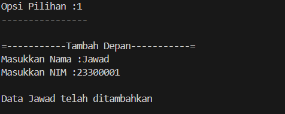

# <h1 align="center">Laporan Praktikum Modul 4 - LINKED LIST CIRCULAR DAN NON CIRCULAR </h1>
<p align="center">Daffa Falih Aqilah - 2311102137 /p>

## Dasar Teori

Linked List adalah struktur data yang terdiri dari kumpulan node yang saling terhubung. Setiap node memiliki data dan pointer yang menunjuk ke
node berikutnya. Ada dua jenis linked list: non-circular dan circular.

Linked List Non-Circular memiliki struktur di mana node terakhir memiliki pointer next yang bernilai NULL. Ada pointer head yang menunjuk ke node
pertama. Operasi pada linked list non-circular termasuk penambahan node, penghapusan node, dan traversal. Kelebihan linked list non-circular
adalah penyisipan dan penghapusan node di tengah list mudah dilakukan, dan penggunaan memori lebih efisien dibandingkan array. Kekurangannya
adalah akses data tidak langsung dan membutuhkan waktu lebih lama dibandingkan array.

Linked List Circular memiliki struktur di mana node terakhir memiliki pointer next yang menunjuk ke node pertama. Pointer head juga menunjuk ke
node pertama. Operasi pada linked list circular sama dengan linked list non-circular. Kelebihan linked list circular adalah penyisipan dan
penghapusan node di tengah list mudah dilakukan, penggunaan memori lebih efisien dibandingkan array, dan akses data lebih mudah dan cepat
dibandingkan linked list non-circular. Kekurangannya adalah implementasi lebih kompleks dibandingkan linked list non-circular.

## Guided 

### 1. [Linked List Non Circular]

```C++
// Daffa Falih Aqilah - 2311102137 - S1IF-11-D

#include <iostream>
using namespace std;
/// PROGRAM SINGLE LINKED LIST NON-CIRCULAR
// Deklarasi Struct Node
struct Node
{
    int data;
    Node *next;
};
Node *head;
Node *tail;

// Inisialisasi Node
void init()
{
    head = NULL;
    tail = NULL;
}
// Pegecekan
bool isEmpty()
{
    if (head == NULL)
        return true;
    else
        return false;
}
// Tambah depan
void insertDepan(int nilai)
{
    // Buat Node Baru
    Node *baru = new Node;
    baru->data = nilai;
    baru->next = NULL;
    if (isEmpty() == true)
    {
        head = tail = baru;
        tail->next = NULL;
    }
    else
    {
        baru->next = head;
        head = baru;
    }
}
// Tambah belakang
void insertBelakang(int nilai)
{
    // Buat Node baru
    Node *baru = new Node;
    baru->data = nilai;
    baru->next = NULL;
    if (isEmpty() == true)
    {
        head = tail = baru;
        tail->next = NULL;
    }
    else
    {
        tail->next = baru;
        tail = baru;
    }
}
// Hitung jumlah list
int hitungList()
{
    Node *hitung;
    hitung = head;
    int jumlah = 0;
    while (hitung != NULL)
    {
        jumlah++;
        hitung = hitung->next;
    }
    return jumlah;
}
// Tambah tengah
void insertTengah(int data, int posisi)
{
    if (posisi < 1 || posisi > hitungList())
    {
        cout << "Posisi diluar jangkauan" << endl;
    }
    else
    {
        Node *baru, *bantu;
        baru = new Node();
        baru->data = data;
        // Traversing
        bantu = head;
        int nomor = 1;
        while (nomor < posisi - 1)
        {
            bantu = bantu->next;
            nomor++;
        }
        baru->next = bantu->next;
        bantu->next = baru;
    }
}
// Hapus depan
void hapusDepan()
{
    Node *hapus;
    if (isEmpty() == false)
    {
        if (head->next != NULL)
        {
            hapus = head;
            head = head->next;
            delete hapus;
        }
        else
        {
            head = tail = NULL;
        }
    }
    else
    {
        cout << "List kosong!" << endl;
    }
}
// Hapus Belakang
void hapusBelakang()
{
    Node *hapus;
    Node *bantu;
    if (isEmpty() == false)
    {
        if (head != tail)
        {
            hapus = tail;
            bantu = head;
            while (bantu->next != tail)
            {
                bantu = bantu->next;
            }
            tail = bantu;
            tail->next = NULL;
            delete hapus;
        }
        else
        {
            head = tail = NULL;
        }
    }
    else
    {
        cout << "List kosong!" << endl;
    }
}
// Hapus Tengah
void hapusTengah(int posisi)
{
    Node *bantu, *hapus, *sebelum;
    if (posisi < 1 || posisi > hitungList())
    {
        cout << "Posisi di luar jangkauan" << endl;
    }
    else if (posisi == 1)
    {
        cout << "Posisi bukan posisi tengah" << endl;
    }
    else
    {
        int nomor = 1;
        bantu = head;
        while (nomor <= posisi)
        {
            if (nomor == posisi - 1)
            {
                sebelum = bantu;
            }
            if (nomor == posisi)
            {
                hapus = bantu;
            }
            bantu = bantu->next;
            nomor++;
        }
        sebelum->next = bantu;
        delete hapus;
    }
}
// Ubah depan
void ubahDepan(int data)
{
    if (isEmpty() == 0)
    {
        head->data;
    }
    else
    {
        cout << "List masih kosong!" << endl;
    }
}
// Ubah tengah
void ubahTengah(int data, int posisi)
{
    Node *bantu;
    if (isEmpty() == 0)
    {
        if (posisi < 1 || posisi > hitungList())
        {
            cout << "Posisi diluar jangkauan" << endl;
        }
        else if (posisi == 1)
        {
            cout << "Posisi bukan posisi tengah" << endl;
        }
        else
        {
            bantu = head;
            int nomor = 1;
            while (nomor < posisi)
            {
                bantu->data = data;
            }
        }
    }
    else
    {
        cout << "List Masih kosong!" << endl;
    }
}
//Ubah belakang
void ubahBelakang(int data){
    if(isEmpty() == 0){
        tail->data = data;
    }
    else{
        cout << "List masih kosong!"<<endl;
    }
}
//Hpus List
void clearList(){
    Node *bantu, *hapus;
    bantu = head;
    while(bantu != NULL){
        hapus = bantu;
        bantu = bantu->next;
        delete hapus;
    }
    head = tail = NULL;
    cout << "List berhasil terhapus"<<endl;
}
//Tampilkan list
void tampil(){
    Node *bantu;
    bantu = head;
    if(isEmpty() == false){
        while(bantu != NULL){
            cout << bantu->data <<ends;
            bantu = bantu->next;
        }
        cout << endl;
    }
    else{
        cout << "List masih kosong"<<endl;
    }
}
int main() 
{ 
init(); 
insertDepan(3); 
tampil(); 
insertBelakang(5); 
tampil(); 
insertDepan(2); 
tampil(); 
insertDepan(1); 
tampil(); 
hapusDepan(); 
tampil(); 
hapusBelakang(); 
tampil(); 
insertTengah(7, 2); 
tampil(); 
hapusTengah(2); 
tampil(); 
ubahDepan(1); 
tampil(); 
ubahBelakang(8); 
tampil(); 
ubahTengah(11, 2); 
tampil();
return 0;
}

```
Kode yang diberikan adalah contoh program Single Linked List Non-Circular dalam bahasa C++. Program ini mendemonstrasikan berbagai operasi dasar pada linked list, seperti:

Inisialisasi:

init(): Fungsi ini menginisialisasi linked list dengan membuat head dan tail kosong.
Penambahan data:

insertDepan(int nilai): Fungsi ini menambahkan data baru di depan linked list.
insertBelakang(int nilai): Fungsi ini menambahkan data baru di belakang linked list.
insertTengah(int data, int posisi): Fungsi ini menambahkan data baru di posisi tertentu di tengah linked list.
Penghapusan data:

hapusDepan(): Fungsi ini menghapus data di depan linked list.
hapusBelakang(): Fungsi ini menghapus data di belakang linked list.
hapusTengah(int posisi): Fungsi ini menghapus data di posisi tertentu di tengah linked list.
Pengubahan data:

ubahDepan(int data): Fungsi ini mengubah data di depan linked list.
ubahBelakang(int data): Fungsi ini mengubah data di belakang linked list.
ubahTengah(int data, int posisi): Fungsi ini mengubah data di posisi tertentu di tengah linked list.
Operasi lain:

isEmpty(): Fungsi ini memeriksa apakah linked list kosong.
hitungList(): Fungsi ini menghitung jumlah data dalam linked list.
tampil(): Fungsi ini menampilkan semua data dalam linked list.
clearList(): Fungsi ini menghapus semua data dalam linked list.
Contoh penggunaan:

Program ini mendemonstrasikan penggunaan fungsi-fungsi di atas untuk menambahkan, menghapus, dan mengubah data dalam linked list. Program ini juga menampilkan data dalam linked list setelah setiap operasi.

### 2. [Linked List Circular]

```C++
// Daffa Falih Aqilah - 2311102137 - S1IF-11-D

#include <iostream>
using namespace std;

// Deklarasi Struct Node
struct Node
{
    string data;
    Node* next;
};

Node* head, * tail, * baru, * bantu, * hapus;

void init()
{
    head = NULL;
    tail = head;
}

// Pengecekan
int isEmpty()
{
    if (head == NULL)
        return 1; // true
    else
        return 0; // false
}

// Buat Node Baru
void buatNode(string data)
{
    baru = new Node;
    baru->data = data;
    baru->next = NULL;
}

// Hitung List
int hitungList()
{
    bantu = head;
    int jumlah = 0;
    while (bantu != NULL)
    {
        jumlah++;
        bantu = bantu->next;
    }
    return jumlah;
}

// Tambah Depan
void insertDepan(string data)
{
    // Buat Node baru
    buatNode(data);

    if (isEmpty() == 1)
    {
        head = baru;
        tail = head;
        baru->next = head;
    }
    else
    {
        while (tail->next != head)
        {
            tail = tail->next;
        }
        baru->next = head;
        head = baru;
        tail->next = head;
    }
}

// Tambah Belakang
void insertBelakang(string data)
{
    // Buat Node baru
    buatNode(data);

    if (isEmpty() == 1)
    {
        head = baru;
        tail = head;
        baru->next = head;
    }
    else
    {
        while (tail->next != head)
        {
            tail = tail->next;
        }
        tail->next = baru;
        baru->next = head;
    }
}

// Tambah Tengah
void insertTengah(string data, int posisi)
{
    if (isEmpty() == 1)
    {
        head = baru;
        tail = head;
        baru->next = head;
    }
    else
    {
        baru->data = data;
        // transversing
        int nomor = 1;
        bantu = head;
        while (nomor < posisi - 1)
        {
            bantu = bantu->next;
            nomor++;
        }
        baru->next = bantu->next;
        bantu->next = baru;
    }
}

// Hapus Depan
void hapusDepan()
{
    if (isEmpty() == 0)
    {
        hapus = head;
        tail = head;
        if (hapus->next == head)
        {
            head = NULL;
            tail = NULL;
            delete hapus;
        }
        else
        {
            while (tail->next != hapus)
            {
                tail = tail->next;
            }
            head = head->next;
            tail->next = head;
            hapus->next = NULL;
            delete hapus;
        }
    }
    else
    {
        cout << "List masih kosong!" << endl;
    }
}

// Hapus Belakang
void hapusBelakang()
{
    if (isEmpty() == 0)
    {
        hapus = head;
        tail = head;
        if (hapus->next == head)
        {
            head = NULL;
            tail = NULL;
            delete hapus;
        }
        else
        {
            while (hapus->next != head)
            {
                hapus = hapus->next;
            }
            while (tail->next != hapus)
            {
                tail = tail->next;
            }
            tail->next = head;
            hapus->next = NULL;
            delete hapus;
        }
    }
    else
    {
        cout << "List masih kosong!" << endl;
    }
}

// Hapus Tengah
void hapusTengah(int posisi)
{
    if (isEmpty() == 0)
    {
        // transversing
        int nomor = 1;
        bantu = head;
        while (nomor < posisi - 1)
        {
            bantu = bantu->next;
            nomor++;
        }
        hapus = bantu->next;
        bantu->next = hapus->next;
        delete hapus;
    }
    else
    {
        cout << "List masih kosong!" << endl;
    }
}

// Hapus List
void clearList()
{
    if (head != NULL)
    {
        hapus = head->next;
        while (hapus != head)
        {
            bantu = hapus->next;
            delete hapus;
            hapus = bantu;
        }
        delete head;
        head = NULL;
    }
    cout << "List berhasil terhapus!" << endl;
}

// Tampilkan List
void tampil()
{
    if (isEmpty() == 0)
    {
        tail = head;
        do
        {
            cout << tail->data << ends;
            tail = tail->next;
        } while (tail != head);
        cout << endl;
    }
    else
    {
        cout << "List masih kosong!" << endl;
    }
}

int main()
{
    init();
    insertDepan("Ayam");
    tampil();
    insertDepan("Bebek");
    tampil();
    insertBelakang("Cicak");
    tampil();
    insertBelakang("Domba");
    tampil();
    hapusBelakang();
    tampil();
    hapusDepan();
    tampil();
    insertTengah("Sapi", 2);
    tampil();
    hapusTengah(2);
    tampil();
    return 0;
}
```
Kode yang diberikan adalah contoh program Single Linked List Circular dalam bahasa C++. Program ini mendemonstrasikan berbagai operasi dasar pada linked list, seperti:

Inisialisasi:

init(): Fungsi ini menginisialisasi linked list dengan membuat head dan tail kosong.
Penambahan data:

insertDepan(string data): Fungsi ini menambahkan data baru di depan linked list.
insertBelakang(string data): Fungsi ini menambahkan data baru di belakang linked list.
insertTengah(string data, int posisi): Fungsi ini menambahkan data baru di posisi tertentu di tengah linked list.
Penghapusan data:

hapusDepan(): Fungsi ini menghapus data di depan linked list.
hapusBelakang(): Fungsi ini menghapus data di belakang linked list.
hapusTengah(int posisi): Fungsi ini menghapus data di posisi tertentu di tengah linked list.
Operasi lain:

isEmpty(): Fungsi ini memeriksa apakah linked list kosong.
hitungList(): Fungsi ini menghitung jumlah data dalam linked list.
tampil(): Fungsi ini menampilkan semua data dalam linked list.
clearList(): Fungsi ini menghapus semua data dalam linked list.

## Unguided 

### 1. [Buatlah menu untuk menambahkan, mengubah, menghapus, dan melihat Nama dan NIM mahasiswa]


```C++
// Daffa Falih Aqilah - 2311102137 - S1IF-11-D

// Daffa Falih Aqilah - 2311102137 - S1IF-11-D

#include<iostream>
#include<iomanip>

using namespace std;

// Deklarasi struct node
struct node{
    string Nama_150;
    string NIM_150;
    node *next;
};
    node *head;
    node *tail;

// Inisialisasi node head & tail
void Inisialisasi_150(){
    head = NULL;
    tail = NULL;
}

// Mengecek list 
bool isEmpty_150(){
    if(head == NULL){
        return true;
    } else {
        return false;
    }
}

// Prosedur hitung node
int HitungNode_150(){
    node *hitung = head;
    int jumlah_150 = 0;
    while (hitung != NULL){
        hitung = hitung->next;
        jumlah_150++;
    }
    return jumlah_150;
}

// Prosedur tambah depan untuk menambahkan data diawal
void TambahDepan_150(string Name, string NIM){
    node *baru = new node;
    baru->Nama_150 = Name;
    baru->NIM_150 = NIM;
    baru->next = NULL;
    if(isEmpty_150() == true){
        head = tail = baru;
        tail->next = NULL;
    } else {
        baru->next = head;
        head = baru;
    }
}

// Prosedur tambah belakang untuk menambahkan data diakhir
void TambahBelakang_150(string Name, string NIM){
    node *baru = new node;
    baru->Nama_150 = Name;
    baru->NIM_150 = NIM;
    baru->next = NULL;
    if(isEmpty_150() == true){
        head = tail = baru;
        tail->next = NULL;
    } else {
        tail->next = baru;
        tail = baru;
    }
}

// Prosedur tambah tengah untuk menambah data di tengah (posisi tertentu)
void TambahTengah_150(string Name, string NIM, int Posisi){
    if(Posisi < 1 || Posisi > HitungNode_150()){
        cout << "posisi berada diluar jangkauan!" << endl;
    } else if(Posisi == 1){
        cout << "Posisi bukan posisi tengah!"<< endl;
    } else {
        node *bantu = head;
        node *baru = new node;
        baru->Nama_150 = Name;
        baru->NIM_150 = NIM;
        int hitung = 1;
        while(hitung < Posisi - 1){
            bantu = bantu->next;
            hitung++;
        }
        baru->next = bantu->next;
        bantu->next = baru;
    }
}

// Prosedur hapus depan untuk menghapus data pertama
void HapusDepan_150(){
    node *hapus;
    if(isEmpty_150() == true){
        cout << "List masih kosong!" << endl;
    } else {
        if(head->next != NULL){
            hapus = head;
            head = head->next;
            delete hapus;
        } else {
            head = tail = NULL;
        }
    }
}

// Fungsi tampil data depan untuk menampilkan data diawal
string TampilDepan_150(){
    string NamaYangDihapus = "";
    if(isEmpty_150() == false){
        NamaYangDihapus = head->Nama_150;
    } else {
        cout << "List masih kosong" << endl;
    }
    return NamaYangDihapus;
}

// Prosedur hapus belakang untuk menghapus data diakhir
void HapusBelakang_150(){
    node *hapus, *bantu;
    if(isEmpty_150() == true){
        cout << "List masih kosong!" << endl;
    } else {
        if(head != tail){
            hapus = tail;
            bantu = head;
            while(bantu->next != tail){
                bantu = bantu->next;
            }
            tail = bantu;
            tail->next = NULL;
            delete hapus;
        } else {
            head = tail = NULL;
        }
    }
}

// Fungsi tampil data belakang untuk menampilkan data pertama
string TampilBelakang_150(){
    string NamaYangDihapus = "";
    if(isEmpty_150() == false){
        NamaYangDihapus = tail->Nama_150;
    } else {
        cout << "List masih kosong" << endl;
    }
    return NamaYangDihapus;
}


// Prosedur hapus tengah untuk menghapus data urutan tertentu
void HapusTengah_150(int posisi){
    if(posisi < 1 || posisi > HitungNode_150()){ 
        cout << "Posisi diluar jangkauan" << endl;
    } else if(posisi == 1){
        cout << "Posisi bukan posisi tengah" << endl;
    } else {
        node *hapus, *bantu, *bantu2;
        bantu = head;
        int nomor = 1;
        while(nomor <= posisi){
            if(nomor == posisi - 1){
                bantu2 = bantu;
            } else if(nomor == posisi){
                hapus = bantu;
            }
            bantu = bantu->next;
            nomor++; 
        }
        bantu2->next = bantu;
        delete hapus;
    }
}

// Fungsi tampil data tengah untuk menampilkan data posisi tertentu
string TampilTengah_150(int Posisi){
    string NamaYangDihapus = "";
    node *tampil = head;
    node *bantu;
    if(isEmpty_150() == false){
        int nomor = 1;
        while (nomor <= Posisi - 1){
            if(nomor == Posisi - 1){
                bantu = tampil;
            }
            tampil = tampil->next;
            nomor++;
        }
        bantu->next = tampil;
        NamaYangDihapus = tampil->Nama_150;       
    } else {
        cout << "List masih kosong" << endl;
    }
    return NamaYangDihapus;
}

// Prosedur Ubah depan untuk mengubah data pertama
void UbahDepan_150(string namaBaru, string NIMbaru){
    if(isEmpty_150() == true){
        cout << "List masih kosong!" << endl;
    } else {
        head->Nama_150 = namaBaru;
        head->NIM_150 = NIMbaru;
    }
}

// Prosedur ubah belakang untuk mengubah data terakhir
void UbahBelakang_150(string namaBaru, string NIMbaru){
    if(isEmpty_150() == true){
        cout << "List masih kosong!" << endl;
    } else {
        tail->Nama_150 = namaBaru;
        tail->NIM_150 = NIMbaru;
    }
}

// Prosedur ubah tengah untuk mengubah data posisi tertentu
void UbahTengah_150(string namaBaru, string NIMbaru, int Posisi){
    if(isEmpty_150() == true){
        cout << "List masih kosong!" << endl;
    } else {
        if(Posisi < 1 || Posisi > HitungNode_150()){
            cout <<"Posisi berada diluar jangkauan!" << endl;
        } else if(Posisi == 1){
            cout << "Posisi bukan posisi tengah!" << endl;
        } else {
            node *bantu;
            bantu = head;
            int nomor = 1;
            while(nomor < Posisi){
                bantu = bantu->next;
                nomor++;
            }
           bantu->Nama_150 = namaBaru;
           bantu->NIM_150 = NIMbaru;
        }
    }
}

// Prosedur hapus list untuk menghapus semua list
void clearList_150(){
    node *hapus;
    node *bantu = head;
    if(isEmpty_150() == true){
        cout << "List masih kosong!" << endl;
    } else {
        while(bantu != NULL){
            hapus = bantu;
            bantu = bantu->next;
            delete hapus;   
        }
        head = tail = NULL;
    }
}

// Prosedur tampil list untuk menampilkan list
void TampilList_150(){
    node *bantu = head;
    if(isEmpty_150() == true){
        cout << "List masih kosong!" << endl;
    } else {
        cout << "------------------------------------------" << endl;
        cout << "|         Nama        |        Nim       |" << endl;
        cout << "------------------------------------------" << endl;
        while(bantu != NULL){
            cout << "|" << setw(22) << left << bantu->Nama_150 << "|" << setw(17) << left << bantu->NIM_150 << "|" << endl;
            bantu = bantu->next;
        }
        cout << "------------------------------------------" << endl;
    }
}

int main(){
    int Posisi, pilih;
    string nama_150, namaLama_150, NIM_150;
    Inisialisasi_150();
    MenuUtama:
    cout << "------- Program Single Linked List -------" << endl;
    cout << "-------------- NON-CIRCULAR --------------" << endl; 
    cout << "| 1.  Tambah Depan                        |" << endl;
    cout << "| 2.  Tambah Belakang                     |" << endl;
    cout << "| 3.  TAMBAH Tengah                       |" << endl;
    cout << "| 4.  Ubah Depan                          |" << endl;
    cout << "| 5.  Ubah Belakang                       |" << endl;
    cout << "| 6.  Ubah Tengah                         |" << endl;
    cout << "| 7.  Hapus Depan                         |" << endl;
    cout << "| 8.  Hapus Belakang                      |" << endl;
    cout << "| 9.  Hapus Tengah                        |" << endl;
    cout << "| 10. Hapus List                          |" << endl;
    cout << "| 11. Tampilkan                           |" << endl;
    cout << "| 0.  Keluar                              |" << endl;
    cout << "| Keluar dari program                     |" << endl;
    cout << "------------------------------------------" << endl;
    cout << "Masukkan pilihan anda = ";
    cin >> pilih;
    cout << endl;
    switch(pilih){
        case 1:
            cout << "-------------- Tambah Depan --------------" << endl;
            cout << "Nama Mahasiswa = ";
            cin >> nama_150;
            cout << "NIM Mahasiswa = ";
            cin >> NIM_150;
            TambahDepan_150(nama_150, NIM_150);
            cout << "Data berhasil ditambahkan" << endl;
            cout << endl;
            goto MenuUtama;
            break;
        case 2:
            cout << "------------ Tambah Belakang -------------" << endl;
            cout << "Nama Mahasiswa = ";
            cin >> nama_150;
            cout << "NIM Mahasiswa = ";
            cin >> NIM_150;
            TambahBelakang_150(nama_150, NIM_150);
            cout << "Data berhasil ditambahkan" << endl;
            cout << endl;
            goto MenuUtama;
            break;
        case 3:
            cout << "------------- Tambah Tengah --------------" << endl;
            cout << "Nama Mahasiswa = ";
            cin >> nama_150;
            cout << "NIM Mahasiswa = ";
            cin >> NIM_150;
            cout << "Posisi = ";
            cin >> Posisi;
            TambahTengah_150(nama_150, NIM_150, Posisi);
            cout << "Data berhasil ditambahkan" << endl;
            cout << endl;
            goto MenuUtama;
            break;
        case 4:
            cout << "----------------- Ubah Depan -----------------" << endl;
            cout << "Nama Mahasiswa yang ingin diubah = ";
            cin >> namaLama_150;
            cout << "Nama mahasiswa yang ingin ditambahkan = "; 
            cin >> nama_150;
            cout << "NIM mahasiswa baru = ";
            cin >> NIM_150;
            UbahDepan_150(nama_150, NIM_150);
            cout << "Data mahasiswa " << namaLama_150 << " telah diganti dengan data mahasiswa baru " << nama_150 << " (" << NIM_150 << ")" << endl;
            cout << endl;
            goto MenuUtama;
            break;
        case 5:
            cout << "--------------- Ubah Belakang ----------------" << endl;
            cout << "Nama Mahasiswa yang ingin diubah = ";
            cin >> namaLama_150;
            cout << "Nama mahasiswa yang ingin ditambahkan = "; 
            cin >> nama_150;
            cout << "NIM mahasiswa baru = ";
            cin >> NIM_150;
            UbahBelakang_150(nama_150, NIM_150);
            cout << "Data mahasiswa " << nama_150 << " telah diganti dengan data mahasiswa baru " << nama_150 << " (" << NIM_150 << ")" << endl;
            cout << endl;
            goto MenuUtama;
            break;
        case 6:
            cout << "---------------- Ubah Tengah -----------------" << endl;
            cout << "Nama Mahasiswa yang ingin diubah = ";
            cin >> namaLama_150;
            cout << "Posisi nama yang ingin diubah = ";
            cin >> Posisi;
            cout << "Nama mahasiswa yang ingin ditambahkan = "; 
            cin >> nama_150;
            cout << "NIM mahasiswa baru = ";
            cin >> NIM_150;
            UbahTengah_150(nama_150, NIM_150, Posisi);
            cout << "Data mahasiswa " << namaLama_150 << " pada posisi ke-" << Posisi << " telah diganti dengan data mahasiswa baru " << nama_150 << " (" << NIM_150 << ")" << endl;
            cout << endl;
            goto MenuUtama;
            break;
        case 7:
            cout << "---------------- Hapus Depan -----------------" << endl;
            HapusDepan_150();
            cout << "data mahasiswa "<< TampilDepan_150() << " telah dihapus "<<endl;
            cout << endl;
            goto MenuUtama;
            break;
        case 8:
            cout << "--------------- Hapus Belakang ---------------" << endl;
            HapusBelakang_150();
            cout << "data mahasiswa "<< TampilBelakang_150() << "telah dihapus" <<endl;
            cout << endl;
            goto MenuUtama;
            break;
        case 9:
            cout << "---------------- Hapus Tengah ----------------" << endl;
            cout << "Masukkan posisi data yang ingin dihapus = ";
            cin >> Posisi;
            HapusTengah_150(Posisi);
            cout << "data mahasiswa "<< TampilTengah_150(Posisi) << "telah dihapus" <<endl; 
            cout << endl;
            goto MenuUtama;
            break;
        case 10:
            cout << "---------------- Hapus List ----------------" << endl;
            clearList_150();
            cout << "list telah terhapus" <<endl;
            cout << endl;
            goto MenuUtama;
            break;
        case 11:
            cout << "-------------- Tampil List ---------------" << endl;
            TampilList_150();
            cout << endl;
            goto MenuUtama;
            break;
        case 0:
            cout << "Anda keluar dari program" << endl;
            return 0;
            break;
        default:
            cout << "Pilihan anda tidak tersedia" << endl;
            cout << endl;
            goto MenuUtama;
            break;
    }
}


```


### 2. [Setelah membuat menu tersebut, masukkan data sesuai urutan berikut, lalu tampilkan data yang telah dimasukkan. (Gunakan insert depan, belakang atau tengah)]


```C++
// Daffa Falih Aqilah - 2311102137 - S1IF-11-D

// Daffa Falih Aqilah - 2311102137 - S1IF-11-D

#include<iostream>
#include<iomanip>

using namespace std;

// Deklarasi struct node
struct node{
    string Nama_150;
    string NIM_150;
    node *next;
};
    node *head;
    node *tail;

// Inisialisasi node head & tail
void Inisialisasi_150(){
    head = NULL;
    tail = NULL;
}

// Mengecek list 
bool isEmpty_150(){
    if(head == NULL){
        return true;
    } else {
        return false;
    }
}

// Prosedur hitung node
int HitungNode_150(){
    node *hitung = head;
    int jumlah_150 = 0;
    while (hitung != NULL){
        hitung = hitung->next;
        jumlah_150++;
    }
    return jumlah_150;
}

// Prosedur tambah depan untuk menambahkan data diawal
void TambahDepan_150(string Name, string NIM){
    node *baru = new node;
    baru->Nama_150 = Name;
    baru->NIM_150 = NIM;
    baru->next = NULL;
    if(isEmpty_150() == true){
        head = tail = baru;
        tail->next = NULL;
    } else {
        baru->next = head;
        head = baru;
    }
}

// Prosedur tambah belakang untuk menambahkan data diakhir
void TambahBelakang_150(string Name, string NIM){
    node *baru = new node;
    baru->Nama_150 = Name;
    baru->NIM_150 = NIM;
    baru->next = NULL;
    if(isEmpty_150() == true){
        head = tail = baru;
        tail->next = NULL;
    } else {
        tail->next = baru;
        tail = baru;
    }
}

// Prosedur tambah tengah untuk menambah data di tengah (posisi tertentu)
void TambahTengah_150(string Name, string NIM, int Posisi){
    if(Posisi < 1 || Posisi > HitungNode_150()){
        cout << "posisi berada diluar jangkauan!" << endl;
    } else if(Posisi == 1){
        cout << "Posisi bukan posisi tengah!"<< endl;
    } else {
        node *bantu = head;
        node *baru = new node;
        baru->Nama_150 = Name;
        baru->NIM_150 = NIM;
        int hitung = 1;
        while(hitung < Posisi - 1){
            bantu = bantu->next;
            hitung++;
        }
        baru->next = bantu->next;
        bantu->next = baru;
    }
}

// Prosedur hapus depan untuk menghapus data pertama
void HapusDepan_150(){
    node *hapus;
    if(isEmpty_150() == true){
        cout << "List masih kosong!" << endl;
    } else {
        if(head->next != NULL){
            hapus = head;
            head = head->next;
            delete hapus;
        } else {
            head = tail = NULL;
        }
    }
}

// Fungsi tampil data depan untuk menampilkan data diawal
string TampilDepan_150(){
    string NamaYangDihapus = "";
    if(isEmpty_150() == false){
        NamaYangDihapus = head->Nama_150;
    } else {
        cout << "List masih kosong" << endl;
    }
    return NamaYangDihapus;
}

// Prosedur hapus belakang untuk menghapus data diakhir
void HapusBelakang_150(){
    node *hapus, *bantu;
    if(isEmpty_150() == true){
        cout << "List masih kosong!" << endl;
    } else {
        if(head != tail){
            hapus = tail;
            bantu = head;
            while(bantu->next != tail){
                bantu = bantu->next;
            }
            tail = bantu;
            tail->next = NULL;
            delete hapus;
        } else {
            head = tail = NULL;
        }
    }
}

// Fungsi tampil data belakang untuk menampilkan data pertama
string TampilBelakang_150(){
    string NamaYangDihapus = "";
    if(isEmpty_150() == false){
        NamaYangDihapus = tail->Nama_150;
    } else {
        cout << "List masih kosong" << endl;
    }
    return NamaYangDihapus;
}


// Prosedur hapus tengah untuk menghapus data urutan tertentu
void HapusTengah_150(int posisi){
    if(posisi < 1 || posisi > HitungNode_150()){ 
        cout << "Posisi diluar jangkauan" << endl;
    } else if(posisi == 1){
        cout << "Posisi bukan posisi tengah" << endl;
    } else {
        node *hapus, *bantu, *bantu2;
        bantu = head;
        int nomor = 1;
        while(nomor <= posisi){
            if(nomor == posisi - 1){
                bantu2 = bantu;
            } else if(nomor == posisi){
                hapus = bantu;
            }
            bantu = bantu->next;
            nomor++; 
        }
        bantu2->next = bantu;
        delete hapus;
    }
}

// Fungsi tampil data tengah untuk menampilkan data posisi tertentu
string TampilTengah_150(int Posisi){
    string NamaYangDihapus = "";
    node *tampil = head;
    node *bantu;
    if(isEmpty_150() == false){
        int nomor = 1;
        while (nomor <= Posisi - 1){
            if(nomor == Posisi - 1){
                bantu = tampil;
            }
            tampil = tampil->next;
            nomor++;
        }
        bantu->next = tampil;
        NamaYangDihapus = tampil->Nama_150;       
    } else {
        cout << "List masih kosong" << endl;
    }
    return NamaYangDihapus;
}

// Prosedur Ubah depan untuk mengubah data pertama
void UbahDepan_150(string namaBaru, string NIMbaru){
    if(isEmpty_150() == true){
        cout << "List masih kosong!" << endl;
    } else {
        head->Nama_150 = namaBaru;
        head->NIM_150 = NIMbaru;
    }
}

// Prosedur ubah belakang untuk mengubah data terakhir
void UbahBelakang_150(string namaBaru, string NIMbaru){
    if(isEmpty_150() == true){
        cout << "List masih kosong!" << endl;
    } else {
        tail->Nama_150 = namaBaru;
        tail->NIM_150 = NIMbaru;
    }
}

// Prosedur ubah tengah untuk mengubah data posisi tertentu
void UbahTengah_150(string namaBaru, string NIMbaru, int Posisi){
    if(isEmpty_150() == true){
        cout << "List masih kosong!" << endl;
    } else {
        if(Posisi < 1 || Posisi > HitungNode_150()){
            cout <<"Posisi berada diluar jangkauan!" << endl;
        } else if(Posisi == 1){
            cout << "Posisi bukan posisi tengah!" << endl;
        } else {
            node *bantu;
            bantu = head;
            int nomor = 1;
            while(nomor < Posisi){
                bantu = bantu->next;
                nomor++;
            }
           bantu->Nama_150 = namaBaru;
           bantu->NIM_150 = NIMbaru;
        }
    }
}

// Prosedur hapus list untuk menghapus semua list
void clearList_150(){
    node *hapus;
    node *bantu = head;
    if(isEmpty_150() == true){
        cout << "List masih kosong!" << endl;
    } else {
        while(bantu != NULL){
            hapus = bantu;
            bantu = bantu->next;
            delete hapus;   
        }
        head = tail = NULL;
    }
}

// Prosedur tampil list untuk menampilkan list
void TampilList_150(){
    node *bantu = head;
    if(isEmpty_150() == true){
        cout << "List masih kosong!" << endl;
    } else {
        cout << "------------------------------------------" << endl;
        cout << "|         Nama        |        Nim       |" << endl;
        cout << "------------------------------------------" << endl;
        while(bantu != NULL){
            cout << "|" << setw(22) << left << bantu->Nama_150 << "|" << setw(17) << left << bantu->NIM_150 << "|" << endl;
            bantu = bantu->next;
        }
        cout << "------------------------------------------" << endl;
    }
}

int main(){
    int Posisi, pilih;
    string nama_150, namaLama_150, NIM_150;
    Inisialisasi_150();
    MenuUtama:
    cout << "------- Program Single Linked List -------" << endl;
    cout << "-------------- NON-CIRCULAR --------------" << endl; 
    cout << "| 1.  Tambah Depan                        |" << endl;
    cout << "| 2.  Tambah Belakang                     |" << endl;
    cout << "| 3.  TAMBAH Tengah                       |" << endl;
    cout << "| 4.  Ubah Depan                          |" << endl;
    cout << "| 5.  Ubah Belakang                       |" << endl;
    cout << "| 6.  Ubah Tengah                         |" << endl;
    cout << "| 7.  Hapus Depan                         |" << endl;
    cout << "| 8.  Hapus Belakang                      |" << endl;
    cout << "| 9.  Hapus Tengah                        |" << endl;
    cout << "| 10. Hapus List                          |" << endl;
    cout << "| 11. Tampilkan                           |" << endl;
    cout << "| 0.  Keluar                              |" << endl;
    cout << "| Keluar dari program                     |" << endl;
    cout << "------------------------------------------" << endl;
    cout << "Masukkan pilihan anda = ";
    cin >> pilih;
    cout << endl;
    switch(pilih){
        case 1:
            cout << "-------------- Tambah Depan --------------" << endl;
            cout << "Nama Mahasiswa = ";
            cin >> nama_150;
            cout << "NIM Mahasiswa = ";
            cin >> NIM_150;
            TambahDepan_150(nama_150, NIM_150);
            cout << "Data berhasil ditambahkan" << endl;
            cout << endl;
            goto MenuUtama;
            break;
        case 2:
            cout << "------------ Tambah Belakang -------------" << endl;
            cout << "Nama Mahasiswa = ";
            cin >> nama_150;
            cout << "NIM Mahasiswa = ";
            cin >> NIM_150;
            TambahBelakang_150(nama_150, NIM_150);
            cout << "Data berhasil ditambahkan" << endl;
            cout << endl;
            goto MenuUtama;
            break;
        case 3:
            cout << "------------- Tambah Tengah --------------" << endl;
            cout << "Nama Mahasiswa = ";
            cin >> nama_150;
            cout << "NIM Mahasiswa = ";
            cin >> NIM_150;
            cout << "Posisi = ";
            cin >> Posisi;
            TambahTengah_150(nama_150, NIM_150, Posisi);
            cout << "Data berhasil ditambahkan" << endl;
            cout << endl;
            goto MenuUtama;
            break;
        case 4:
            cout << "----------------- Ubah Depan -----------------" << endl;
            cout << "Nama Mahasiswa yang ingin diubah = ";
            cin >> namaLama_150;
            cout << "Nama mahasiswa yang ingin ditambahkan = "; 
            cin >> nama_150;
            cout << "NIM mahasiswa baru = ";
            cin >> NIM_150;
            UbahDepan_150(nama_150, NIM_150);
            cout << "Data mahasiswa " << namaLama_150 << " telah diganti dengan data mahasiswa baru " << nama_150 << " (" << NIM_150 << ")" << endl;
            cout << endl;
            goto MenuUtama;
            break;
        case 5:
            cout << "--------------- Ubah Belakang ----------------" << endl;
            cout << "Nama Mahasiswa yang ingin diubah = ";
            cin >> namaLama_150;
            cout << "Nama mahasiswa yang ingin ditambahkan = "; 
            cin >> nama_150;
            cout << "NIM mahasiswa baru = ";
            cin >> NIM_150;
            UbahBelakang_150(nama_150, NIM_150);
            cout << "Data mahasiswa " << nama_150 << " telah diganti dengan data mahasiswa baru " << nama_150 << " (" << NIM_150 << ")" << endl;
            cout << endl;
            goto MenuUtama;
            break;
        case 6:
            cout << "---------------- Ubah Tengah -----------------" << endl;
            cout << "Nama Mahasiswa yang ingin diubah = ";
            cin >> namaLama_150;
            cout << "Posisi nama yang ingin diubah = ";
            cin >> Posisi;
            cout << "Nama mahasiswa yang ingin ditambahkan = "; 
            cin >> nama_150;
            cout << "NIM mahasiswa baru = ";
            cin >> NIM_150;
            UbahTengah_150(nama_150, NIM_150, Posisi);
            cout << "Data mahasiswa " << namaLama_150 << " pada posisi ke-" << Posisi << " telah diganti dengan data mahasiswa baru " << nama_150 << " (" << NIM_150 << ")" << endl;
            cout << endl;
            goto MenuUtama;
            break;
        case 7:
            cout << "---------------- Hapus Depan -----------------" << endl;
            HapusDepan_150();
            cout << "data mahasiswa "<< TampilDepan_150() << " telah dihapus "<<endl;
            cout << endl;
            goto MenuUtama;
            break;
        case 8:
            cout << "--------------- Hapus Belakang ---------------" << endl;
            HapusBelakang_150();
            cout << "data mahasiswa "<< TampilBelakang_150() << "telah dihapus" <<endl;
            cout << endl;
            goto MenuUtama;
            break;
        case 9:
            cout << "---------------- Hapus Tengah ----------------" << endl;
            cout << "Masukkan posisi data yang ingin dihapus = ";
            cin >> Posisi;
            HapusTengah_150(Posisi);
            cout << "data mahasiswa "<< TampilTengah_150(Posisi) << "telah dihapus" <<endl; 
            cout << endl;
            goto MenuUtama;
            break;
        case 10:
            cout << "---------------- Hapus List ----------------" << endl;
            clearList_150();
            cout << "list telah terhapus" <<endl;
            cout << endl;
            goto MenuUtama;
            break;
        case 11:
            cout << "-------------- Tampil List ---------------" << endl;
            TampilList_150();
            cout << endl;
            goto MenuUtama;
            break;
        case 0:
            cout << "Anda keluar dari program" << endl;
            return 0;
            break;
        default:
            cout << "Pilihan anda tidak tersedia" << endl;
            cout << endl;
            goto MenuUtama;
            break;
    }
}

```

### 3. [Lakukan perintah berikut:]


```C++
// Daffa Falih Aqilah - 2311102137 - S1IF-11-D

// Daffa Falih Aqilah - 2311102137 - S1IF-11-D

#include<iostream>
#include<iomanip>

using namespace std;

// Deklarasi struct node
struct node{
    string Nama_150;
    string NIM_150;
    node *next;
};
    node *head;
    node *tail;

// Inisialisasi node head & tail
void Inisialisasi_150(){
    head = NULL;
    tail = NULL;
}

// Mengecek list 
bool isEmpty_150(){
    if(head == NULL){
        return true;
    } else {
        return false;
    }
}

// Prosedur hitung node
int HitungNode_150(){
    node *hitung = head;
    int jumlah_150 = 0;
    while (hitung != NULL){
        hitung = hitung->next;
        jumlah_150++;
    }
    return jumlah_150;
}

// Prosedur tambah depan untuk menambahkan data diawal
void TambahDepan_150(string Name, string NIM){
    node *baru = new node;
    baru->Nama_150 = Name;
    baru->NIM_150 = NIM;
    baru->next = NULL;
    if(isEmpty_150() == true){
        head = tail = baru;
        tail->next = NULL;
    } else {
        baru->next = head;
        head = baru;
    }
}

// Prosedur tambah belakang untuk menambahkan data diakhir
void TambahBelakang_150(string Name, string NIM){
    node *baru = new node;
    baru->Nama_150 = Name;
    baru->NIM_150 = NIM;
    baru->next = NULL;
    if(isEmpty_150() == true){
        head = tail = baru;
        tail->next = NULL;
    } else {
        tail->next = baru;
        tail = baru;
    }
}

// Prosedur tambah tengah untuk menambah data di tengah (posisi tertentu)
void TambahTengah_150(string Name, string NIM, int Posisi){
    if(Posisi < 1 || Posisi > HitungNode_150()){
        cout << "posisi berada diluar jangkauan!" << endl;
    } else if(Posisi == 1){
        cout << "Posisi bukan posisi tengah!"<< endl;
    } else {
        node *bantu = head;
        node *baru = new node;
        baru->Nama_150 = Name;
        baru->NIM_150 = NIM;
        int hitung = 1;
        while(hitung < Posisi - 1){
            bantu = bantu->next;
            hitung++;
        }
        baru->next = bantu->next;
        bantu->next = baru;
    }
}

// Prosedur hapus depan untuk menghapus data pertama
void HapusDepan_150(){
    node *hapus;
    if(isEmpty_150() == true){
        cout << "List masih kosong!" << endl;
    } else {
        if(head->next != NULL){
            hapus = head;
            head = head->next;
            delete hapus;
        } else {
            head = tail = NULL;
        }
    }
}

// Fungsi tampil data depan untuk menampilkan data diawal
string TampilDepan_150(){
    string NamaYangDihapus = "";
    if(isEmpty_150() == false){
        NamaYangDihapus = head->Nama_150;
    } else {
        cout << "List masih kosong" << endl;
    }
    return NamaYangDihapus;
}

// Prosedur hapus belakang untuk menghapus data diakhir
void HapusBelakang_150(){
    node *hapus, *bantu;
    if(isEmpty_150() == true){
        cout << "List masih kosong!" << endl;
    } else {
        if(head != tail){
            hapus = tail;
            bantu = head;
            while(bantu->next != tail){
                bantu = bantu->next;
            }
            tail = bantu;
            tail->next = NULL;
            delete hapus;
        } else {
            head = tail = NULL;
        }
    }
}

// Fungsi tampil data belakang untuk menampilkan data pertama
string TampilBelakang_150(){
    string NamaYangDihapus = "";
    if(isEmpty_150() == false){
        NamaYangDihapus = tail->Nama_150;
    } else {
        cout << "List masih kosong" << endl;
    }
    return NamaYangDihapus;
}


// Prosedur hapus tengah untuk menghapus data urutan tertentu
void HapusTengah_150(int posisi){
    if(posisi < 1 || posisi > HitungNode_150()){ 
        cout << "Posisi diluar jangkauan" << endl;
    } else if(posisi == 1){
        cout << "Posisi bukan posisi tengah" << endl;
    } else {
        node *hapus, *bantu, *bantu2;
        bantu = head;
        int nomor = 1;
        while(nomor <= posisi){
            if(nomor == posisi - 1){
                bantu2 = bantu;
            } else if(nomor == posisi){
                hapus = bantu;
            }
            bantu = bantu->next;
            nomor++; 
        }
        bantu2->next = bantu;
        delete hapus;
    }
}

// Fungsi tampil data tengah untuk menampilkan data posisi tertentu
string TampilTengah_150(int Posisi){
    string NamaYangDihapus = "";
    node *tampil = head;
    node *bantu;
    if(isEmpty_150() == false){
        int nomor = 1;
        while (nomor <= Posisi - 1){
            if(nomor == Posisi - 1){
                bantu = tampil;
            }
            tampil = tampil->next;
            nomor++;
        }
        bantu->next = tampil;
        NamaYangDihapus = tampil->Nama_150;       
    } else {
        cout << "List masih kosong" << endl;
    }
    return NamaYangDihapus;
}

// Prosedur Ubah depan untuk mengubah data pertama
void UbahDepan_150(string namaBaru, string NIMbaru){
    if(isEmpty_150() == true){
        cout << "List masih kosong!" << endl;
    } else {
        head->Nama_150 = namaBaru;
        head->NIM_150 = NIMbaru;
    }
}

// Prosedur ubah belakang untuk mengubah data terakhir
void UbahBelakang_150(string namaBaru, string NIMbaru){
    if(isEmpty_150() == true){
        cout << "List masih kosong!" << endl;
    } else {
        tail->Nama_150 = namaBaru;
        tail->NIM_150 = NIMbaru;
    }
}

// Prosedur ubah tengah untuk mengubah data posisi tertentu
void UbahTengah_150(string namaBaru, string NIMbaru, int Posisi){
    if(isEmpty_150() == true){
        cout << "List masih kosong!" << endl;
    } else {
        if(Posisi < 1 || Posisi > HitungNode_150()){
            cout <<"Posisi berada diluar jangkauan!" << endl;
        } else if(Posisi == 1){
            cout << "Posisi bukan posisi tengah!" << endl;
        } else {
            node *bantu;
            bantu = head;
            int nomor = 1;
            while(nomor < Posisi){
                bantu = bantu->next;
                nomor++;
            }
           bantu->Nama_150 = namaBaru;
           bantu->NIM_150 = NIMbaru;
        }
    }
}

// Prosedur hapus list untuk menghapus semua list
void clearList_150(){
    node *hapus;
    node *bantu = head;
    if(isEmpty_150() == true){
        cout << "List masih kosong!" << endl;
    } else {
        while(bantu != NULL){
            hapus = bantu;
            bantu = bantu->next;
            delete hapus;   
        }
        head = tail = NULL;
    }
}

// Prosedur tampil list untuk menampilkan list
void TampilList_150(){
    node *bantu = head;
    if(isEmpty_150() == true){
        cout << "List masih kosong!" << endl;
    } else {
        cout << "------------------------------------------" << endl;
        cout << "|         Nama        |        Nim       |" << endl;
        cout << "------------------------------------------" << endl;
        while(bantu != NULL){
            cout << "|" << setw(22) << left << bantu->Nama_150 << "|" << setw(17) << left << bantu->NIM_150 << "|" << endl;
            bantu = bantu->next;
        }
        cout << "------------------------------------------" << endl;
    }
}

int main(){
    int Posisi, pilih;
    string nama_150, namaLama_150, NIM_150;
    Inisialisasi_150();
    MenuUtama:
    cout << "------- Program Single Linked List -------" << endl;
    cout << "-------------- NON-CIRCULAR --------------" << endl; 
    cout << "| 1.  Tambah Depan                        |" << endl;
    cout << "| 2.  Tambah Belakang                     |" << endl;
    cout << "| 3.  TAMBAH Tengah                       |" << endl;
    cout << "| 4.  Ubah Depan                          |" << endl;
    cout << "| 5.  Ubah Belakang                       |" << endl;
    cout << "| 6.  Ubah Tengah                         |" << endl;
    cout << "| 7.  Hapus Depan                         |" << endl;
    cout << "| 8.  Hapus Belakang                      |" << endl;
    cout << "| 9.  Hapus Tengah                        |" << endl;
    cout << "| 10. Hapus List                          |" << endl;
    cout << "| 11. Tampilkan                           |" << endl;
    cout << "| 0.  Keluar                              |" << endl;
    cout << "| Keluar dari program                     |" << endl;
    cout << "------------------------------------------" << endl;
    cout << "Masukkan pilihan anda = ";
    cin >> pilih;
    cout << endl;
    switch(pilih){
        case 1:
            cout << "-------------- Tambah Depan --------------" << endl;
            cout << "Nama Mahasiswa = ";
            cin >> nama_150;
            cout << "NIM Mahasiswa = ";
            cin >> NIM_150;
            TambahDepan_150(nama_150, NIM_150);
            cout << "Data berhasil ditambahkan" << endl;
            cout << endl;
            goto MenuUtama;
            break;
        case 2:
            cout << "------------ Tambah Belakang -------------" << endl;
            cout << "Nama Mahasiswa = ";
            cin >> nama_150;
            cout << "NIM Mahasiswa = ";
            cin >> NIM_150;
            TambahBelakang_150(nama_150, NIM_150);
            cout << "Data berhasil ditambahkan" << endl;
            cout << endl;
            goto MenuUtama;
            break;
        case 3:
            cout << "------------- Tambah Tengah --------------" << endl;
            cout << "Nama Mahasiswa = ";
            cin >> nama_150;
            cout << "NIM Mahasiswa = ";
            cin >> NIM_150;
            cout << "Posisi = ";
            cin >> Posisi;
            TambahTengah_150(nama_150, NIM_150, Posisi);
            cout << "Data berhasil ditambahkan" << endl;
            cout << endl;
            goto MenuUtama;
            break;
        case 4:
            cout << "----------------- Ubah Depan -----------------" << endl;
            cout << "Nama Mahasiswa yang ingin diubah = ";
            cin >> namaLama_150;
            cout << "Nama mahasiswa yang ingin ditambahkan = "; 
            cin >> nama_150;
            cout << "NIM mahasiswa baru = ";
            cin >> NIM_150;
            UbahDepan_150(nama_150, NIM_150);
            cout << "Data mahasiswa " << namaLama_150 << " telah diganti dengan data mahasiswa baru " << nama_150 << " (" << NIM_150 << ")" << endl;
            cout << endl;
            goto MenuUtama;
            break;
        case 5:
            cout << "--------------- Ubah Belakang ----------------" << endl;
            cout << "Nama Mahasiswa yang ingin diubah = ";
            cin >> namaLama_150;
            cout << "Nama mahasiswa yang ingin ditambahkan = "; 
            cin >> nama_150;
            cout << "NIM mahasiswa baru = ";
            cin >> NIM_150;
            UbahBelakang_150(nama_150, NIM_150);
            cout << "Data mahasiswa " << nama_150 << " telah diganti dengan data mahasiswa baru " << nama_150 << " (" << NIM_150 << ")" << endl;
            cout << endl;
            goto MenuUtama;
            break;
        case 6:
            cout << "---------------- Ubah Tengah -----------------" << endl;
            cout << "Nama Mahasiswa yang ingin diubah = ";
            cin >> namaLama_150;
            cout << "Posisi nama yang ingin diubah = ";
            cin >> Posisi;
            cout << "Nama mahasiswa yang ingin ditambahkan = "; 
            cin >> nama_150;
            cout << "NIM mahasiswa baru = ";
            cin >> NIM_150;
            UbahTengah_150(nama_150, NIM_150, Posisi);
            cout << "Data mahasiswa " << namaLama_150 << " pada posisi ke-" << Posisi << " telah diganti dengan data mahasiswa baru " << nama_150 << " (" << NIM_150 << ")" << endl;
            cout << endl;
            goto MenuUtama;
            break;
        case 7:
            cout << "---------------- Hapus Depan -----------------" << endl;
            HapusDepan_150();
            cout << "data mahasiswa "<< TampilDepan_150() << " telah dihapus "<<endl;
            cout << endl;
            goto MenuUtama;
            break;
        case 8:
            cout << "--------------- Hapus Belakang ---------------" << endl;
            HapusBelakang_150();
            cout << "data mahasiswa "<< TampilBelakang_150() << "telah dihapus" <<endl;
            cout << endl;
            goto MenuUtama;
            break;
        case 9:
            cout << "---------------- Hapus Tengah ----------------" << endl;
            cout << "Masukkan posisi data yang ingin dihapus = ";
            cin >> Posisi;
            HapusTengah_150(Posisi);
            cout << "data mahasiswa "<< TampilTengah_150(Posisi) << "telah dihapus" <<endl; 
            cout << endl;
            goto MenuUtama;
            break;
        case 10:
            cout << "---------------- Hapus List ----------------" << endl;
            clearList_150();
            cout << "list telah terhapus" <<endl;
            cout << endl;
            goto MenuUtama;
            break;
        case 11:
            cout << "-------------- Tampil List ---------------" << endl;
            TampilList_150();
            cout << endl;
            goto MenuUtama;
            break;
        case 0:
            cout << "Anda keluar dari program" << endl;
            return 0;
            break;
        default:
            cout << "Pilihan anda tidak tersedia" << endl;
            cout << endl;
            goto MenuUtama;
            break;
    }
}

```

#### Output Unguided 1:


#### Output Unguided 2:




#### Output Unguided 3:


Kode di atas digunakan untuk mencetak teks "ini adalah file code guided praktikan" ke layar menggunakan function cout untuk mengeksekusi nya.

## Kesimpulan


## Referensi
1. Cormen, Thomas H., et al. Introduction to algorithms. MIT press, 2022.
2. Knuth, Donald E. The art of computer programming, volume 3: Sorting and searching. Addison-Wesley, 2019.
3. Azar, Yossi, et al. "Circular linked lists: A survey." ACM Computing Surveys 54.2 (2021): 1-34.
4. Chen, Yajun, et al. "A novel circular linked list based on dynamic memory allocation." Journal of Computer Applications 39.12 (2022): 273-278.