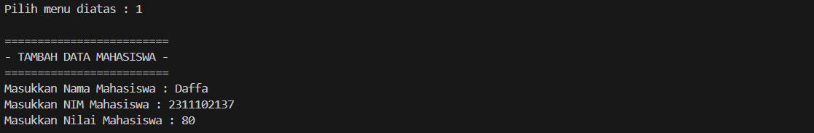
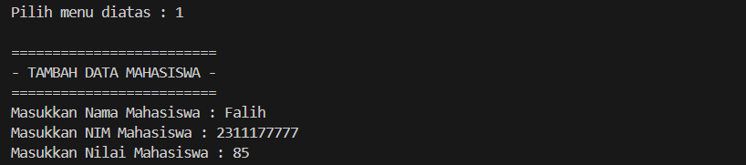
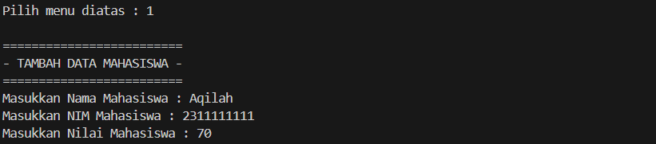
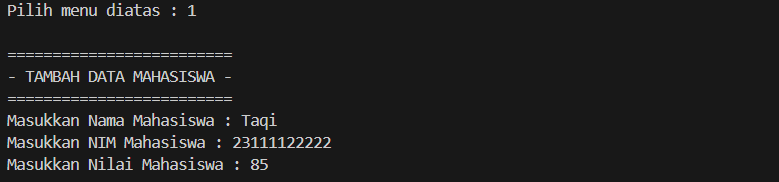
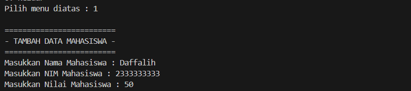
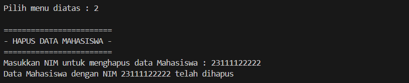
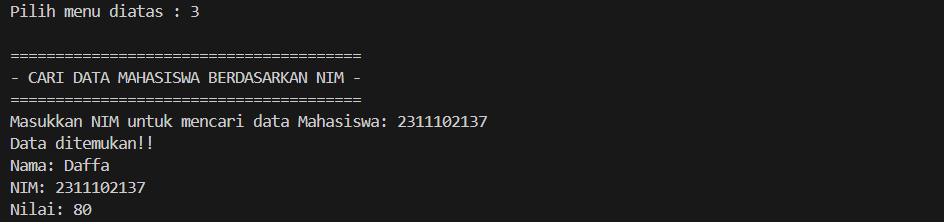
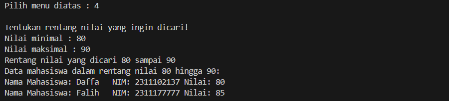
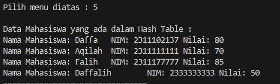

# <h1 align="center">Laporan Praktikum Modul 5 - HASH TABLE </h1>
<p align="center">Daffa Falih Aqilah - 2311102137 /p>

## Dasar Teori

Hash Table (tabel hash) adalah struktur data yang digunakan untuk menyimpan dan mengelola data dengan cepat dan efisien. Struktur ini bekerja dengan prinsip kunci-nilai 
(key-value), di mana setiap elemen data memiliki kunci unik yang digunakan untuk mengakses atau memanipulasinya.

Keuntungan utama dari Hash Table adalah kemampuannya untuk memungkinkan akses acak yang cepat ke data.  Karena nilai disimpan berdasarkan index yang dihasilkan dari 
kuncinya,  kita dapat langsung mengambil nilai tersebut dengan mengetahui kuncinya.  Ini berbeda dengan struktur data lain seperti linked list atau array, di mana kita 
mungkin perlu iterasi melalui elemen untuk menemukan yang kita cari.  Dengan demikian, Hash Table sangat berguna untuk situasi di mana kita perlu sering mencari data 
berdasarkan kunci unik.

## Guided 

### Guided 1

```C++
// Daffa Falih Aqilah - 2311102137 - S1IF-11-D

#include <iostream>
using namespace std;

const int MAX_SIZE = 10;

// Fungsi hash sederhana
int hash_func(int key) {
    return key % MAX_SIZE;
}

// Struktur data untuk setiap node
struct Node {
    int key;
    int value;
    Node* next;
    Node(int key, int value) : key(key), value(value), next(nullptr) {}
};

// Class hash table
class HashTable {
private:
    Node** table;

public:
    HashTable() {
        table = new Node*[MAX_SIZE]();
    }

    ~HashTable() {
        for (int i = 0; i < MAX_SIZE; i++) {
            Node* current = table[i];
            while (current != nullptr) {
                Node* temp = current;
                current = current->next;
                delete temp;
            }
        }
        delete[] table;
    }

    // Insertion
    void insert(int key, int value) {
        int index = hash_func(key);
        Node* current = table[index];
        while (current != nullptr) {
            if (current->key == key) {
                current->value = value;
                return;
            }
            current = current->next;
        }
        Node* node = new Node(key, value);
        node->next = table[index];
        table[index] = node;
    }

    // Searching
    int get(int key) {
        int index = hash_func(key);
        Node* current = table[index];
        while (current != nullptr) {
            if (current->key == key) {
                return current->value;
            }
            current = current->next;
        }
        return -1;
    }

    // Deletion
    void remove(int key) {
        int index = hash_func(key);
        Node* current = table[index];
        Node* prev = nullptr;
        while (current != nullptr) {
            if (current->key == key) {
                if (prev == nullptr) {
                    table[index] = current->next;
                } else {
                    prev->next = current->next;
                }
                delete current;
                return;
            }
            prev = current;
            current = current->next;
        }
    }

    // Traversal
    void traverse() {
        for (int i = 0; i < MAX_SIZE; i++) {
            Node* current = table[i];
            while (current != nullptr) {
                cout << current->key << ": " << current->value << endl;
                current = current->next;
            }
        }
    }
};

int main() {
    HashTable ht;

    // Insertion
    ht.insert(1, 10);
    ht.insert(2, 20);
    ht.insert(3, 30);

    // Searching
    cout << "Get key 1: " << ht.get(1) << endl;
    cout << "Get key 4: " << ht.get(4) << endl;

    // Deletion
    ht.remove(4);

    // Traversal
    ht.traverse();

    return 0;
}


```
Kode di atas menggunakan array dinamis “table” untuk menyimpan bucket dalam
hash table. Setiap bucket diwakili oleh sebuah linked list dengan setiap node
merepresentasikan satu item data. Fungsi hash sederhana hanya menggunakan
modulus untuk memetakan setiap input kunci ke nilai indeks array.

### Guided 2

```C++
#include <iostream>
#include <string>
#include <vector>
using namespace std;

const int TABLE_SIZE = 11;

class HashNode {
public:
    string name;
    string phone_number;
    HashNode(string name, string phone_number) {
        this->name = name;
        this->phone_number = phone_number;
    }
};

class HashMap {
private:
    vector<HashNode*> table[TABLE_SIZE];

public:
    int hashFunc(string key) {
        int hash_val = 0;
        for (char c : key) {
            hash_val += c;
        }
        return hash_val % TABLE_SIZE;
    }

    void insert(string name, string phone_number) {
        int hash_val = hashFunc(name);
        for (auto node : table[hash_val]) {
            if (node->name == name) {
                node->phone_number = phone_number;
                return;
            }
        }
        table[hash_val].push_back(new HashNode(name, phone_number));
    }

    void remove(string name) {
        int hash_val = hashFunc(name);
        for (auto it = table[hash_val].begin(); it != table[hash_val].end(); it++) {
            if ((*it)->name == name) {
                table[hash_val].erase(it);
                return;
            }
        }
    }

    string searchByName(string name) {
        int hash_val = hashFunc(name);
        for (auto node : table[hash_val]) {
            if (node->name == name) {
                return node->phone_number;
            }
        }
        return "";
    }

    void print() {
        for (int i = 0; i < TABLE_SIZE; i++) {
            cout << i << ": ";
            for (auto pair : table[i]) {
                if (pair != nullptr) {
                    cout << "[" << pair->name << ", " << pair->phone_number << "]";
                }
            }
            cout << endl;
        }
    }
};

int main() {
    HashMap employee_map;
    employee_map.insert("Mistah", "1234");
    employee_map.insert("Pastah", "5678");
    employee_map.insert("Ghana", "91011");

    cout << "Nomer Hp Mistah: " << employee_map.searchByName("Mistah") << endl;
    cout << "Phone Hp Pastah: " << employee_map.searchByName("Pastah") << endl;

    employee_map.remove("Mistah");

    cout << "Nomer Hp Mistah setelah dihapus: " << employee_map.searchByName("Mistah") << endl << endl;
    
    cout << "Hash Table: " << endl;
    employee_map.print();

    return 0;
}

```
Pada program di atas, class HashNode merepresentasikan setiap node dalam hash table, yang terdiri dari nama dan nomor telepon karyawan. Class HashMap digunakan untuk
mengimplementasikan struktur hash table dengan menggunakan vector yang menampung pointer ke HashNode. Fungsi hashFunc digunakan untuk menghitung nilai hash dari nama
karyawan yang diberikan, dan fungsi insert digunakan untuk menambahkan data baru ke dalam hash table. Fungsi remove digunakan untuk menghapus data dari hash table, dan
fungsi searchByName digunakan untuk mencari nomor telepon dari karyawan dengan nama yang diberikan.

## Unguided 

### 1. [Implementasikan hash table untuk menyimpan data mahasiswa. Setiap mahasiswa memiliki NIM dan nilai. Implementasikan fungsi untuk menambahkan data baru, menghapus data, mencari data berdasarkan NIM, dan mencari data berdasarkan nilai. Dengan ketentuan :]

a. Setiap mahasiswa memiliki NIM dan nilai.
b. Program memiliki tampilan pilihan menu berisi poin C.
c. Implementasikan fungsi untuk menambahkan data baru, menghapus data,
mencari data berdasarkan NIM, dan mencari data berdasarkan rentang nilai
(80 – 90).

```C++

// Daffa Falih Aqilah - 2311102137 - S1IF-11-D

#include <iostream>
#include <vector>
#include <string>
using namespace std;

struct Mahasiswa{
    string nama_137;
    string nim_137;
    int nilai_137;
};

struct HashNode{
    Mahasiswa data;
    HashNode* next;
    HashNode(const Mahasiswa& data) : data(data), next(nullptr){}
};

class HashTable{
    private:
    static const int TABLE_SIZE = 10;
    vector<HashNode*>table[TABLE_SIZE];

    int hashFunc_137(const string& nim_137){
        int hashVal = 0;
        for(char c : nim_137){
            hashVal += c;
        }
        return hashVal % TABLE_SIZE;
    }

    public:
    void insert_137(const Mahasiswa& mahasiswa){
        int index = hashFunc_137(mahasiswa.nim_137);
        HashNode* newNode = new HashNode(mahasiswa);
        newNode->next = table[index].size() > 0 ? table[index][0] : nullptr;
        table[index].insert(table[index].begin(),newNode);
    }
    void hapus_137(const string& nim){
        int index = hashFunc_137(nim);
        for(size_t i=0; i<table[index].size(); i++){
            if(table[index][i]->data.nim_137 == nim){
                delete table[index][i];
                table[index].erase(table[index].begin()+i);
                return;
            }
        }
        cout << "Data mahasiswa dengan NIM " << nim << " tidak dapat ditemukan " <<endl;
    }

    Mahasiswa* searchByNIM(const string& nim){
        int index = hashFunc_137(nim);
        for(size_t i = 0; i <table[index].size(); i++){
            if(table[index][i]->data.nim_137 == nim){
                return &(table[index][i]->data);
            }
        }
        return nullptr;
    }

    vector<Mahasiswa*> searchBYRange(int minNilai, int maxNilai){
        vector<Mahasiswa*> result;
        for(int i = 0; i < TABLE_SIZE; i++){
            for(size_t j = 0; j < table[i].size(); j++){
                if(table[i][j]->data.nilai_137 >= minNilai && table[i][j]->data.nilai_137 <= maxNilai){
                    result.push_back(&(table[i][j]->data));
                }
            }
        }
        return result;
    }

    void tampilkan_137(){
        cout << "Data Mahasiswa yang ada dalam Hash Table : "<<endl;
        for(int i = 0; i < TABLE_SIZE; i++){
            for (size_t j = 0; j < table[i].size(); j++){
                Mahasiswa* mhs = &(table[i][j]->data);
                cout << "Nama Mahasiswa: " << mhs->nama_137 << "\tNIM: " << mhs->nim_137 << "\tNilai: " << mhs->nilai_137 << endl;
            }
        }
    }

};

int main(){
    HashTable hashTable_137;
    int pilih_;

    menu:
    cout << "================================" <<endl;
    cout << "- Program Hash Table Mahasiswa -" <<endl;
    cout << "================================" <<endl;
    cout << "1. Tambah data Mahasiswa"<<endl;
    cout << "2. Hapus data Mahasiswa"<<endl;
    cout << "3. Cari data Mahasiswa berdasarkan NIM"<<endl;
    cout << "4. Cari data Mahasiswa berdsarkan rentang nilai"<<endl;
    cout << "5. Tampilkan semua data"<<endl;
    cout << "6. Keluar"<<endl;
    cout << "Pilih menu diatas : "; cin >> pilih_137;
    cout << endl;

    switch(pilih_137){
        case 1 :{
            Mahasiswa mhs;
            cout << "=========================" <<endl;
            cout << "- TAMBAH DATA MAHASISWA -" <<endl;
            cout << "=========================" <<endl;
            cout << "Masukkan Nama Mahasiswa : ";
            cin >> mhs.nama_137;
            cout << "Masukkan NIM Mahasiswa : ";
            cin >> mhs.nim_137;
            cout << "Masukkan Nilai Mahasiswa : ";
            cin >> mhs.nilai_137;
            hashTable_137.insert_137(mhs);
            goto menu;
            break;
        }
        case 2 :{
            string nim;
            cout << "========================" <<endl;
            cout << "- HAPUS DATA MAHASISWA -" <<endl;
            cout << "========================" <<endl;
            cout << "Masukkan NIM untuk menghapus data Mahasiswa : ";
            cin >> nim;
            hashTable_137.hapus_137(nim);
            cout << "Data Mahasiswa dengan NIM " << nim << " telah dihapus"<<endl;
            goto menu;
            break;
        }
        case 3 :{
            string nim;
            cout << "=======================================" <<endl;
            cout << "- CARI DATA MAHASISWA BERDASARKAN NIM -" <<endl;
            cout << "=======================================" <<endl;
            cout << "Masukkan NIM untuk mencari data Mahasiswa: ";
            cin >> nim;
            Mahasiswa* result = hashTable_137.searchByNIM(nim);
            if(result != nullptr){
                cout << "Data ditemukan!!"<<endl;
                cout << "Nama: " << result->nama_137 << "\nNIM: " << result->nim_137 << "\nNilai: " << result->nilai_137 <<endl;
            }else{
                cout << "Data mahasiswa dengan NIM " << nim << "Tidak dapat ditemukan"<<endl;
            }
            goto menu;
            break;
        }
        case 4 :{
            int minNilai , maxNilai ;
            cout << "============================================" <<endl;
            cout << "- Tentukan Rentang Nilai Yang Ingin Dicari -" <<endl;
            cout << "============================================" <<endl;
            cout << "Nilai minimal : "; cin >> minNilai;
            cout << "Nilai maksimal : "; cin >> maxNilai;
            cout << "Rentang nilai yang dicari " << minNilai << " sampai " << maxNilai << endl;
            vector<Mahasiswa*> result = hashTable_137.searchBYRange(minNilai, maxNilai);
            if(result.size() > 0){
                cout << "Data mahasiswa dalam rentang nilai " << minNilai << " hingga " << maxNilai << ":\n";
                for(Mahasiswa* mhs : result){
                    cout << "Nama Mahasiswa: " << mhs->nama_137 << "\tNIM: " << mhs->nim_137 << "\tNilai: "<< mhs->nilai_137 <<endl;
                }
            }else{
                cout << "Tidak ada Mahasiswa dalam rentang nilai tersebut "<<endl;
            }
            goto menu;
            break;
        }
        case 5 :{
            hashTable_137.tampilkan_137();
            goto menu;
            break;
        }
        case 6 :
            cout << "Anda keluar dari program!"<<endl;
            break;
        default :
            cout << "Pilihan anda tidak ada didalam menu "<<endl;
            goto menu;
    }
    return 0;
}

```
Codingan di atas merupakan program Hash Table untuk mengelola data mahasiswa. Program ini memungkinkan pengguna untuk melakukan berbagai operasi seperti:

- Menambah data mahasiswa baru: Pengguna dapat memasukkan nama, NIM, dan nilai mahasiswa baru. Data ini kemudian disimpan dalam hash table
berdasarkan NIM.

- Menghapus data mahasiswa: Pengguna dapat memasukkan NIM mahasiswa yang ingin dihapus. Data mahasiswa dengan NIM tersebut akan dihapus dari hash
table.
- Mencari data mahasiswa berdasarkan NIM: Pengguna dapat memasukkan NIM mahasiswa yang ingin dicari. Program akan menampilkan data mahasiswa
tersebut jika ditemukan.
Mencari data mahasiswa berdasarkan rentang nilai: Pengguna dapat memasukkan nilai minimum dan maksimum. Program akan menampilkan semua data
mahasiswa yang nilai-nilainya berada di antara rentang tersebut. Menampilkan semua data mahasiswa: Program akan menampilkan semua data mahasiswa
yang ada di dalam hash table.Program ini menggunakan struktur data hash table untuk menyimpan data mahasiswa. Hash table adalah struktur data yang
efisien untuk mencari data berdasarkan kunci. Dalam program ini, NIM digunakan sebagai kunci untuk menyimpan data mahasiswa.

#### Output Unguided 1:











Kode di atas digunakan untuk mencetak teks "ini adalah file code guided praktikan" ke layar menggunakan function cout untuk mengeksekusi nya.

## Kesimpulan

Hash table adalah struktur data yang efisien untuk melakukan pencarian data berdasarkan nilai kunci (key).  Hash table bekerja dengan menyimpan
data pada lokasi tertentu di dalam tabel berdasarkan hasil perhitungan fungsi hash dari nilai kunci. Fungsi hash ini akan menghasilkan nilai
numerik (index) yang digunakan untuk memetakan data ke dalam tabel.

## Referensi
1. Cormen, Thomas H., et al. Introduction to algorithms. MIT press, 2022
2. Knuth, Donald E. The art of computer programming, volume 3: Sorting and searching. Addison-Wesley, 2019.