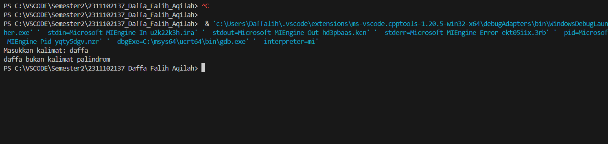

# <h1 align="center">Laporan Praktikum Modul 6 - STACK </h1>
<p align="center">Daffa Falih Aqilah - 2311102137 /p>

## Dasar Teori

Stack, atau tumpukan, adalah struktur data linier yang mengikuti prinsip Last In First Out (LIFO). Artinya, elemen yang terakhir dimasukkan ke dalam stack akan menjadi elemen pertama yang diambil. Hal ini bagaikan tumpukan piring, di mana piring yang terakhir ditaruh akan menjadi piring pertama yang diambil.

Operasi dasar pada stack adalah:

-Push: Menambahkan elemen baru ke dalam stack.
-Pop: Menghapus dan mengembalikan elemen terakhir dari stack.
-Top: Mengembalikan elemen terakhir dari stack tanpa menghapusnya.
-Empty: Memeriksa apakah stack kosong.

## Guided 

### Guided 1

```C++
// Daffa Falih Aqilah - 2311102137 - S1IF-11-D

#include <iostream>
using namespace std;

string arrayBuku[5];
int maksimal = 5, top = 0;

bool isFull() {
    return (top == maksimal);
}

bool isEmpty() {
    return (top == 0);
}

void pushArrayBuku(string data) {
    if (isFull()) {
        cout << "Data telah penuh" << endl;
    } else {
        arrayBuku[top] = data;
        top++;
    }
}

void popArrayBuku() {
    if (isEmpty()) {
        cout << "Tidak ada data yang dihapus" << endl;
    } else {
        arrayBuku[top - 1] = "";
        top--;
    }
}

void peekArrayBuku(int posisi) {
    if (isEmpty()) {
        cout << "Tidak ada data yang bisa dilihat" << endl;
    } else {
        int index = top;
        for (int i = 1; i <= posisi; i++) {
            index--;
        }
        cout << "Posisi ke " << posisi << " adalah " << arrayBuku[index] << endl;
    }
}

int countStack() {
    return top;
}

void changeArrayBuku(int posisi, string data) {
    if (posisi > top) {
        cout << "Posisi melebihi data yang ada" << endl;
    } else {
        int index = top;
        for (int i = 1; i <= posisi; i++) {
            index--;
        }
        arrayBuku[index] = data;
    }
}

void destroyArraybuku() {
    for (int i = top; i >= 0; i--) {
        arrayBuku[i] = "";
    }
    top = 0;
}

void cetakArrayBuku() {
    if (isEmpty()) {
        cout << "Tidak ada data yang dicetak" << endl;
    } else {
        for (int i = top - 1; i >= 0; i--) {
            cout << arrayBuku[i] << endl;
        }
    }
}

int main() {
    pushArrayBuku("Kalkulus");
    pushArrayBuku("Struktur Data");
    pushArrayBuku("Matematika Diskrit");
    pushArrayBuku("Dasar Multimedia");
    pushArrayBuku("Inggris");

    cetakArrayBuku();
    cout << "\n";

    cout << "Apakah data stack penuh? " << isFull() << endl;
    cout << "Apakah data stack kosong? " << isEmpty() << endl;

    peekArrayBuku(2);

    popArrayBuku();

    cout << "Banyaknya data = " << countStack() << endl;

    changeArrayBuku(2, "Bahasa Jerman");

    cetakArrayBuku();
    cout << "\n";

    destroyArraybuku();
    cout << "Jumlah data setelah dihapus: " << top << endl;

    cetakArrayBuku();

    return 0;
}

```
Program di atas adalah implementasi dari struktur data stack menggunakan array dalam bahasa pemrograman C++. Program ini memiliki beberapa fungsi utama, termasuk pushArrayBuku() untuk menambahkan data ke dalam stack, popArrayBuku() untuk menghapus data dari stack, peekArrayBuku() untuk melihat data pada posisi tertentu dalam stack, changeArrayBuku() untuk mengubah data pada posisi tertentu dalam stack, destroyArraybuku() untuk menghapus semua data dalam stack, serta countStack() untuk menghitung jumlah data dalam stack.

## Unguided 

### 1. [Buatlah program untuk menentukan apakah kalimat tersebut yang diinputkan dalam program stack adalah palindrom/tidak. Palindrom kalimat yang dibaca dari depan dan belakang sama. Jelaskan bagaimana cara kerja programnya.]


  
```C++

// Daffa Falih Aqilah
// 2311102137
// S1IF-11-D

#include <iostream>
#include <stack>

using namespace std;

// Fungsinya untuk menentukan apakah kalimat tersebut Palindrom atau tidak
string cleanstack_137(string str) {
    string cleaned;
    for (char c : str) {
        if (isalpha(c)) {
            cleaned += tolower(c);
        }
    }
    return cleaned;
}

// Fungsi mengecek palindrome
bool Palindrome_137(string str) {
    stack<char> charStack;
    str = cleanstack_137(str);

    // Memeriksa apakah kalimat kosong
    if (str.empty()) {
        return false;
    }

    for (char c : str) {
        charStack.push(c);
    }

    for (char c : str) {
        if (c != charStack.top()) {
            return false;
        }
        charStack.pop();
    }

    return true;
}

int main() {
    int choice;
    string kalimat;

    do {
        cout << "--------------- Menu --------------" << endl;
        cout << "1. Cek kalimat palindrome" << endl;
        cout << "2. Keluar" << endl;
        cout << "Pilihan Anda: ";
        cin >> choice;
        cin.ignore();
        cout << "-----------------------------------" << endl;

        switch (choice) {
            case 1:
                cout << "Masukkan kalimat: ";
                getline(cin, kalimat);

                if (Palindrome_137(kalimat)) {
                    cout << "Kalimat tersebut adalah palindrom." << endl;
                } else {
                    cout << "Kalimat tersebut bukan palindrom." << endl;
                }
                break;
            case 2:
                cout << "Terima kasih telah menggunakan program ini. Sampai jumpa!" << endl;
                break;
            default:
                cout << "Pilihan tidak valid. Silakan pilih lagi." << endl;
        }
    } while (choice != 2);

    return 0;
}


```

Fungsi ini memeriksa apakah kalimat masukan merupakan palindrom.
Langkah:
Pertama, bersihkan pernyataan dengan memanggil fungsi cleanstack.
Memeriksa apakah pernyataan itu kosong. Mengembalikan false jika kosong.
Menyimpan karakter kalimat yang dihapus ke dalam tumpukan.
Ulangi setiap karakter dalam set.
Membandingkan karakter saat ini dengan karakter teratas di tumpukan.
Jika sama, hapus karakter pertama dari tumpukan.
Mengembalikan nilai salah jika tidak sama.
Mengembalikan nilai benar jika semua karakter dibandingkan dan tidak ada yang serupa.
Fungsi utama:

Fungsi ini menjalankan program utama.
Langkah:
Menampilkan menu program.
Meminta pengguna untuk memilih opsi.
Melakukan tindakan berdasarkan pilihan pengguna.
Opsi 1 (Periksa palindrom dalam kalimat):
Meminta pengguna untuk memberikan kalimat.
Periksa kalimat dengan memanggil fungsi palindrom.
Menampilkan hasil tes (palindrom atau tidak).
Opsi 2 (Keluar):
Menampilkan pesan terima kasih dan keluar dari program.
Pilihan tidak valid:
Pesan kesalahan ditampilkan dan pengguna diminta untuk membuat pilihan lagi.
Ulangi proses menu dan opsi hingga pengguna memilih opsi 2.
Secara keseluruhan, program ini bekerja sebagai berikut.

Menghapus kumpulan karakter asing yang dimasukkan.
Memeriksa apakah kalimat yang disanitasi merupakan palindrom dengan membandingkan karakter pertama dan terakhirnya.
Menampilkan hasil pengujian kepada pengguna.
Program ini menggunakan struktur data tumpukan untuk menyimpan karakter kalimat yang dibersihkan. Struktur data tumpukan memungkinkan program dengan mudah membandingkan karakter di awal dan akhir pernyataan.

#### Output Unguided 1:



## Unguided 

### 2. [Buatlah program untuk melakukan pembalikan terhadap kalimat menggunakan stack dengan minimal 3 kata. Jelaskan output program dan source codenya beserta operasi/fungsi yang dibuat?]


  
```C++

// Daffa Falih Aqilah
// 2311102137
// S1IF-11-D

#include <iostream>
#include <stack>
#include <string>
using namespace std;

// fungsinya adalah untuk membalikkan kata seperti daffa jadi affad
string membalikankata_137(string sentence) {
    stack<char> charStack;
    string reversedSentence;

    for (char c : sentence) {
        charStack.push(c);
    }

    while (!charStack.empty()) {
        reversedSentence += charStack.top();
        charStack.pop();
    }

    return reversedSentence;
}

int main() {
    int choice;
    string kalimat;
    do {
        cout <<"--------------- Menu --------------"<<endl;
        cout << "1. Balikkan Kalimat"<<endl;
        cout << "2. Keluar"<<endl;
        cout <<"-----------------------------------"<<endl;
        cout << "Pilihan Anda: ";
        cin >> choice;
        cin.ignore(); 
        switch (choice) {
            case 1:
            // inputkan kata yang ingin dibalikkan
                cout << "Masukkan kalimat: ";
                getline(cin, kalimat);
                cout << "Kalimat Awal: " << kalimat << endl;
                cout << "Kalimat Terbalik: " << membalikankata_137(kalimat) << endl;
                break;
            case 2:
                cout << "Terima kasih sudah menggunakan program ini:) " << endl;
                break;
            default:
                cout << "Pilihan tidak valid. Silakan pilih lagi." << endl;
        }
    } while (choice != 2);

    return 0;
}


```

## Cara kerja program

Program ini digunakan untuk membalik urutan karakter dalam sebuah kalimat. Begini cara kerjanya:

Fungsi membalikan kata :

- Fungsi ini menerima argumen string yang berisi kalimat yang ingin Anda balikkan.
- Fungsi ini memiliki dua variabel.
- "charStack": Tumpukan yang digunakan untuk menyimpan karakter dari set.
- "reversedSentence": string kosong berisi kalimat terbalik.
- Perulangan pertama melewati setiap karakter dalam kalimat.
- Karakter dimasukkan ke dalam charStack menggunakan fungsi push().
- Perulangan iterasi kedua, kecuali 'charStack' kosong:
- Karakter pertama 'charStack' dicetak dan ditambahkan ke 'reversedSentence' menggunakan fungsi 'pop()'.
- Fungsi ini mengembalikan string "reversedSentence" yang berisi kalimat terbalik.

#### Output Unguided 2:


## Kesimpulan

Kesimpulannya, pada modul 6 ini Stack atau tumpukan merupakan struktur data LIFO (Last In First Out) dimana suatu struktur data yang terbentuk dari barisan hingga yang terurut dari satuan data. Pada stack, penambahan dan penghapusan elemennya hanya dapat dilakukan pada satu posisi.

Kelebihan Stack adalah kemampuan untuk melakukan hal-hal seperti undo dan rendo, yang memungkinkan program untuk mengembalikan kata dan kalimat. Program ini menunjukkan bagaimana struktur data sederhana dapat digunakan untuk menyelesaikan tugas tertentu dengan sangat efisien, yang dapat digunakan dalam aplikasi yang membutuhkan operasi tersebut secara berulang.

Kekurangan stack termasuk ukuran terbatas; ukuran stack biasanya tetap atau terbatas, tergantung pada implementasi sistem atau batasan memori. Jika stack penuh dan operasi push dilakukan, maka akan terjadi overflow. Stack memiliki sifat LIFO yang tidak dapat diubah, yang berarti elemen yang dimasukkan terakhir akan menjadi elemen yang pertama kali diambil. Akibatnya, stack kurang fleksibel untuk digunakan dalam situasi di mana akses acak atau pengubahan urutan data diperlukan.

## Referensi
1. Implementasi Stack Menggunakan Array oleh Rio Septiawan 2023
2. Penerapan Stack dalam Menentukan Validitas Kurung Tutup oleh Rini Fitriani 2022