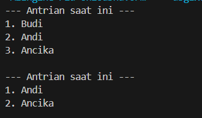
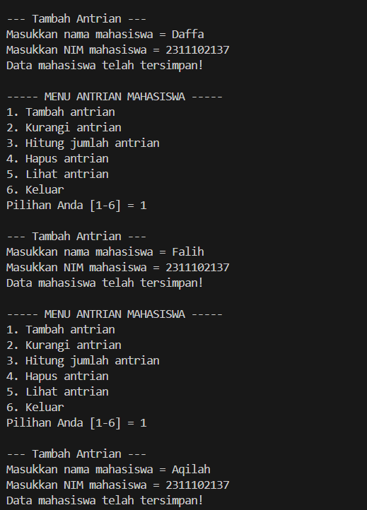
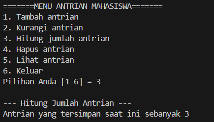
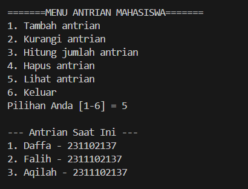
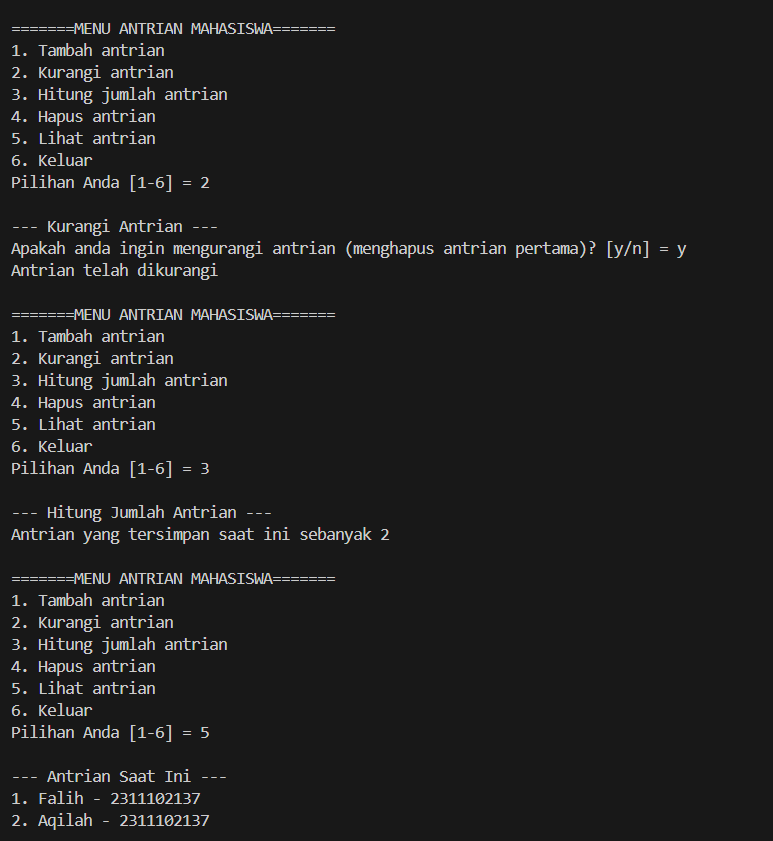
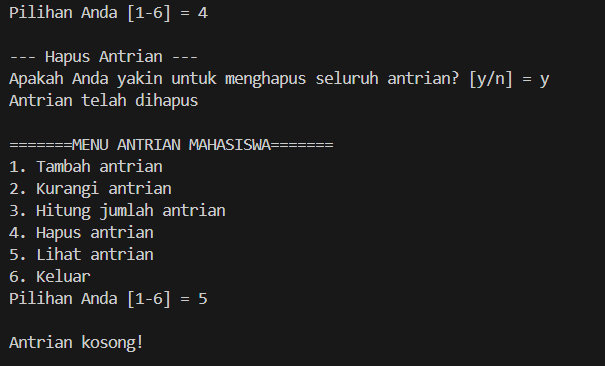

# <h1 align="center">Laporan Praktikum Modul 7 - QUEUE </h1>
<p align="center">Daffa Falih Aqilah - 2311102137 /p>

## Dasar Teori

Queue atau antrian adalah struktur data yang tersusun secara linier dan mengikuti prinsip First In First Out (FIFO). Artinya, elemen data yang pertama kali dimasukkan ke dalam antrean akan menjadi yang pertama kali dikeluarkan. Queue sering diibaratkan seperti antrean di kehidupan sehari-hari, di mana orang yang datang pertama kali akan dilayani terlebih dahulu.

Operasi Dasar Queue

Terdapat beberapa operasi dasar yang dapat dilakukan pada queue:

Enqueue (Push): Menambahkan elemen baru ke bagian belakang antrean.
Dequeue (Pop): Menghapus elemen terdepan dari antrean dan mengembalikan nilainya.
Front (Peek): Mengambil dan mengembalikan nilai elemen terdepan antrean tanpa menghapusnya.
IsEmpty: Mengecek apakah antrean kosong atau tidak.
Implementasi Queue

Queue dapat diimplementasikan menggunakan berbagai struktur data, seperti:

Array: Queue dapat diimplementasikan dengan array melingkar (circular array) untuk memanfaatkan ruang penyimpanan secara efisien.
Linked List: Queue dapat diimplementasikan dengan linked list untuk memungkinkan penambahan dan penghapusan elemen tanpa batasan panjang.

## Guided 

### Guided 1

```C++
#include<iostream>

using namespace std;

const int MaksimalAntrian = 5;
int front = 0;
int back = 0;
string QueueTeller[5];

//Mengecek apakah antrian sudah penuh atau belum
bool isFull(){
    if(back == MaksimalAntrian){
        return true;
    } else {
        return false;
    }
}

//Mengecek apakah antrian masih kosong atau tidak
bool isEmpty(){
    if(back == 0){
        return true;
    } else {
        return false;
    }
}

//Menambah antrian
void TambahData(string nama){
    if(isFull()){
        cout << "Antrian sudah penuh" << endl;
    } else if(!isFull()){
        if(isEmpty()){
            QueueTeller[0] = nama;
            front++;
            back++;
        } else if(!isEmpty()){
            QueueTeller[back] = nama;
            back++;
        }
    }
}

//Mengurangi antrian
void KurangAntrian(){
    if(isEmpty()){
        cout << "Antrian masih kosong" << endl;
    } else if(!isEmpty()){
        for(int i = 0; i < back; i++){
            QueueTeller[i] =  QueueTeller[i+1];
        }
        back--;
    }
}

//Menghitung banyak antrian
int Count(){
    return back;
}

//Menghapus seluruh antrian
void ClearQueue(){
    if(isEmpty()){
        cout << "Antrian masih kosong" << endl;
    } else if(!isEmpty()){
        for(int i = 0; i < back; i++){
            QueueTeller[i] = "";
        }
        back = 0;
        front = 0;
    }
}

//Melihat Antrian
void ViewQueue(){
    cout << "Data antrian = " << endl;
    for(int i = 0; i < MaksimalAntrian; i++){
        if(QueueTeller[i] != ""){
            cout << i+1 << ". " << QueueTeller[i] << endl;
        } else {
            cout << i+1 << ". " << "(kosong)" << endl;
        }
    }
}

//main fungsi
int main(){
    //Menambah 3 data nama kedalam antrian
    TambahData("Alya");
    TambahData("Kiki");
    TambahData("Artika");

    //menampilkan data yang sudah ditambahkan
    ViewQueue();

    //mengurangi data
    KurangAntrian();

    //menampilkan data setelah dikurangi
    ViewQueue();

    //menghapus seluruh antrian
    ClearQueue();

    //menampilkan data setelah dihapus
    ViewQueue();
}

```
penggunaan array dalam bahasa pemrograman C++ untuk mengimplementasikan struktur data antrian (queue). Fungsi TambahData menambahkan data ke dalam antrian setelah memeriksa apakah antrian sudah penuh. Fungsi KurangAntrian mengurangi data dari antrian dengan menggeser elemen di dalam array. Fungsi ClearQueue menghapus seluruh elemen antrian dengan mengosongkan nilai array dan mengatur ulang pointer depan dan belakang. Fungsi ViewQueue digunakan untuk melihat antrian di seluruhnya. Fungsi-fungsi ini digunakan oleh program utama untuk menambah, mengurangi, dan menghapus data dari antrian, serta menampilkan isi antrian pada tahap tertentu.

## Unguided 

### 1. [Ubahlah penerapan konsep queue pada bagian guided dari array menjadi linked list]

  
```C++

#include<iostream>

using namespace std;

struct node{ 
    string nama_137;
    node *next;
};
    node *front;  
    node *back; 

void Inisialisasi_137(){ 
    front = NULL;
    back = NULL;
}

bool isEmpty_137(){
    if (front == 0){
        return true; 
    } else {
        return false; 
    }
}

void TambahData_137(string name_137){
    node *baru = new node; 
    baru->nama_137 = name_137; 
    baru->next = NULL; 
    if(isEmpty_137() == true){ 
        front = back = baru; 
        back->next = NULL; 
    } else if(isEmpty_137() == false){ 
        back->next = baru; 
        back = baru; 
    }
}

void KurangiAntrian_137(){
    node *hapus; 
    if(isEmpty_137() == true){ 
        cout << "Antrian masih kosong!" << endl;
    } else if(isEmpty_137() == false){ 
        if(front->next != NULL){ 
            hapus = front; 
            front = front->next;
            delete hapus; 
        } else { 
            front = back = NULL; 
        }
    }
}

int HitungAntrian_137(){
    node *hitung; 
    hitung = front; 
    int jumlah_137 = 0; 
    while(hitung != NULL){ 
        hitung = hitung->next; 
        jumlah_137++; 
    }
    return jumlah_137; 
}

void HapusAntrian_137(){
    node *hapus, *bantu; 
    bantu = front; 
    while(bantu != NULL){ 
        hapus = bantu; 
        bantu = bantu->next; 
        delete hapus; 
    }
    front = back = NULL; 
}

void LihatAntrian_137(){
    node *bantu; 
    bantu = front; 
    if(isEmpty_137() == true){  
        cout << "Antrian kosong!" << endl; 
    } else if(isEmpty_137() == false){ 
        cout << "--- Antrian saat ini ---" << endl;  
        int NomorAntrian_137 = 1; 
        while(bantu != NULL){ 
            cout << NomorAntrian_137 << ". " << bantu->nama_137 << endl; 
            bantu = bantu->next; 
            NomorAntrian_137++; 
        }
    }
    cout << endl;
}

int main(){
    //Menambah 3 data nama kedalam antrian
    TambahData_137("Budi");
    TambahData_137("Andi");
    TambahData_137("Ancika");

    //Menampilkan data yang sudah ditambahkan
    LihatAntrian_137();

    //Mengurangi data
    KurangiAntrian_137();

    //menampilkan data setelah dikurangi
    LihatAntrian_137();

    //Menghapus seluruh antrian
    HapusAntrian_137();

    //menampilkan data setelah dihapus
    LihatAntrian_137();
    
    return 0;
}


```

## Cara kerja program

simulasi antrian sederhana dengan menggunakan struktur data tertaut (linked list). Program ini memiliki beberapa fungsi utama, yaitu:

Inisialisasi_137: Mengatur antrian agar kosong (front dan back sama dengan NULL).
isEmpty_137: Mengecek apakah antrian kosong atau tidak.
TambahData_137: Menambahkan data nama baru ke dalam antrian.
KurangiAntrian_137: Menghapus data nama pertama dari antrian.
HitungAntrian_137: Menghitung jumlah data nama yang ada di dalam antrian.
HapusAntrian_137: Menghapus seluruh data nama dari antrian.
LihatAntrian_137: Menampilkan seluruh data nama yang ada di dalam antrian.

Program ini diawali dengan menginisialisasi antrian agar kosong. Kemudian, 3 data nama ditambahkan ke dalam antrian. Selanjutnya, program menampilkan data yang sudah ditambahkan, kemudian menghapus data pertama dari antrian, dan menampilkan kembali data yang ada di dalam antrian. Terakhir, program menghapus seluruh data dari antrian dan menampilkan pesan bahwa antrian kosong.

#### Output Unguided 1:



## Unguided 

### 2. [Dari nomor 1 buatlah konsep antri dengan atribut Nama mahasiswa dan NIM Mahasiswa]

  
```C++

#include<iostream>

using namespace std;

// deklarasi struct node
struct node{ // node berisi variabel NamaMahasiswa_137, NIM_137, dan pointer next
    string NamaMahasiswa_137;
    string NIM_137;
    node *next;
};
    node *front; // deklarasi node front
    node *back; // deklarasi node back

// prosedur inisialisasi node front dan back sebagai NULL
void Inisialisasi_137(){ 
    front = NULL;
    back = NULL;
}

// fungsi untuk mengecek apakah queue kosong atau tidak
bool isEmpty_137(){
    if (front == 0){
        return true; 
    } else {
        return false; 
    }
}

// Prosedur untuk menambahkan data pada antrian
void TambahData_137(string Name_137, string NIM_137){
    node *baru = new node; //tambah node baru
    baru->NamaMahasiswa_137 = Name_137; //node baru berisi nama mahasiswa dan NIM 
    baru->NIM_137 = NIM_137; 
    baru->next = NULL; 
    if(isEmpty_137() == true){ 
        front = back = baru; 
        back->next = NULL; 
    } else if(isEmpty_137() == false){ 
        back->next = baru; //node baru sebagai node selanjutnya dari antrian yang sudah ada
        back = baru; //node baru sebagai back
    }
}

//Prosedur untuk mengurangi antrian 
void KurangiAntrian_137(){
    node *hapus; //inisialisasi node hapus
    if(isEmpty_137() == false){ //jika antrian tidak kosong, maka lanjutkan
        if(front->next != NULL){ //jika node selanjutnya setelah antrian pertama bukan NULL, maka lanjutkan
            hapus = front; //node hapus sebagai front
            front = front->next; //pindahkan front ke node selanjutnya setelah node pertama
            delete hapus; //hapus node pertama
        } else { //jika tidak ada node selanjutnya setelah antrian pertama, maka lanjutkan
            front = back = NULL; //front dan back adalah NULL
        }
    }
}

//Fungsi untuk menghitung jumlah antrian
int HitungAntrian_137(){
    node *hitung; //inisialisasi node hitung
    hitung = front; //node hitung sebagai front
    int jumlah_137 = 0; 
    while(hitung != NULL){ //jika node hitung bukan NULL, maka ulangi
        hitung = hitung->next; //node hitung berlanjut ke node selanjutnya
        jumlah_137++; 
    }
    return jumlah_137; 
}

//Prosedur untuk menghapus seluruh antrian
void HapusAntrian_137(){
    node *hapus, *bantu; //inisialisasi node hapus dan node bantu
    bantu = front; //node bantu sebagai front
    while(bantu != NULL){ 
        hapus = bantu; //node hapus sama dengan node bantu
        bantu = bantu->next; 
        delete hapus; 
    }
    front = back = NULL;
}

void LihatAntrian_137(){
    node *bantu; //node bantu
    bantu = front; 
    if(isEmpty_137() == true){ //jika antrian kosong, maka tampilkan "Antrian kosong!" 
        cout << "Antrian kosong!" << endl; 
    } else if(isEmpty_137() == false){ //jika antrian tidak kosong, maka lanjutkan
        cout << "====Antrian Saat Ini====" << endl; 
        int NomorAntrian_137 = 1; 
        while(bantu != NULL){ //jika node bantu bukan NULL, maka ulangi
            cout << NomorAntrian_137 << ". " << bantu->NamaMahasiswa_137 << " - " << bantu->NIM_137 << endl; 
            bantu = bantu->next; 
            NomorAntrian_137++; //nomor antrian bertambah
        }
    }
    cout << endl;
}

int main(){
    string NamaMahasiswa_137, NIM_137; 
    int Pilih_137; 
    char Yakin_137;
    MenuUtama:
    cout << "=======MENU ANTRIAN MAHASISWA=======" << endl; //Tampilan menu antrian mahasiswa
    cout << "1. Tambah antrian" << endl;
    cout << "2. Kurangi antrian" << endl;
    cout << "3. Hitung jumlah antrian" << endl;
    cout << "4. Hapus antrian" << endl;
    cout << "5. Lihat antrian" << endl;
    cout << "6. Keluar" << endl;
    cout << "Pilihan Anda [1-6] = ";
    cin >> Pilih_137;
    cout << endl;
    switch(Pilih_137){ //switch case berdasarkan pilihan user
        case 1: //jika user memilih 1, maka tampilkan menu tambah antrian
            cout << "=====Tambah Antrian=====" << endl;
            cout << "Masukkan nama mahasiswa = ";
            cin >> NamaMahasiswa_137;
            cout << "Masukkan NIM mahasiswa = ";
            cin >> NIM_137;
            TambahData_137(NamaMahasiswa_137, NIM_137); //pemanggilan prosedur TambahData_137 dengan parameter nama mahasiswa dan NIM
            cout << "Data mahasiswa telah tersimpan!" << endl;
            cout << endl;
            goto MenuUtama;
            break;
        case 2: //jika user memilih 2, maka tampilkan menu kurangi antrian
            cout << "====Kurangi Antrian====" << endl;
            if(isEmpty_137() == true){ //Jika antrian kosong, maka tampilkan "Antrian masih kosong!"
                cout << "Antrian masih kosong!" << endl;
            } else { //jika antrian tidak kosong, maka lanjutkan
                cout << "Apakah anda ingin mengurangi antrian (menghapus antrian pertama)? [y/n] = "; //validasi keyakinan user untuk mengurangi antrian
                cin >> Yakin_137;
                if(Yakin_137 == 'y' || Yakin_137 == 'Y'){ //jika user menginputkan y atau Y, maka lanjutkan
                    KurangiAntrian_137(); //pemanggilan prosedur KurangiAntrian_137()
                    cout << "Antrian telah dikurangi" << endl;
                } else if(Yakin_137 == 'n' || Yakin_137 == 'Y'){ //jika user menginputkan n atau N, maka tampilkan "Aksi dibatalkan"
                    cout << "Aksi dibatalkan" << endl;
                }
            }
            cout << endl;
            goto MenuUtama;
            break;
        case 3: //jika user memilih 3, maka tampilkan menu Hitung Jumlah Antrian
            cout << "====Hitung Jumlah Antrian====" << endl;
            cout << "Antrian yang tersimpan saat ini sebanyak " << HitungAntrian_137() << endl; //Pemanggilan fungsi HitungAntrian_137()
            cout << endl;
            goto MenuUtama;
            break;
        case 4: //jika user memilih 4, maka tampilkan menu hapus antrian
            cout << "====Hapus Antrian====" << endl;
            cout << "Apakah Anda yakin untuk menghapus seluruh antrian? [y/n] = "; //validasi keyakinan user untuk menghapus seluruh antrian
            cin >> Yakin_137;
            if(Yakin_137 == 'y' || Yakin_137 == 'Y'){ //jika user menginputkan y atau Y, maka lanjutkan
                HapusAntrian_137(); //pemanggilan prosedur HapusAntrian_137()
                cout << "Antrian telah dihapus" << endl;
            } else if(Yakin_137 == 'n' || Yakin_137 == 'N'){ //jika user menginputkan n atau N, maka tampilkan "Aksi dibatalkan"
                cout << "Aksi dibatalkan" << endl;
            }
            cout << endl;
            goto MenuUtama;
            break;
        case 5: //jika user memilih 5, maka tampilkan antrian
            LihatAntrian_137(); //pemanggilan prosedur LihatAntrian_137()
            cout << endl;
            goto MenuUtama;
            break;
        case 6:
            cout << "Anda keluar dari program" << endl;
            cout << endl;
            return 0;
            break;
        default: //jika user memilih selain 1-5, maka tampilkan "Pilihan yang anda masukkan salah!"
            cout << "Pilihan yang anda masukkan salah!" << endl;
            cout << endl;
            goto MenuUtama;
        break;
        }
}


```

## Cara kerja program

Program ini mensimulasikan antrian mahasiswa dengan menggunakan struktur data tertaut (linked list). Program ini memiliki menu utama yang memungkinkan pengguna untuk:

1. Menambahkan data mahasiswa (nama dan NIM) ke dalam antrian.
2. Mengurangi antrian (menghapus data mahasiswa pertama) dari antrian.
3. Menghitung jumlah antrian (jumlah data mahasiswa yang ada di dalam antrian).
4. Menghapus seluruh antrian.
5. Melihat antrian (menampilkan data semua mahasiswa yang ada di dalam antrian).

Program ini menggunakan fungsi-fungsi seperti `Inisialisasi_137`, `isEmpty_137`, `TambahData_137`, `KurangiAntrian_137`, `HitungAntrian_137`, `HapusAntrian_137`, dan `LihatAntrian_137` untuk menjalankan fungsinya. 

Secara keseluruhan, program ini menunjukkan bagaimana cara membuat dan memanipulasi antrian data mahasiswa dengan struktur data tertaut dan menu interaktif dalam bahasa C++.

#### Output Unguided 2:







## Kesimpulan

Kedua program yang diberikan memiliki fungsi yang sama, yaitu untuk mengelola antrian mahasiswa. Program pertama menggunakan struktur data array untuk menyimpan data mahasiswa, sedangkan program kedua menggunakan struktur data linked list.

Kedua program memiliki fungsi dasar untuk menambah, mengurangi, menghitung, menghapus, dan melihat antrian. Program pertama additionally has a feature to initialize the queue.

Perbedaan utama antara kedua program terletak pada struktur data yang digunakan untuk menyimpan data mahasiswa. Array lebih efisien untuk akses data secara acak, sedangkan linked list lebih efisien untuk penambahan dan penghapusan data.

## Referensi
Rizky, Agam. "Penerapan Algoritma Queue Pada Aplikasi Pemesanan Obat Berbasis Mobile Pada Apotek Aruba Farma Depok." LOGIC: Jurnal Ilmu Komputer dan Pendidikan 1.5 (2023): 1168-1177.