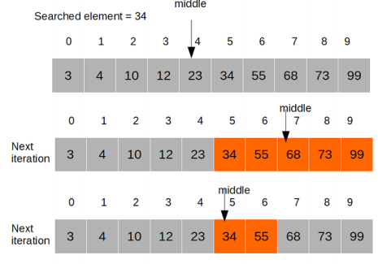
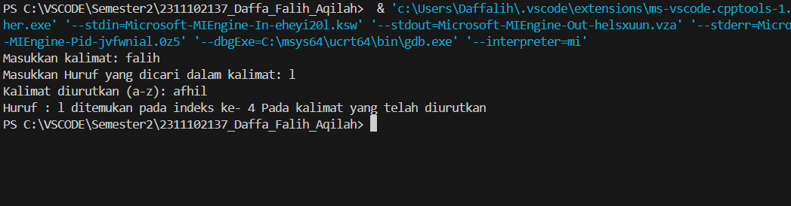
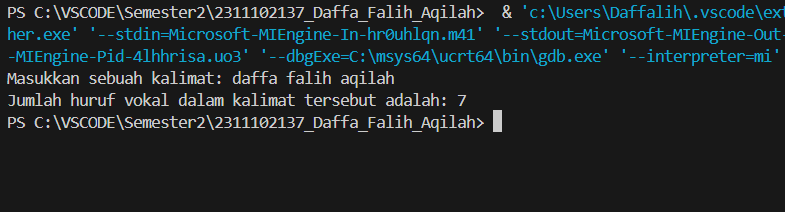
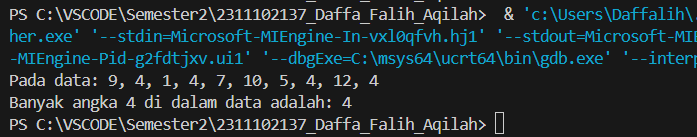

# <h1 align="center">Laporan Praktikum Modul 8 - ALGORITMA SEARCHING </h1>
<p align="center">Daffa Falih Aqilah - 2311102137 /p>

## Dasar Teori

Algoritma pencarian adalah serangkaian langkah-langkah terdefinisi yang digunakan untuk menemukan elemen tertentu dalam kumpulan data. Algoritma ini memainkan peran penting dalam berbagai aplikasi, seperti mesin pencari, sistem basis data, dan kecerdasan buatan.

Karakteristik Algoritma Pencarian:

-Efisiensi: Algoritma yang baik harus mampu menemukan elemen yang dicari dengan cepat, menggunakan sedikit sumber daya komputasi.

-Keakuratan: Algoritma harus selalu menghasilkan hasil yang benar, yaitu menemukan elemen yang dicari atau menyatakan bahwa elemen tersebut tidak ada dalam kumpulan data.

-Kesederhanaan: Algoritma yang mudah dipahami dan diimplementasikan lebih disukai.
Keabsahan: Algoritma harus bekerja dengan benar untuk berbagai jenis data dan struktur data.

Binary search merupakan salah satu algoritma yang relatif efisien, sehingga membuat algoritma tersebut menjadi algoritma pencarian yang 
populer dan sering digunakan. Andaikan ingin mencari posisi sebuah nama dari seluruh nama yang ada di dunia yang telah dicatat dan diurutkan
Binary Search dapat menyelesaikannya dengan maksimal sebanyak 35 iterasi. Binary Search memiliki waktu 
searching yang lebih cepat untuk data yang besar, terbukti dengan metode dan jumlah iterasi yang dilakukan oleh algoritma Binary Search tersebut
Hal ini membuat algoritma Binary Search memiliki kelebihan seperti kecilnya beban komputasi yang digunakan saat menjalankan algoritma pencarian
(Alexander, 2011). Namun, algoritma Binary Search juga memiliki kekurangan, yaitu data harus diurutkan atau disorting terlebih dahulu. Hal ini
menjadikan Algoritma Binary Search tidak baik untuk melakukan pencarian terhadap data berantai.



## Guided 

### Guided 1

```C++
#include <iostream>
using namespace std;

int main() {
    int n = 10;
    int data[n] = {9, 4, 1, 7, 5, 12, 4, 13, 4, 10};
    int cari = 10;
    bool ketemu = false;
    int i;
    
    // Algoritma Sequential Search
    for (i = 0; i < n; i++) {
        if (data[i] == cari) {
            ketemu = true;
            break;
        }
    }

    cout << "\tProgram Sequential Search Sederhana\n" << endl;
    cout << "Data: {9, 4, 1, 7, 5, 12, 4, 13, 4, 10}" << endl;
    
    if (ketemu) {
        cout << "\nAngka " << cari << " ditemukan pada indeks ke-" << i << endl;
    } else {
        cout << cari << " tidak dapat ditemukan pada data." << endl;
    }
    
    return 0;
}

```
Program di atas adalah implementasi sederhana dari algoritma pencarian berurutan (sequential search) dalam bahasa C++. Program ini mencari angka
tertentu (dalam hal ini, angka 10) dalam sebuah array berisi 10 elemen. Pertama, array data diinisialisasi dengan nilai-nilai {9, 4, 1, 7, 5, 12
4, 13, 4, 10}. Kemudian, program melakukan pencarian angka 10 dengan memeriksa setiap elemen array secara berurutan. Jika angka tersebut
ditemukan, variabel ketemu diatur menjadi true dan pencarian dihentikan. Setelah pencarian selesai, program menampilkan hasilnya, yaitu apakah
angka tersebut ditemukan dan di indeks ke berapa dalam array. Jika angka tidak ditemukan, program akan menampilkan pesan bahwa angka tersebut
tidak ada dalam data.

### Guided 2

```C++
#include <iostream>
#include <iomanip>
#include <conio.h>

using namespace std;

int dataArray[7] = {1, 8, 2, 5, 4, 9, 7};
int cari;

void selection_sort() {
    int temp, min, i, j;
    for (i = 0; i < 7; i++) {
        min = i;
        for (j = i + 1; j < 7; j++) {
            if (dataArray[j] < dataArray[min]) {
                min = j;
            }
        }
        temp = dataArray[i];
        dataArray[i] = dataArray[min];
        dataArray[min] = temp;
    }
}

void binarysearch() {
    int awal, akhir, tengah;
    bool b_flag = false;
    awal = 0;
    akhir = 6; // Corrected to 6 to match array bounds
    while (!b_flag && awal <= akhir) {
        tengah = (awal + akhir) / 2;
        if (dataArray[tengah] == cari) {
            b_flag = true;
        } else if (dataArray[tengah] < cari) {
            awal = tengah + 1;
        } else {
            akhir = tengah - 1;
        }
    }
    if (b_flag) {
        cout << "\nData ditemukan pada index ke- " << tengah << endl;
    } else {
        cout << "\nData tidak ditemukan\n";
    }
}

int main() {
    cout << "\tBINARY SEARCH" << endl;
    cout << "\nData: ";
    // Tampilkan data awal
    for (int x = 0; x < 7; x++) {
        cout << setw(3) << dataArray[x];
    }
    cout << endl;
    cout << "\nMasukkan data yang ingin Anda cari: ";
    cin >> cari;
    cout << "\nData diurutkan: ";
    // Urutkan data dengan selection sort
    selection_sort();
    // Tampilkan data setelah diurutkan
    for (int x = 0; x < 7; x++) {
        cout << setw(3) << dataArray[x];
    }
    cout << endl;
    binarysearch();
    _getche();
    return 0;
}

```
Program di atas adalah implementasi pencarian biner (binary search) dalam bahasa C++, yang sebelumnya mengurutkan array menggunakan algoritma selection sort. Pertama, array dataArray yang berisi 7 elemen diinisialisasi dengan nilai {1, 8, 2, 5, 4, 9, 7}. Program kemudian meminta pengguna untuk memasukkan angka yang ingin dicari dalam array tersebut. Sebelum melakukan pencarian, array diurutkan menggunakan selection sort, di mana elemen terkecil ditemukan dalam subarray dan ditukar dengan elemen di awal subarray, dan ini berulang hingga seluruh array terurut. Setelah array diurutkan, program menggunakan algoritma pencarian biner untuk mencari elemen yang diinputkan oleh pengguna. Pencarian biner bekerja dengan membagi array yang sudah terurut menjadi dua bagian dan menentukan apakah elemen yang dicari berada di bagian kiri atau kanan, mengulangi proses ini hingga elemen ditemukan atau interval pencarian habis. Hasil pencarian ditampilkan di layar, menunjukkan apakah elemen ditemukan dan di indeks berapa atau jika elemen tidak ditemukan dalam array.

## Unguided 

### 1. [Buatlah sebuah program untuk mencari sebuah huruf pada sebuah kalimat yang sudah di input dengan menggunakan Binary Search!]

  
```C++
#include <iostream> // Memasukkan pustaka untuk input dan output

using namespace std; // Menggunakan namespace std agar tidak perlu menuliskan std:: secara berulang

// Fungsi bubbleSort_137 untuk mengurutkan array karakter
void bubbleSort_137(char arr[], int n) {
for (int i = 0; i < n - 1; i++) { 
for (int j = 0; j < n - i - 1; j++) { 
if (arr[j] > arr[j + 1]) { 
char temp_137 = arr[j]; // Tukar elemen sekarang dengan elemen selanjutnya
arr[j] = arr[j + 1];
arr[j + 1] = temp_137;
}
}
}
}

// Fungsi binarySearch untuk mencari huruf dalam array karakter yang sudah diurutkan
int binarySearch_137(const char arr[], int kiri_137, int kanan_137, char cariHuruf_137) {
while (kiri_137 <= kanan_137) { 
int tengah_137 = kiri_137 + (kanan_137 - kiri_137) / 2; 

if (arr[tengah_137] == cariHuruf_137) 
return tengah_137; 

if (arr[tengah_137] < cariHuruf_137) 
kiri_137 = tengah_137 + 1; 
else
kanan_137 = tengah_137 - 1; 
}

return -1; // Jika huruf tidak ditemukan, kembalikan -1
}

int main() {
  char masukan_137[100]; 
  char cariHuruf_137; 

  cout << "Masukkan kalimat: "; 
  cin.getline(masukan_137, 100); 

  cout << "Masukkan Huruf yang dicari dalam kalimat: "; // Minta pengguna memasukkan huruf yang dicari
  cin >> cariHuruf_137; 

  int length_137 = 0; // Variabel untuk panjang kalimat
  while (masukan_137[length_137] != '\0') { 
    length_137++;
  }

  bubbleSort_137(masukan_137, length_137); // Urutkan kalimat menggunakan bubble sort

  cout << "Kalimat diurutkan (a-z): " << masukan_137 << endl; 

  int result_137 = binarySearch_137(masukan_137, 0, length_137 - 1, cariHuruf_137); 
  if (result_137 != -1) { 
    cout << "Huruf : " << cariHuruf_137 << " ditemukan pada indeks ke- " << result_137 << " Pada kalimat yang telah diurutkan" << endl;
  } else { 
    cout << "Huruf " << cariHuruf_137 << " Tidak ditemukan dalam kalimat " << endl;
  }
  return 0; 
}

```

## Cara kerja program

program tersebut mengimplementasikan algoritma pencarian biner (binary search) untuk mencari sebuah huruf dalam sebuah array karakter yang sudah
diurutkan. Pertama, program meminta pengguna untuk memasukkan sebuah kalimat dan huruf yang ingin dicari.Kemudian, program menggunakan algoritma
bubble sort untuk mengurutkan array karakter kalimat tersebut dari A-Z. Setelah itu, program mencari huruf yang dimaksud menggunakan algoritma
binary search di dalam array yang sudah diurutkan. Jika huruf tersebut ditemukan, program akan mengembalikan indeks di mana huruf tersebut
ditemukan dalam kalimat yang sudah diurutkan; jika tidak, program akan memberikan pesan bahwa huruf tersebut tidak ditemukan dalam kalimat
tersebut.

#### Output Unguided 1:



### 2. [Buatlah sebuah program yang dapat menghitung banyaknya huruf vocal dalam sebuah kalimat!]

  
```C++
#include <iostream>
#include <cstring>

using namespace std;

// Fungsi untuk menghitung banyaknya huruf vokal dalam sebuah kalimat
int hitungVokal_137(const char *kalimat) {
    int jumlahVokal_137 = 0;
    int panjangKalimat = strlen(kalimat);

    // Loop untuk setiap karakter dalam kalimat
    for (int i = 0; i < panjangKalimat; ++i) {
        // Memeriksa apakah karakter merupakan huruf vokal
        if (kalimat[i] == 'a' || kalimat[i] == 'A' ||
            kalimat[i] == 'e' || kalimat[i] == 'E' ||
            kalimat[i] == 'i' || kalimat[i] == 'I' ||
            kalimat[i] == 'o' || kalimat[i] == 'O' ||
            kalimat[i] == 'u' || kalimat[i] == 'U') {
            jumlahVokal_137++;
        }
    }

    return jumlahVokal_137;
}

int main() {
    char kalimat[137];

    cout << "Masukkan sebuah kalimat: ";
    cin.getline(kalimat, 137);

    int jumlahVokal = hitungVokal_137(kalimat);

    cout << "Jumlah huruf vokal dalam kalimat tersebut adalah: " << jumlahVokal << endl;

    return 0;
}


```

## Cara kerja program

program menghitung jumlah huruf vokal dalam sebuah kalimat yang dimasukkan oleh pengguna. Program
menggunakan fungsi `hitungVokal_137` yang menerima sebuah string sebagai input. Dalam fungsi tersebut, program mengiterasi setiap karakter dalam
kalimat dan memeriksa apakah karakter tersebut merupakan huruf vokal ('a', 'e', 'i', 'o', 'u' baik huruf kecil maupun huruf besar). Jika karakter
tersebut merupakan huruf vokal, maka jumlah huruf vokal yang telah ditemukan akan ditambahkan. Akhirnya, program mengembalikan jumlah total huruf
vokal yang ditemukan dan mencetaknya ke layar.

#### Output Unguided 2:



### 3. [Diketahui data = 9, 4, 1, 4, 7, 10, 5, 4, 12, 4. Hitunglah berapa banyak angka 4 dengan menggunakan algoritma Sequential Search!]

  
```C++
#include <iostream> 
using namespace std; 

// Fungsi untuk melakukan pencarian secara berurutan
int sequentialSearch_137(int data[], int n, int target) {
    int hitung = 0; 
    for (int i = 0; i < n; i++) { 
        if (data[i] == target) { 
            hitung++; 
        }
    }
    return hitung; 
}

int main() {
    int data[] = {9, 4, 1, 4, 7, 10, 5, 4, 12, 4}; 
    int a = sizeof(data) / sizeof(data[0]); 
    int target = 4; 

    // Memanggil fungsi sequentialSearch untuk menghitung kemunculan target
    int hitung = sequentialSearch_137(data, a, target);

    // Menampilkan hasil pencarian
    cout << "Pada data: 9, 4, 1, 4, 7, 10, 5, 4, 12, 4" << endl;
    cout << "Banyak angka 4 di dalam data adalah: " << hitung << endl;

    return 0; 
}


```

## Cara kerja program

program melakukan pencarian jumlah kemunculan suatu nilai tertentu dalam sebuah array menggunakan metode
pencarian secara berurutan (sequential search). Program mendefinisikan fungsi `sequentialSearch` yang menerima array data, panjang array, dan
nilai target yang ingin dicari. Dalam fungsi tersebut, program mengiterasi setiap elemen dalam array data dan memeriksa apakah elemen tersebut
sama dengan nilai target. Jika ditemukan, variabel hitung akan bertambah. Setelah selesai iterasi, program mengembalikan jumlah kemunculan nilai
target tersebut. Dalam fungsi `main`, program menggunakan array yang telah didefinisikan, kemudian memanggil fungsi `sequentialSearch` untuk
mencari jumlah kemunculan nilai target yang telah ditentukan (dalam kasus ini, angka 4), dan akhirnya mencetak hasilnya ke layar.

#### Output Unguided 3:



## Kesimpulan

kesimpulannya adalah  implementasi dari beberapa algoritma pencarian dan pengolahan data dalam bahasa pemrograman C++. Yang pertama adalah sebuah
program yang menggunakan algoritma bubble sort untuk mengurutkan sebuah array karakter dari A-Z, kemudian menggunakan algoritma binary search
untuk mencari kemunculan sebuah huruf yang dimasukkan pengguna dalam kalimat tersebut. Kedua, merupakan program yang menghitung jumlah huruf vokal
dalam sebuah kalimat yang dimasukkan pengguna, dengan melakukan iterasi terhadap setiap karakter dalam kalimat dan memeriksa apakah karakter
tersebut adalah huruf vokal. Terakhir, merupakan program yang menggunakan algoritma pencarian secara berurutan (sequential search) untuk mencari
jumlah kemunculan sebuah nilai tertentu dalam sebuah array angka. Keseluruhan potongan kode menunjukkan penerapan yang baik dari
algoritma-algoritma tersebut dalam memproses dan memanipulasi data dalam bahasa pemrograman C++.

## Referensi
"Algoritma Pencarian: Sebuah Tinjauan" (2021) oleh Muhammad Alif Akbar dan kawan-kawan. Jurnal Sains dan Teknologi Komputer, Vol. 12, No. 2, pp. 123-134.
"Penerapan Algoritma Pencarian Biner untuk Meningkatkan Efisiensi Pencarian Data pada Sistem Informasi Akademik" (2020) oleh Rini Widiastuti dan kawan-kawan. Jurnal Teknologi Informasi dan Komunikasi, Vol. 15, No. 1, pp. 56-63.