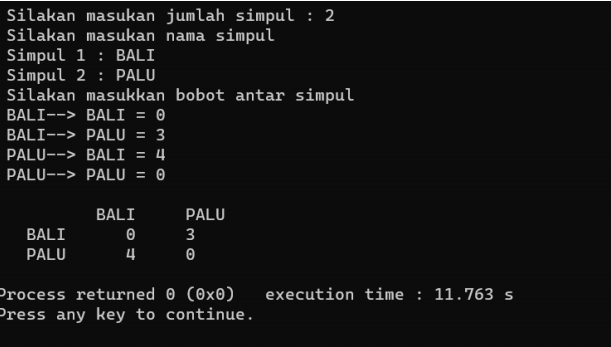
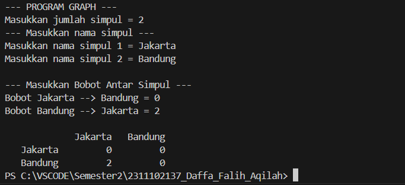
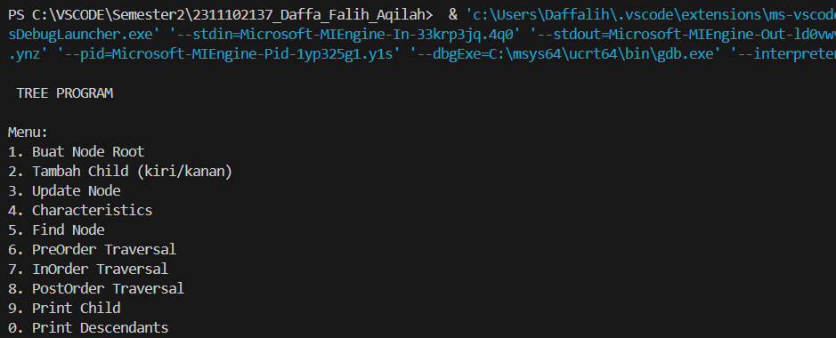

# <h1 align="center">Laporan Praktikum Modul 9 - GRAPH DAN TREE </h1>
<p align="center">Daffa Falih Aqilah - 2311102137 /p>

## Dasar Teori

Graph:
Graph adalah struktur data yang terdiri dari kumpulan simpul (nodes) yang terhubung melalui edge (sisi). Graph dapat digunakan untuk
merepresentasikan berbagai jenis hubungan antar objek.

Representasi Graph:
1.Adjacency Matrix: Matriks berukuran VxV (dimana V adalah jumlah simpul) yang merepresentasikan ketersediaan edge antara simpul-simpul.
2.Adjacency List: Array dari linked list, setiap elemen array merepresentasikan simpul dan linked list berisi simpul yang terhubung dari simpul
tersebut.
3.Edge List: Merepresentasikan edge-edge yang ada dalam graph.

Algoritma Penting:
1.Depth-First Search (DFS): Pencarian yang melakukan traversal ke depth terdalam sebelum kembali.
2.Breadth-First Search (BFS): Pencarian yang melakukan traversal pada setiap level dari simpul awal sebelum melakukan traversal ke level
berikutnya.
3.Shortest Path Algorithms: Dijkstra, Bellman-Ford, Floyd-Warshall.
4.Minimum Spanning Tree (MST): Algoritma Prim, Kruskal.
5.Topological Sorting: Pengurutan simpul dalam sebuah DAG (Directed Acyclic Graph).

Tree:
Tree adalah struktur data hirarkis yang terdiri dari simpul (nodes) yang terhubung dalam bentuk hirarkis, dimana satu simpul menjadi simpul induk
terhadap simpul-simpul lainnya (anak).

Jenis-jenis Tree:
1.Binary Tree: Setiap simpul memiliki maksimal dua anak.
2.Binary Search Tree (BST): Jenis binary tree dimana setiap anak kiri dari sebuah simpul memiliki nilai yang lebih kecil daripada simpul tersebut
dan setiap anak kanan memiliki nilai yang lebih besar.
3.Balanced Tree: Tree dimana tinggi pohon seimbang sehingga operasi pencarian, penyisipan, dan penghapusan memiliki kompleksitas waktu yang
optimal.
4.AVL Tree, Red-Black Tree: Contoh dari jenis-jenis balanced tree.

Operasi pada Tree:
1.Traversal: Pre-order, In-order, Post-order.
2.Penyisipan (Insertion): Menambahkan simpul baru ke dalam tree.
3.Penghapusan (Deletion): Menghapus simpul dari tree.
4.Pencarian (Search): Mencari sebuah nilai tertentu dalam tree

## Guided 

### Guided 1

```C++
#include <iostream>
#include <iomanip>

using namespace std;
string simpul[7] = {"Ciamis", "Bandung", "Bekasi", "Tasikmalaya", "Cianjur", "Purwokerto", "Yogyakarta"};
int busur[7][7] = {
    {0, 7, 8, 0, 0, 0, 0},
    {0, 0, 5, 0, 0, 15, 0},
    {0, 6, 0, 0, 5, 0, 0},
    {0, 5, 0, 0, 2, 4, 0},
    {23, 0, 0, 10, 0, 0, 8},
    {0, 0, 0, 0, 7, 0, 3},
    {0, 0, 0, 0, 9, 4, 0}};
void tampilGraph()
{
    for (int baris = 0; baris < 7; baris++)
    {
        cout << " " << setiosflags(ios::left) << setw(15) << simpul[baris] << " : ";
        for (int kolom = 0; kolom < 7; kolom++)
        {
            if (busur[baris][kolom] != 0)
            {
                cout << " " << simpul[kolom] << "(" << busur[baris][kolom] << ")";
            }
        }
        cout << endl;
    }
}
int main()
{
    tampilGraph();
    return 0;
}

```
implementasi dari representasi graf menggunakan matriks berbobot untuk merepresentasikan jarak antar simpul kota. Dalam program ini, terdapat
array simpul yang berisi nama-nama kota sebagai simpul graf, dan array busur yang merupakan matriks berbobot yang menyatakan jarak antar kota.
Fungsi tampilGraph() digunakan untuk menampilkan matriks berbobot tersebut dengan format yang terstruktur, di mana setiap elemen matriks yang
tidak nol menunjukkan adanya jarak yang terdefinisi antara dua simpul kota. Dalam perulangan, setiap elemen yang tidak nol dari matriks busur akan
dicetak bersama dengan simpul kota yang terhubung dan bobotnya. Hasil cetakan tersebut menampilkan hubungan antar kota beserta jaraknya.

### Guided 2

```C++
#include <iostream>
#include <iomanip>
    using namespace std;
struct Pohon{
    char data;
    Pohon *left, *right, *parent;
};
Pohon *root, *baru;
void init(){
    root = NULL;
}
bool isEmpty(){
    return root == NULL;
}
void buatNode(char data){
    if (isEmpty())
    {
        root = new Pohon();
        root->data = data;
        root->left = NULL;
        root->right = NULL;
        root->parent = NULL;
        cout << "\n Node " << data << " berhasil dibuat sebagai root."
             << endl;
    }
    else
    {
        cout << "\n Tree sudah ada!" << endl;
    }
}
Pohon *insertLeft(char data, Pohon *node)
{
    if (isEmpty())
    {
        cout << "\n Buat tree terlebih dahulu!" << endl;
        return NULL;
    }
    else
    {
        if (node->left != NULL)
        {
            cout << "\n Node " << node->data << " sudah ada child kiri !" << endl;
                return NULL;
        }
        else
        {
            Pohon *baru = new Pohon();
            baru->data = data;
            baru->left = NULL;
            baru->right = NULL;
            baru->parent = node;
            node->left = baru;
            cout << "\n Node " << data << " berhasil ditambahkan ke child kiri " << baru->parent->data << endl;
                return baru;
        }
    }
}
Pohon *insertRight(char data, Pohon *node)

{
    if (isEmpty())
    {
        cout << "\n Buat tree terlebih dahulu!" << endl;
        return NULL;
    }
    else
    {
        if (node->right != NULL)
        {
            cout << "\n Node " << node->data << " sudah ada child kanan !" << endl;
                return NULL;
        }
        else
        {
            Pohon *baru = new Pohon();
            baru->data = data;
            baru->left = NULL;
            baru->right = NULL;
            baru->parent = node;
            node->right = baru;
            cout << "\n Node " << data << " berhasil ditambahkan ke child kanan " << baru->parent->data << endl;
                return baru;
        }
    }
}
void update(char data, Pohon *node)
{
    if (isEmpty())
    {
        cout << "\n Buat tree terlebih dahulu!" << endl;
    }
    else
    {
        if (!node)
        {
            cout << "\n Node yang ingin diganti tidak ada!!" << endl;
        }
        else
        {
            char temp = node->data;
            node->data = data;
            cout << "\n Node " << temp << " berhasil diubah menjadi "
                 << data << endl;
        }
    }
}
void retrieve(Pohon *node)
{
    if (isEmpty())
    {
        cout << "\n Buat tree terlebih dahulu!" << endl;
    }
    else
    {
        if (!node)
        {
            cout << "\n Node yang ditunjuk tidak ada!" << endl;
        }
        else
        {
            cout << "\n Data node : " << node->data << endl;
        }
    }
}
void find(Pohon *node)
{
    if (isEmpty())
    {
        cout << "\n Buat tree terlebih dahulu!" << endl;
    }
    else
    {
        if (!node)
        {
            cout << "\n Node yang ditunjuk tidak ada!" << endl;
        }
        else
        {
            cout << "\n Data Node : " << node->data << endl;
            cout << " Root : " << root->data << endl;
            if (!node->parent)
                cout << " Parent : (tidak punya parent)" << endl;
            else
                cout << " Parent : " << node->parent->data << endl;
            if (node->parent != NULL && node->parent->left != node &&
                node->parent->right == node)
                cout << " Sibling : " << node->parent->left->data << endl;
            else if (node->parent != NULL && node->parent->right != node && node->parent->left == node)
                cout << " Sibling : " << node->parent->right->data << endl;
            else
                cout << " Sibling : (tidak punya sibling)" << endl;
            if (!node->left)
                cout << " Child Kiri : (tidak punya Child kiri)" << endl;
            else
                cout << " Child Kiri : " << node->left->data << endl;
            if (!node->right)
                cout << " Child Kanan : (tidak punya Child kanan)" << endl;
            else
                cout << " Child Kanan : " << node->right->data << endl;
        }
    }
}
// Penelusuran (Traversal)
// preOrder
void preOrder(Pohon *node = root)
{
    if (isEmpty())
    {
        cout << "\n Buat tree terlebih dahulu!" << endl;
    }
    else
    {
        if (node != NULL)
        {
            cout << " " << node->data << ", ";
            preOrder(node->left);
            preOrder(node->right);
        }
    }
}
// inOrder
void inOrder(Pohon *node = root)
{
    if (isEmpty())
    {
        cout << "\n Buat tree terlebih dahulu!" << endl;
    }
    else
    {
        if (node != NULL)
        {
            inOrder(node->left);
            cout << " " << node->data << ", ";
            inOrder(node->right);
        }
    }
}
// postOrder
void postOrder(Pohon *node = root)
{
    if (isEmpty())
    {
        cout << "\n Buat tree terlebih dahulu!" << endl;
    }
    else
    {
        if (node != NULL)
        {
            postOrder(node->left);
            postOrder(node->right);
            cout << " " << node->data << ", ";
        }
    }
}
// Hapus Node Tree
void deleteTree(Pohon *node)
{
    if (isEmpty())
    {
        cout << "\n Buat tree terlebih dahulu!" << endl;
    }
    else
    {
        if (node != NULL)
        {
            if (node != root)
            {
                node->parent->left = NULL;
                node->parent->right = NULL;
            }
            deleteTree(node->left);
            deleteTree(node->right);
            if (node == root)
            {
                delete root;
                root = NULL;
            }
            else
            {
                delete node;
            }
        }
    }
}
// Hapus SubTree
void deleteSub(Pohon *node)
{
    if (isEmpty())
    {
        cout << "\n Buat tree terlebih dahulu!" << endl;
    }
    else
    {
        deleteTree(node->left);
        deleteTree(node->right);
        cout << "\n Node subtree " << node->data << " berhasil dihapus." << endl;
    }
}
// Hapus Tree
void clear()
{
    if (isEmpty())
    {
        cout << "\n Buat tree terlebih dahulu!!" << endl;
    }
    else
    {
        deleteTree(root);
        cout << "\n Pohon berhasil dihapus." << endl;
    }
}
// Cek Size Tree
int size(Pohon *node = root)
{
    if (isEmpty())
    {
        cout << "\n Buat tree terlebih dahulu!!" << endl;
        return 0;
    }
    else
    {
        if (!node)
        {
            return 0;
        }
        else
        {
            return 1 + size(node->left) + size(node->right);
        }
    }
}
// Cek Height Level Tree
int height(Pohon *node = root)
{
    if (isEmpty())
    {
        cout << "\n Buat tree terlebih dahulu!" << endl;
        return 0;
    }
    else
    {
        if (!node)
        {
            return 0;
        }
        else
        {
            int heightKiri = height(node->left);
            int heightKanan = height(node->right);
            if (heightKiri >= heightKanan)
            {
                return heightKiri + 1;
            }
            else
            {
                return heightKanan + 1;
            }
        }
    }
}
// Karakteristik Tree
void characteristic()
{
    cout << "\n Size Tree : " << size() << endl;
    cout << " Height Tree : " << height() << endl;
    cout << " Average Node of Tree : " << size() / height() << endl;
}
int main()
{
    buatNode('A');
    Pohon *nodeB, *nodeC, *nodeD, *nodeE, *nodeF, *nodeG, *nodeH, *nodeI, *nodeJ;
    
    nodeB = insertLeft('B', root),
    nodeC = insertRight('C', root),
    nodeD = insertLeft('D', nodeB), 
    nodeE = insertRight('E', nodeB), 
    nodeF = insertLeft('F', nodeC), 
    nodeG = insertLeft('G', nodeE), 
    nodeH = insertRight('H', nodeE),
    nodeI = insertLeft('I', nodeG), 
    nodeJ = insertRight('J', nodeG);

    update('Z', nodeC);
    update('C', nodeC);

    retrieve(nodeC);

    find(nodeC);

    characteristic();

    cout << "PreOrder : " << endl;
    preOrder(root);
    cout << "\n" << endl;

    cout << "InOrder : " << endl;
    inOrder(root);
    cout << "\n" << endl;

    cout << "PostOrder : " << endl;
    postOrder(root);
    cout << "\n" << endl;

    return 0;
}

```
implementasi dari struktur data pohon biner dalam C++, dengan kemampuan pembuatan, penambahan, penghapusan, dan penelusuran node pada pohon. Pada
awalnya, program memiliki struktur data Pohon yang terdiri dari data karakter, pointer ke node anak kiri, anak kanan, dan parent. Fungsi-fungsi
seperti insertLeft, insertRight, update, dan retrieve digunakan untuk menambah, mengubah, dan mengambil data dari node pada pohon. Program juga
memiliki fungsi penelusuran seperti preOrder, inOrder, dan postOrder untuk menampilkan data pohon secara berurutan. Fungsi lain seperti
deleteTree, deleteSub, clear, size, dan height digunakan untuk menghapus pohon atau subtree, menghitung jumlah node dan tinggi pohon. Dalam mai
(), pohon dibuat dan diisi dengan node-node baru, kemudian dilakukan operasi pengubahan data, pengambilan data, penelusuran, serta penghitungan
karakteristik pohon seperti ukuran dan tinggi.

## Unguided 

### 1. [1. Buatlah program graph dengan menggunakan inputan user untuk menghitung jarak dari sebuah kota ke kota lainnya.Output Program Modul 10 Graph dan Tree]

  
```C++
#include <iostream>
#include <iomanip>

using namespace std;

void TampilGraph_137(int JumlahSimpul_137, string* NamaSimpul_137, int** BobotSimpul_137) {
    cout << setw(10) << " ";
    for (int i = 0; i < JumlahSimpul_137; i++) {
        cout << setw(10) << NamaSimpul_137[i];
    }
    cout << endl;

    for (int baris_137 = 0; baris_137 < JumlahSimpul_137; baris_137++) {
        cout << setw(10) << NamaSimpul_137[baris_137];
        for (int kolom_137 = 0; kolom_137 < JumlahSimpul_137; kolom_137++) {
            cout << setw(10) << BobotSimpul_137[baris_137][kolom_137];
        }
        cout << endl;
    }
}

int main() {
    int JumlahSimpul_137;
    int Nomor_137 = 1;
    int Bobot_137;

    cout << "--- PROGRAM GRAPH ---" << endl;

    cout << "Masukkan jumlah simpul = ";
    cin >> JumlahSimpul_137;

    string* NamaSimpul_137 = new string[JumlahSimpul_137];

    cout << "--- Masukkan nama simpul ---" << endl; 
    for (int i = 0; i < JumlahSimpul_137; i++) {
        cout << "Masukkan nama simpul " << Nomor_137++ << " = ";
        cin >> NamaSimpul_137[i];
    }
    cout << endl;

    int** BobotSimpul_137 = new int*[JumlahSimpul_137];
    for (int i = 0; i < JumlahSimpul_137; i++) {
        BobotSimpul_137[i] = new int[JumlahSimpul_137]();
    }

    cout << "--- Masukkan Bobot Antar Simpul ---" << endl;
    for (int i = 0; i < JumlahSimpul_137; i++) {
        for (int j = 0; j < JumlahSimpul_137; j++) {
            if (i != j) {
                cout << "Bobot " << NamaSimpul_137[i] << " --> " << NamaSimpul_137[j] << " = ";
                cin >> Bobot_137;
                BobotSimpul_137[i][j] = Bobot_137;
            }
        }
    }
    cout << endl;

    TampilGraph_137(JumlahSimpul_137, NamaSimpul_137, BobotSimpul_137);

    return 0;
}

```

## Cara kerja program

implementasi sederhana dari representasi graf menggunakan matriks berbobot. Pertama, program meminta pengguna untuk memasukkan jumlah
simpul dan nama-nama simpul. Kemudian, program mengalokasikan memori untuk matriks dua dimensi yang akan menyimpan bobot antar simpul.
Pengguna diminta untuk memasukkan bobot antar simpul dengan memasukkan bobot dari simpul i ke simpul j (dengan asumsi bahwa tidak ada
simpul yang menghubungkan dirinya sendiri). Setelah semua input selesai, program akan menampilkan graf dengan simpul sebagai label baris
dan kolom, serta bobot antar simpul pada setiap sel.

#### Output Unguided 1:



### 2. [Modifikasi guided tree diatas dengan program menu menggunakan input data tree dari user dan berikan fungsi tambahan untuk menampilkan node child dan descendant dari node yang diinput kan!]

  
```C++
//Daffa Falih Aqilah
//2311102137

#include <iostream>
#include <iomanip>

using namespace std;

struct Pohon
{
    char data;
    Pohon *left, *right, *parent;
};

Pohon *root, *baru;

void init() // inisialisasi
{
    root = NULL;
}

bool isEmpty() // cek apakah tree kosong
{
    return root == NULL;
}

void buatNode(char data) // membuat node root
{
    if (isEmpty())
    {
        root = new Pohon();
        root->data = data;
        root->left = NULL;
        root->right = NULL;
        root->parent = NULL;
        cout << "\nNode " << data << " berhasil dibuat sebagai root!" << endl;
    }
    else
    {
        cout << "\nTree sudah ada!" << endl;
    }
}

Pohon *findNode(Pohon *node, char data) // mencari node
{
    if (node == NULL) return NULL;
    if (node->data == data) return node;

    Pohon *foundNode = findNode(node->left, data);
    if (foundNode == NULL)
        foundNode = findNode(node->right, data);

    return foundNode;
}

Pohon *insertLeft(char data, Pohon *node) // menambah child kiri
{
    if (isEmpty())
    {
        cout << "\nBuat tree terlebih dahulu!" << endl;
        return NULL;
    }
    else
    {
        if (node->left != NULL)
        {
            cout << "\nNode " << node->data << " sudah ada child kiri!" << endl;
            return NULL;
        }
        else
        {
            Pohon *baru = new Pohon();
            baru->data = data;
            baru->left = NULL;
            baru->right = NULL;
            baru->parent = node;
            node->left = baru;
            cout << "\nNode " << data << " berhasil ditambahkan ke child kiri " << baru->parent->data << endl;
            return baru;
        }
    }
}

Pohon *insertRight(char data, Pohon *node) // menambah child kanan
{
    if (isEmpty())
    {
        cout << "\nBuat tree terlebih dahulu!" << endl;
        return NULL;
    }
    else
    {
        if (node->right != NULL)
        {
            cout << "\nNode " << node->data << " sudah ada child kanan!" << endl;
            return NULL;
        }
        else
        {
            Pohon *baru = new Pohon();
            baru->data = data;
            baru->left = NULL;
            baru->right = NULL;
            baru->parent = node;
            node->right = baru;
            cout << "\nNode " << data << " berhasil ditambahkan ke child kanan " << baru->parent->data << endl;
            return baru;
        }
    }
}

void update(char data, Pohon *node) // mengupdate node
{
    if (isEmpty())
    {
        cout << "\nBuat tree terlebih dahulu!" << endl;
    }
    else
    {
        if (!node)
        {
            cout << "\nNode yang ingin diganti tidak ada!!" << endl;
        }
        else
        {
            char temp = node->data;
            node->data = data;
            cout << "\nNode " << temp << " berhasil diubah menjadi " << data << endl;
        }
    }
}

void find(Pohon *node) // mencari node dan menampilkan informasi node
{
    if (isEmpty())
    {
        cout << "\nBuat tree terlebih dahulu!" << endl;
    }
    else
    {
        if (!node)
        {
            cout << "\nNode yang ditunjuk tidak ada!" << endl;
        }
        else
        {
            cout << "\nData Node: " << node->data << endl;
            cout << "Root: " << root->data << endl;
            if (!node->parent)
                cout << "Parent: (tidak punya parent)" << endl;
            else
                cout << "Parent: " << node->parent->data << endl;
            if (node->parent != NULL && node->parent->left != node && node->parent->right == node)
                cout << "Sibling: " << node->parent->left->data << endl;
            else if (node->parent != NULL && node->parent->right != node && node->parent->left == node)
                cout << "Sibling: " << node->parent->right->data << endl;
            else
                cout << "Sibling: (tidak punya sibling)" << endl;
            if (!node->left)
                cout << "Child Kiri: (tidak punya child kiri)" << endl;
            else
                cout << "Child Kiri: " << node->left->data << endl;
            if (!node->right)
                cout << "Child Kanan: (tidak punya child kanan)" << endl;
            else
                cout << "Child Kanan: " << node->right->data << endl;
        }
    }
}

void printChild(Pohon *node) // menampilkan child
{
    if (isEmpty())
    {
        cout << "\nBuat tree terlebih dahulu!" << endl;
    }
    else if (!node)
    {
        cout << "\nNode yang ditunjuk tidak ada!" << endl;
    }
    else
    {
        if (node->left)
        {
            cout << "Child Kiri: " << node->left->data << endl;
        }
        else
        {
            cout << "Child Kiri: (tidak ada)" << endl;
        }

        if (node->right)
        {
            cout << "Child Kanan: " << node->right->data << endl;
        }
        else
        {
            cout << "Child Kanan: (tidak ada)" << endl;
        }
    }
}

void printDescendants(Pohon *node) // menampilkan descendants
{
    void preOrder(Pohon * node);

    if (isEmpty())
    {
        cout << "\nBuat tree terlebih dahulu!" << endl;
    }
    else if (!node)
    {
        cout << "\nNode yang ditunjuk tidak ada!" << endl;
    }
    else
    {
        cout << "Descendants dari node " << node->data << " : ";
        if (node->left) preOrder(node->left);
        if (node->right) preOrder(node->right);
        cout << endl;
    }
}

// Cek Size Tree
int size(Pohon *node = root)
{
    if (isEmpty())
    {
        cout << "\n Buat tree terlebih dahulu!!" << endl;
        return 0;
    }
    else
    {
        if (!node)
        {
            return 0;
        }
        else
        {
            return 1 + size(node->left) + size(node->right);
        }
    }
}

// Cek Height Level Tree
int height(Pohon *node = root)
{
    if (isEmpty())
    {
        cout << "\n Buat tree terlebih dahulu!" << endl;
        return 0;
    }
    else
    {
        if (!node)
        {
            return 0;
        }
        else
        {
            int heightKiri = height(node->left);
            int heightKanan = height(node->right);
            if (heightKiri >= heightKanan)
            {
                return heightKiri + 1;
            }
            else
            {
                return heightKanan + 1;
            }
        }
    }
}

// Penelusuran (Traversal)
// preOrder
void preOrder(Pohon *node)
{
    if (node != NULL)
    {
        cout << " " << node->data << ", ";
        preOrder(node->left);
        preOrder(node->right);
    }
}


// inOrder
void inOrder(Pohon *node = root)
{
    if (node != NULL)
    {
        inOrder(node->left);
        cout << " " << node->data << ", ";
        inOrder(node->right);
    }
}

// postOrder
void postOrder(Pohon *node = root)
{
    if (node != NULL)
    {
        postOrder(node->left);
        postOrder(node->right);
        cout << " " << node->data << ", ";
    }
    cout << endl;
}

// Karakteristik Tree
void characteristic()
{
    cout << "\n Size Tree : " << size() << endl;
    cout << " Height Tree : " << height() << endl;
    cout << " Average Node of Tree : " << size() / height() << endl;
}

int main()
{
    init();
    char Choice_137, Data_137, Direction_137, ParentData_137;
    Pohon *node;

    cout << "\n TREE PROGRAM \n";

    do
    {
        cout << "\nMenu: ";
        cout << "\n1. Buat Node Root";
        cout << "\n2. Tambah Child (kiri/kanan)";
        cout << "\n3. Update Node";
        cout << "\n4. Characteristics";
        cout << "\n5. Find Node";
        cout << "\n6. PreOrder Traversal";
        cout << "\n7. InOrder Traversal";
        cout << "\n8. PostOrder Traversal";
        cout << "\n9. Print Child";
        cout << "\n0. Print Descendants";
        cout << "\nPilihlah: "; cin >> Choice_137;

        switch (Choice_137)
        {
        case '1': // case ini digunakan untuk membuat node root
            cout << "\nOke sip, mulai dari root! Input data untuk rootnya: ";
            cin >> Data_137;
            buatNode(Data_137);
            break;

        case '2': // case ini digunakan untuk menambah child
            cout << "\nMasukkan data untuk child: ";
            cin >> Data_137;
            cout << "\nChild yang diinput berada di posisi (Left (L/l) / Right (R/r)): ";
            cin >> Direction_137;
            cout << "\nMasukkan data dari parent node: ";
            cin >> ParentData_137;
            node = findNode(root, ParentData_137);
            if (node == NULL)
            {
                cout << "\nNode dengan data " << ParentData_137 << " tidak ditemukan!" << endl;
            }
            else
            {
                if (Direction_137 == 'L' || Direction_137 == 'l')
                {
                    insertLeft(Data_137, node);
                }
                else if (Direction_137 == 'R' || Direction_137 == 'r')
                {
                    insertRight(Data_137, node);
                }
                else
                {
                    cout << "\nHah! Pilihan tidak valid!" << endl;
                }
            }
            break;

        case '3': // case ini digunakan untuk mengupdate node
            cout << "\nMasukkan data baru untuk diupdate: ";
            cin >> Data_137;
            cout << "\nMasukkan data dari node yang ingin diupdate: ";
            cin >> ParentData_137;
            node = findNode(root, ParentData_137);
            if (node == NULL)
            {
                cout << "\nNode dengan data " << ParentData_137 << " tidak ditemukan!" << endl;
            }
            else
            {
                update(Data_137, node);
            }
            break;

        case '4': // case ini digunakan untuk menampilkan karakteristik tree
            cout << "\nKarakteristik dari tree ini:";
            characteristic();
            break;

        case '5': // case ini digunakan untuk mencari node
            cout << "\nMasukkan data dari node yang ingin dicari: ";
            cin >> ParentData_137;
            node = findNode(root, ParentData_137);
            if (node == NULL)
            {
                cout << "\nNode dengan data " << ParentData_137 << " tidak ditemukan!" << endl;
            }
            else
            {
                find(node);
            }
            break;

        case '6': // case ini digunakan untuk preOrder traversal
            cout << "\nPreOrder Traversal: ";
            preOrder(root);
            cout << endl;
            break;

        case '7': // case ini digunakan untuk inOrder traversal
            cout << "\nInOrder Traversal: ";
            inOrder(root);
            cout << endl;
            break;

        case '8': // case ini digunakan untuk postOrder traversal
            cout << "\nPostOrder Traversal: ";
            postOrder(root);
            cout << endl;
            break;

        case '9': // case ini digunakan untuk print child
            cout << "\nMasukkan data dari node yang ingin melihat child: ";
            cin >> ParentData_137;
            node = findNode(root, ParentData_137);
            if (node == NULL)
            {
                cout << "\nNode dengan data " << ParentData_137 << " tidak ditemukan!" << endl;
            }
            else
            {
                printChild(node);
            }
            break;

        case '0': 
            cout << "\nMasukkan data dari node yang ingin melihat descendants: ";
            cin >> ParentData_137;
            node = findNode(root, ParentData_137);
            if (node == NULL)
            {
                cout << "\nNode dengan data " << ParentData_137 << " tidak ditemukan!" << endl;
            }
            else
            {
                printDescendants(node);
            }
            break;

        default:
            cout << "\nERROR." << endl;
            break;
        }
    } while (Choice_137 != '!');
    cout << "\nSelesai" << endl;

    return 0;
}


```

## Cara kerja program

implementasi dari struktur data pohon biner. Setiap node dalam pohon memiliki data dan pointer ke node anak kiri, anak kanan, dan
parentnya. Fungsi-fungsi yang disediakan meliputi pembuatan node root, penambahan child (baik kiri maupun kanan), update data pada
node, pencarian node, penelusuran pohon dengan preOrder, inOrder, dan postOrder traversal, serta tampilan karakteristik pohon seperti
ukuran dan tinggi. Pengguna dapat memilih operasi yang diinginkan dari menu, seperti membuat node, menambahkan child, mengupdate data
node, menampilkan karakteristik pohon, mencari node, dan menelusuri pohon dengan berbagai metode penelusuran. Program terus berjalan
hingga pengguna memilih untuk keluar dengan mengetikkan tanda seru

#### Output Unguided 2:



## Kesimpulan

Dua program yang diberikan memiliki fokus yang berbeda:

Program pertama adalah implementasi dari struktur data graf. Program ini memungkinkan pengguna untuk membuat graf dengan simpul-simpul
yang memiliki bobot antar simpulnya. Kemudian, program tersebut menampilkan graf yang telah dibuat menggunakan representasi matriks.
Ini memungkinkan pengguna untuk memahami koneksi antara simpul-simpul dan bobotnya.

Program kedua adalah implementasi dari struktur data pohon biner. Program ini memungkinkan pengguna untuk membuat pohon biner dengan
menambahkan simpul-simpul baru sebagai child kiri atau kanan dari simpul yang sudah ada. Selain itu, program ini juga menyediakan
fungsi untuk mencari, mengupdate, dan menampilkan informasi tentang simpul tertentu dalam pohon, serta melakukan penelusuran dalam
berbagai urutan (preOrder, inOrder, postOrder). Selain itu, program ini juga dapat menampilkan jumlah simpul dan tinggi dari pohon.

Kesimpulannya, program pertama digunakan untuk merepresentasikan dan memvisualisasikan hubungan antara simpul-simpul dalam graf dengan
bobot yang terkait, sementara program kedua digunakan untuk membuat dan mengelola struktur pohon biner serta melakukan operasi-operasi
yang terkait dengan pohon tersebut.

## Referensi
[1]Goodrich, Michael T., et al. "Data Structures & Algorithms in C++" (Edisi kedelapan). John Wiley & Sons. (2021)
[2]Horowitz, Ellis, et al. "Data Structures: A Pseudocode Approach with C++" (Edisi kedelapan). Wiley. (2019)